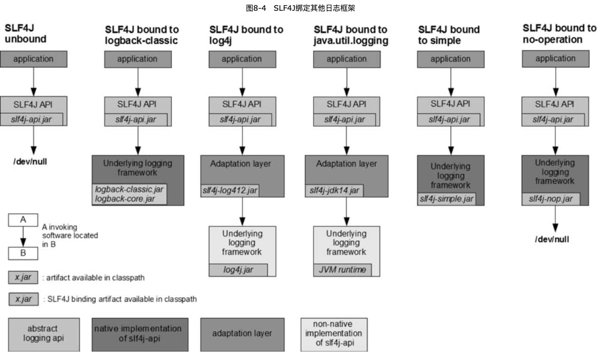

MyBatis3源码深度解析
-----

https://book.douban.com/subject/34836563/

优化了SQL配置方式，引用OGNL表达式来支持动态SQL配置

引入了SQL Mapper的概念

将XML文件中的SQL配置与一个Java接口进行绑定，SQL配置的命名空间对应Java接口的完全限定名，而具体的每个SQL语句的配置对应Java接口中的一个方法，建立绑定后，可以通过调用Java接口中定义的方法来执行XML文件中配置的SQL语句。


https://github.com/rongbo-j/mybatis-book


## 1 搭建MyBatis源码环境

https://github.com/mybatis/mybatis-3

https://github.com/mybatis/spring

https://github.com/mybatis/parent


### HSQLDB数据库简介

[HSQLDB官方文档](http://hsqldb.org/doc/2.0/guide/index.html)

[SQL-92规范文档](http://www.contrib.andrew.cmu.edu/~shadow/sql/sql1992.txt)

HSQLDB是纯Java语言编写的关系型数据库管理系统，支持大部分 **SQL-92、SQL:2008、SQL:2011规范**。它提供了一个小型的同时支持内存和磁盘存储表结构的数据库引擎，支持**Server模式**和**内存模式**两种运行模式。

Server模式是把HSQLDB作为一个单独的数据库服务运行，类似于我们常用的关系型数据库，例如Oracle、MySQL等。而内存模式则是把HSQLDB嵌入应用进程中，这种模式只能存储应用内部数据。由于HSQLDB能够很好地支持JDBC规范，因此我们可以使用它作为Java语言与关系型数据库交互的测试工具。


MyBatis源码中提供了大量的单元测试用例，都使用了HSQLDB的内存模式，我们不需要额外安装其他数据库就可以运行MyBatis源码中的测试用例。


MyBatis提供的两个工具类`ScriptRunner`和`SqlRunner`，分别用于批量执行数据库脚本和对数据库进行增删改查操作


## 2 JDBC规范详解

MyBatis框架对JDBC做了轻量级的封装

[JDBC4.2规范文档](https://download.oracle.com/otndocs/jcp/jdbc-4_2-mrel2-spec/index.html)

### 2.1 JDBC API简介

**==JDBC（Java Database Connectivity）==**是Java语言中提供的**==访问关系型数据的接口==**🔖非关系。在Java编写的应用中，使用JDBC API可以==执行SQL语句、检索SQL执行结果以及将数据更改写回到底层数据源==。JDBC API也可以用于==分布式、异构的环境中与多个数据源交互==。

当然，使用JDBC访问其他数据源（例如文件系统或者面向对象系统等）也是有可能的，只要该数据源提供JDBC规范驱动程序即可。

使用JDBC操作数据源大致步骤：

1. 与数据源建立连接。
2. 执行SQL语句。
3. 检索SQL执行结果。
4. 关闭连接。

#### 建立数据源连接

`Connection`接口用来表示与底层数据源的连接，是JDBC对数据源连接的抽象。

两种获取`Connection`对象的方式：

1. `DriverManager`：类，JDBC 1.0。当应用程序第一次尝试通过URL连接数据源时，DriverManager会自动加载CLASSPATH下所有的JDBC驱动。DriverManager类提供了一系列重载的getConnection()方法，用来获取Connection对象，例如：

   ```java
   DriverManager.getConnection("jdbc:hsqldb:mem:mybatis", "sa", "");
   ```

2. `DataSource1：接口，JDBC 2.0。 

比DriverManager更受欢迎，因为它提供了更多底层数据源相关的细节，而且对应用来说，不需要关注JDBC驱动的实现。一个DataSource对象的属性被设置后，它就代表一个特定的数据源。🔖

JDBC API中只提供了DataSource接口，没有提供DataSource的具体实现，DataSource具体的实现由JDBC驱动程序提供。

MyBatis框架中提供了DataSource接口的实现：

```java
DataSource dataSource = new UnpooledDataSource("org.hsqldb.jdbcDriver", "jdbc:hsqldb:mem:mybatis", "sa", "");
            Connection conn = dataSource.getConnection();
```

另外，MyBatis框架还提供了DataSource的工厂，即`DataSourceFactory`：

```java
UnpooledDataSourceFactory dsf = new UnpooledDataSourceFactory();
Properties properties = new Properties();
InputStream configStream = Thread.currentThread().getContextClassLoader().getResourceAsStream("database.properties");
properties.load(configStream);
dsf.setProperties(properties);

DataSource dataSource = dsf.getDataSource();
Connection conn = dataSource.getConnection();
```

#### 执行SQL语句

JDBC API提供了访问SQL:2003规范中常用的实现特性，因为不同的JDBC厂商对这些特性的支持程度各不相同，所以JDBC API中提供了一个`DatabaseMetadata`接口，应用程序可以使用DatabaseMetadata的实例来确定目前使用的数据源是否支持某一特性。

```java
conn = dataSource.getConnection();
DatabaseMetaData dbmd = conn.getMetaData();
```

Connection接口中提供的方法创建`Statement`、`PreparedStatement`或者`CallableStatement`对象。

Statement接口可以理解SQL语句的**执行器**，其中`executeQuery()`方法执行**查询操作**，调用`executeUpdate()`方法执行**更新操作**，另外调用`executeBatch()`方法执行**批量处理**。当不知道SQL语句的类型时，可以调用`execute()`方法进行统一的操作，返回值可判断SQL语句类型：`true if the first result is a ResultSet object; false if it is an update count or there are no results`。最后可以通过`getResultSet()`方法来获取查询结果集，或者通过`getUpdateCount()`方法来获取更新操作影响的行数。

#### 处理SQL执行结果

`ResultSet`接口的实现类封装SQL查询的结果，可以对ResultSet对象进行遍历，然后通过ResultSet提供的一系列`getXXX()`方法（例如getString）获取查询结果集。`getMetaData()`方法获取结果集元数据信息（`ResultSetMetaData`）：字段名称、字段数量、字段数据类型等。


#### 使用JDBC操作数据库


### 2.2 JDBC API中的类与接口

JDBC API由java.sql和javax.sql两个包构成。

#### java.sql包详解

java.sql包中的所有接口、枚举和类：

```java
# 数据类型
java.sql.Array 
java.sql.Blob 
java.sql.Clob 
java.sgl.Date 
java.sql.NClob 
java.sql.Struct 
java.sql.Time

java.sql.Timestamp 
java.sql.SQLXML 
java.sql.Ref 
java.sql.RowId 
java.sql.SQLOutput 
java.sql.SQLData 
java.sql.SQLInput


# 枚举
java.sql.SQLType 
java.sql.JDBCType 
java.sql.Types 
java.sql.RowIdLifeTime 
java.sql.PseudoColumnUsage 
java.sql.ClientinfoStatus
# 驱动相关
java.sgl.Driver
java.sql.DriverAction 
java.sql.DriverManager 
java.sql.DriverPropertyInfo 
java.sql.SQLPermission 
java.sql.Savepoint
# 异常
java.sql.BatchUpdateException 
java.sql.DataTruncation 
java.sql.SQLClientInfoException 
java.sql.SQLDataException 
java.sql.SQLException 
java.sql.SQLFeatureNotSupportedException
Lava.sql.SQLIntegrityConstraintViolationException java.sql.SQLInvalidAuthorizationSpecException java.sql.SQLNonTransientConnectionException 
java.sql.SQLNonTransientException 
java.sql.SQLSyntaxErrorException 
java.sql.SQLTimeoutException 
java.sql.SOLTransactionRollbackException java.sql.SQLTransientConnectionException 
java.sql.SQLTransientException 
java.sql.SOLWarning

# API 相关
java.sql.Wrapper
java.sql.Connection
java.sql.Statement 
java.sql.CallableStatement
java.sql.PreparedStatement 
java.sql.DatabaseMetaData 
java.sql.ParameterMetaData 
java.sql.ResultSet
java.sal.ResultSetMetaData
```

大致可以分为数据类型接口、枚举类、驱动相关类和接口、异常类、API相关。

其中API相关对于开发人员最重要，这些接口都继承了`java.sql.Wrapper`接口。

```java
public interface Wrapper {
    <T> T unwrap(java.lang.Class<T> iface) throws java.sql.SQLException;
    boolean isWrapperFor(java.lang.Class<?> iface) throws java.sql.SQLException;
}

```

`unwrap()`方法用于返回未经过包装的JDBC驱动原始类型实例，可以通过该实例调用JDBC驱动中提供的非标准的方法。

`isWrapperFor()`方法用于判断当前实例是否是JDBC驱动中某一类型的包装类型。

```java
Statement stmt = conn.createStatement();
Class clzz = Class.forName("oracle.jdbc.OracleStatement");
if (stmt.isWrapperFor(clzz)) {
  OracleStatement os = (OracleStatement) stmt.unwrap(clzz);
  os.defineColumnType(1, Types.NUMBER);
}
```

👆🏻，Oracle数据库驱动中提供了一些非JDBC标准的方法，如果需要使用这些非标准的方法，则可以调用Wrapper接口提供的unwrap()方法获取Oracle驱动的原始类型，然后调用原始类型提供的非标准方法就可以访问Oracle数据库特有的一些特性了。


JDBC API中的`Connection`、`Statement`、`ResultSet`等接口都继承自Wrapper接口，这些接口都提供了对JDBC驱动原始类型的访问能力。


#### javax.sql包详解

```java
# 数据源
javax.sql.DataSource 
javax.sql.CommonDataSource
# 连接池相关
javax.sql.ConnectionPoolDataSource 
javax.sql.PooledConnection 
javax.sql.ConnectionEvent 
javax.sql.ConnectionEventListener 
javax.sql.StatementEvent 
javax.sql.StatementEventListener
# ResultSet 扩展
javax.sql.RowSet 
javax.sql.RowSetEvent 
javax.sql.RowSetInternal 
javax.sql.RowSetListener 
javax.sql.RowSetMetaData 
javax.sql.RowSetReader 
javax.sql.RowSetWriter
＃分布式扩展
javax.sql.XAconnection
javax.sql.XADatasource
```

相对于`DriverManager`，JDBC 2.0提供的`DataSource`接口是一个更好的连接数据源的方式。两个优势：

- 首先，应用程序不需要像使用DriverManager一样对加载的数据库驱动程序信息进行**硬编码**。开发人员可以选择通过**JNDI**注册这个数据源对象，然后在程序中使用一个逻辑名称来引用它，JNDI会自动根据我们给出的名称找到与这个名称绑定的DataSource对象。然后我们就可以使用这个DataSource对象来建立和具体数据库的连接了。🔖
- 其次，体现在**连接池和分布式事务**上。连接池通过对==连接的复用==，而不是每次需要操作数据源时都新建一个物理连接来显著地提高程序的效率，适用于任务繁忙、负担繁重的企业级应用。


`javax.sql.PooledConnection`和`Connection`的不同之处在于，它提供了==连接池管理的句柄==。一个PooledConnection表示与数据源建立的物理连接，该连接在应用程序使用完后可以回收而不用关闭它，从而减少了与数据源建立连接的次数。

🔖


另外，javax.sql包中还包含`XADataSource`、`XAResource`和`XAConnection`接口，这些接口提供了分布式事务的支持，具体由JDBC驱动来实现。更多分布式事务相关细节可参考[**JTA（Java Transaction API）**规范文档](https://download.oracle.com/otndocs/jcp/jta-1.1-spec-oth-JSpec/?submit=Download)。


`RowSet`用于为数据源和应用程序在内容中建立一个映射。

相较于`java.sql.ResultSet`而言，RowSet的离线操作能够有效地利用计算机越来越充足的内存减轻数据库服务器的负担。【数据操作都是在内存中进行的，然后批量提交到数据源】

RowSet默认是一个==可滚动、可更新、可序列化==的结果集，而且它作为一个JavaBean组件，可以方便地在网络间传输，用于两端的数据同步。通俗来讲，RowSet就相当于数据库表==数据在应用程序内存中的映射==。


### 2.3 Connection详解

一个Connection对象表示通过JDBC驱动与数据源建立的连接，这里的数据源可以是关系型数据库管理系统（DBMS）、文件系统或者其他通过JDBC驱动访问的数据。

使用JDBC API的应用程序可能需要维护多个Connection对象，一个Connection对象可能访问多个数据源，也可能访问单个数据源。

从JDBC驱动的角度来看，Connection对象表示**客户端会话**，因此它需要一些相关的**状态信息**。

使用DataSource的具体实现获取Connection对象是比较推荐的一种方式，因为它增强了应用程序的可移植性，使代码维护更加容易，并且使应用程序能够透明地使用连接池和处理分布式事务。

#### JDBC驱动类型

##### 1.JDBC-ODBC Bridge Driver


##### 2.Native API Driver

这类驱动程序会直接调用数据库提供的**原生链接库或客户端**，因为没有中间过程，访问速度通常表现良好。但是**驱动程序与数据库和平台绑定无法达到JDBC跨平台的基本目的**。


##### 3.JDB-Net Driver

这类驱动程序会**将JDBC调用转换为独立于数据库的协议**，然后通过特定的**中间组件或服务器**转换为数据库通信协议，主要目的是获得更好的架构灵活性。


##### 4.Native Protocol Driver

这是最常见的驱动程序类型，开发中使用的驱动包基本都属于此类，通常由数据库厂商直接提供，例如mysql-connector-java，驱动程序把JDBC调用转换为数据库特定的网络通信协议。使用网络通信，驱动程序可以纯Java实现，支持跨平台部署，性能也较好。


#### java.sql.Driver接口

**==所有的JDBC驱动都必须实现Driver接口==**，而且实现类必须包含一个静态初始化代码块。

驱动实现类需要在静态初始化代码块中向DriverManager注册自己的一个实例：

```java
public class AcmeJdbcDriver implements java.sql.Driver {
	static {
		java.sql.DriverManager.registerDriver (new AcmeJdbcDriver());
  }
  ...
}
```

为了确保驱动程序可以使用这种机制加载，==`Driver`实现类需要提供一个无参数的构造方法==。

DriverManager类与注册的驱动程序进行交互时会调用Driver接口中提供的方法。DriverManager类可以通过Driver实现类的`acceptsURL()`来判断一个给定的URL是否能与数据库成功建立连接，通过`connect()`方法与数据库建立连接。

```java
Connection connect(String url, java.util.Properties info)
```

第一个参数为驱动能够识别的URL；第二个参数为与数据库建立连接需要的额外参数，例如用户名、密码等。

#### Java SPI机制简介

在JDBC 4.0版本之前，使用DriverManager获取Connection对象之前都需要通过代码显式地加载驱动实现类：

```java
Class.forName("com.mysql.cj.jdbc.Driver");
```

JDBC 4.0之后，就不需要显示加载了，这是得益于SPI机制。

==SPI==（Service Provider Interface）是JDK内置的一种服务提供发现机制。SPI是一种动态替换发现的机制。比如有一个接口，想在运行时动态地给它添加实现，只需要添加一个实现，SPI机制在程序运行时就会发现该实现类，整体流程：


当服务的提供者提供了一种接口的实现之后，需要在classpath下的`META-INF/services`目录中创建一个以服务接口命名的文件，这个文件中的内容就是这个接口具体的实现类。

各种驱动包中META-INF/services中都有java.sql.Driver做配置文件，这个配置文件中有接口的具体实现类名，根据这个类名加载服务实现类，然后就可以使用该服务了。


JDK中查找服务实现的工具类是`java.util.ServiceLoader`，使用方式：

```java
// 各种驱动包中META-INF/services中都有java.sql.Driver做配置文件，这个配置文件中有接口的具体实现类名
ServiceLoader<Driver> drivers = ServiceLoader.load(java.sql.Driver.class);
for (Driver driver : drivers) {
  System.out.println(driver.getClass().getName());
}
```

ServiceLoader类提供了一个静态的load()方法，用于==加载指定接口的所有实现类==。


DriverManager加载驱动实现类的过程：

```java
public class DriverManager {
	...
   static {
     loadInitialDrivers();
     println("JDBC DriverManager initialized");
   }
  ...
    
   private static void loadInitialDrivers() {
        ...

        AccessController.doPrivileged(new PrivilegedAction<Void>() {
            public Void run() {
                ServiceLoader<Driver> loadedDrivers = ServiceLoader.load(Driver.class);  // SPI机制加载
                Iterator<Driver> driversIterator = loadedDrivers.iterator();

                try{
                    while(driversIterator.hasNext()) {
                        driversIterator.next();
                    }
                } catch(Throwable t) {
                // Do nothing
                }
                return null;
            }
        });
    
    ...
  
}
```

在loadInitialDrivers()方法中，通过JDK内置的ServiceLoader机制加载java.sql.Driver接口的实现类，然后对所有实现类进行遍历，这样就完成了驱动类的加载。驱动实现类会在自己的静态代码块中将驱动实现类的实例注册到DriverManager中，这样就取代了通过调用`Class.forName()`方法加载驱动的过程。


#### java.sql.DriverAction接口

Driver实现类在被加载时会调用DriverManager类的`registerDriver()`方法注册驱动。例如mysql8驱动的：

```java
public class Driver extends NonRegisteringDriver implements java.sql.Driver {
    public Driver() throws SQLException {
    }

    static {
        try {
            DriverManager.registerDriver(new Driver());
        } catch (SQLException var1) {
            throw new RuntimeException("Can't register driver!");
        }
    }
}
```

也可以在应用程序中显式地调用DriverManager类的`deregisterDriver()`方法来解除注册。

JDBC驱动可以通过实现`DriverAction`接口来监听DriverManager类的deregisterDriver()方法的调用。

🔖

DriverAction用于监听驱动类被解除注册事件，是驱动提供者需要关注的范畴，作为JDBC的使用者，我们只需要了解即可。

#### java.sql.DriverManager类

两个关键的静态方法：

- registerDriver()：该方法用于将驱动的实现类注册到DriverManager类中，这个方法会在驱动加载时隐式地调用，而且通常在每个驱动实现类的静态初始化代码块中调用。
- getConnection()：这个方法是提供给JDBC客户端调用的，可以接收一个JDBC URL作为参数，DriverManager类会对所有注册驱动进行遍历，调用Driver实现的connect()方法找到能够识别JDBC URL的驱动实现后，会与数据库建立连接，然后返回Connection对象。


#### javax.sql.DataSource接口

JDBC驱动程序都会实现DataSource接口，通过DataSource实现类的实例，返回一个Connection接口的实现类的实例。

使用DataSource对象可以提高应用程序的可移植性。可以使用JNDI（Java Naming and Directory Interface）把一个逻辑名称和数据源对象建立映射关系。🔖

DataSource对象用于表示能够提供数据库连接的数据源对象。如果数据库相关的信息发生了变化，则可以简单地修改DataSource对象的属性来反映这种变化，而不用修改应用程序的任何代码。

DataSource接口可以被实现，提供如下两种功能：

- 通过连接池提高系统性能和伸缩性。
- 通过XADataSource接口支持分布式事务。


DataSource接口的实现必须包含一个无参构造方法。


#### 使用JNDI API增强应用的可移植性🔖

==JNDI（Java Naming and Directory Interface，Java命名和目录接口）==为应用程序提供了一种通过网络访问远程服务的方式。

JNDI API的命名服务可以**把一个逻辑名称和一个具体的对象绑定**。


[JNDI规范文档](https://docs.oracle.com/cd/E17802_01/products/products/jndi/javadoc/)

#### 关闭Connection对象


### 2.4 Statement详解

#### java.sql.Statement接口

每个Connection对象可以同时创建多个Statement对象。

Connection接口中还提供了几个重载的createStatement()方法，用于通过Statement对象指定ResultSet（结果集）的属性，例如：

```java
				Connection conn = dataSource.getConnection();
        Statement stmt = conn.createStatement(ResultSet.TYPE_SCROLL_SENSITIVE,  // 创建的ResultSet对象是可滚动的
                ResultSet.CONCUR_UPDATABLE,  // 可以修改的
                ResultSet.HOLD_CURSORS_OVER_COMMIT); // 当修改提交时ResultSet不会被关闭
```

Statement的主要作用是==与数据库进行交互==，该接口中定义了一些数据库操作以及检索SQL执行结果相关的方法，具体如下：

```java
# 批量执行SQl
void addBatch(String sql)
void clearBatch()
int[] executeBatch()
# 执行未知SQl语句
boolean execute(String sql)
boolean execute(String sql, int autoGeneratedKeys) boolean execute (String sql, int [] columnIndexes) boolean execute (String sql, String[] columnNames)
# 执行查询语句
ResultSet executeQuery(String sql)
# 执行更新语句，包括UPDATE、DELETE、INSERT
int executeUpdate(String sql)
int executeUpdate(String sql, int autoGeneratedKeys) 
int executeUpdate(String sql, int [] columnIndexes) 
int executeUpdate(String sql, String[] columnNames)
# SQl执行结果处理
long getLargeUpdateCount()
ResultSet getResultSet()
int getUpdateCount()
boolean getMoreResults()
boolean getMoreResults(int current)
ResultSet getGeneratedKeys()
# JDBC 4.2 新增，数据量大于 Integer.MAX_VALUE 时使用
long [] executeLargeBatch()
long executeLargeUpdate(String sql)
long executeLargeUpdate(String sql, int autoGeneratedKeys) long executeLargeUpdate(String sql, int [] columnIndexes) 
long executeLargeUpdate(String sql, String[] columnNames)
# 取消SQL执行，需要数据库和驱动支持
void cancel()
＃ 关闭 Statement 对象
void close()
void closeOnCompletion()
```

🔖

#### java.sql.PreparedStatement接口

PreparedStatement接口继承自Statement接口，在Statement接口的基础上增加了==参数占位符==功能。


```java
String sql = "insert into user (create_time, name, password, phone, nick_name) values(?,?,?,?,?)";
PreparedStatement ps = conn.prepareStatement(sql);
ps.setString(1, "2022-10-26 10:20:30");
ps.setString(2, "andy");
ps.setString(3, "123456");
ps.setString(4, "1395226445");
ps.setString(5, "big day");
ps.execute();

Statement st = conn.createStatement();
ResultSet resultSet = st.executeQuery("select * from user");
DbUtils.dumpRS(resultSet);

conn.close();
```


PreparedStatement对象设置的参数在执行后不能被重置，需要显式地调用clearParameters()方法清除先前设置的值，再为参数重新设置值即可。🔖


PreparedStatement接口中提供了一个setObject()方法，可以将Java类型转换为JDBC类型。该方法可以接收三个参数，第一个参数为占位符位置，第二个参数为Java对象，第三个参数是要转换成的JDBC类型。

```JAVA
Integer value = new Integer(15);
ps.setObject(1, value, java.sql.Types.SHORT);
```


PreparedStatement接口中提供了一个getParameterMetaData()方法，用于获取`ParameterMetaData`（描述PreparedStatement对象的参数信息，包括参数个数、参数类型等）实例。

#### java.sql.CallableStatement接口🔖

`CallableStatement`接口继承自PreparedStatement接口，在PreparedStatement的基础上增加了==调用存储过程并检索调用结果==的功能。

#### 获取自增长的键值

Statement接口中提供了getGeneratedKeys()方法，用于获取数据库自动生成的值，该方法返回一个ResultSet对象，我们可以从ResultSet对象中获取数据库中所有自增长的键值。

### 2.5 ResultSet详解

ResultSet接口提供了检索和操作SQL执行结果相关的方法。

#### ResultSet类型

ResultSet对象的类型主要体现在两个方面：

1. 游标可操作的方式。
2. ResultSet对象的修改对数据库的影响。（ResultSet对象的==敏感性==）

ResultSet有3种不同的类型：

1. `TYPE_FORWARD_ONLY`：【默认值】不可滚动，游标只能向前移动；也就是只能使用next()方法，而不能使用previous()方法。
2. `TYPE_SCROLL_INSENSITIVE`：可滚动。对ResultSet对象的修改不会影响对应的数据库中的记录。
3. `TYPE_SCROLL_SENSITIVE`：可滚动。对ResultSet对象的修改会直接影响数据库中的记录。

#### ResultSet并行性

- `CONCUR_READ_ONLY`：【默认值】只能从ResulSet对象中读取数据，但是不能更新ResultSet对象中的数据。
- `CONCUR_UPDATABLE`：既可以从ResulSet对象中读取数据，又能更新ResultSet中的数据。


#### ResultSet可保持性

调用Connection对象的commit()方法能够关闭当前事务中创建的ResultSet对象。然而，在某些情况下，这可能不是我们期望的行为。ResultSet对象的`holdability`属性使得应用程序能够在Connection对象的commit()方法调用后控制ResultSet对象是否关闭。

- `HOLD_CURSORS_OVER_COMMIT`：当调用Connection对象的commit()方法时，不关闭当前事务创建的ResultSet对象。
- `CLOSE_CURSORS_AT_COMMIT`：当前事务创建的ResultSet对象在事务提交后会被关闭，对一些应用程序来说，这样能够提升系统性能。

#### ResultSet属性设置

ResultSet的类型、并行性和可保持性等属性可以在调用Connection对象的createStatement()、prepareStatement()或prepareCall()方法创建Statement对象时设置。


#### ResultSet游标移动

ResultSet对象中维护了一个游标，游标指向当前数据行。当ResultSet对象第一次创建时，游标指向数据的第一行。

- next()
- previous()
- first()
- last()
- beforeFirst()：移动游标到ResultSet对象的第一行之前，如果ResultSet对象不包含任何数据行，则该方法不生效。
- afterLast()：游标位置移动到ResultSet对象最后一行之后，如果ResultSet对象中不包含任何行，则该方法不生效。
- relative(int rows)：相对于当前位置移动游标。
- absolute(int row)：游标定位到ResultSet对象中的第row行。


#### 修改ResultSet对象🔖


#### 关闭ResultSet对象


> ResultSet对象关闭后，不会关闭由ResultSet对象创建的Blob、Clob、NClob或SQLXML对象，除非调用这些对象的free()方法。

### 2.6 DatabaseMetaData详解

DatabaseMetaData接口是由JDBC驱动程序实现的，用于提供**底层数据源相关的信息**。

DatabaseMetaData接口中包含超过150个方法，根据这些方法的类型可以分为以下几类：

1. 获取数据源信息。
2. 确定数据源是否支持某一特性或功能。
3. 获取数据源的限制。
4. 确定数据源包含哪些SQL对象以及这些对象的属性。
5. 获取数据源对事务的支持。

DatabaseMetaData接口中有超过40个字段，这些字段都是常量，用于DatabaseMetaData接口中各个方法的返回值。

#### 创建DatabaseMetaData对象

Connection对象中提供了一个getMetadata()方法，用于创建DatabaseMetaData对象。

#### 获取数据源的基本信息

```java
getURL()：获取数据库URL。
getUserName()：获取数据库已知的用户。
getDatabaseProductName()：获取数据库产品名。
getDatabaseProductVersion()：获取数据库产品的版本。
getDriverMajorVersion()：获取驱动主版本。
getDriverMinorVersion()：获取驱动副版本。
getSchemaTerm()：获取数据库供应商用于Schema的首选术语。
getCatalogTerm()：获取数据库供应商用于Catalog的首选术语。
getProcedureTerm()：获取数据库供应商用于Procedure的首选术语。
nullsAreSortedHigh()：获取null值是否高排序。
nullsAreSortedLow()：获取null值是否低排序。
usesLocalFiles()：获取数据库是否将表存储在本地文件中。
usesLocalFilePerTable()：获取数据库是否为每个表使用一个文件。
getSQLKeywords()：获取数据库SQL关键字。
```

#### 获取数据源支持特性

```java
supportsAlterTableWithDropColumn()：检索此数据源是否支持带有删除列的ALTER TABLE语句。
supportsBatchUpdates()：检索此数据源是否支持批量更新。supportsTableCorrelationNames()：检索此数据源是否支持表相关名称。
supportsPositionedDelete()：检索此数据源是否支持定位的DELETE语句。
supportsFullOuterJoins()：检索此数据源是否支持完整地嵌套外部连接。
supportsStoredProcedures()：检索此数据源是否存储过程。
supportsMixedCaseQuotedIdentifiers()：检索此数据源是否将用双引号引起来的大小写混合的SQL标识符视为区分大小写，并以混合大小写方式存储它们。下面的方法用于判断数据库对某些特性支持的级别。
supportsANSI92EntryLevelSQL()：检索此数据源是否支持ANSI92入门级SQL语法。
supportsCoreSQLGrammar()：检索此数据源是否支持ODBC核心SQL语法。
```

#### 获取数据源限制

```java
getMaxRowSize()：获取最大行数。
getMaxStatementLength()：获取此数据库在SQL语句中允许的最大字符数。
getMaxTablesInSelect()：获取此数据库在SELECT语句中允许的最大表数。
getMaxConnections()：获取此数据库支持的最大连接数。
getMaxCharLiteralLength()：获取数据库支持的字符串字面量长度。
getMaxColumnsInTable()：获取数据库表中允许的最大列数。
```

这些方法返回值为int类型，当返回值为0时，表示没有限制或限制未知。

#### 获取SQL对象及属性

```java
getSchemas()：获取Schema信息。
getCatalogs()：获取Catalog信息。
getTables()：获取表信息。
getPrimaryKeys()：获取主键信息。
getProcedures()：获取存储过程信息。
getProcedureColumns()：获取给定类别的存储过程参数和结果列的信息。
getUDTs()：获取用户自定义数据类型。
getFunctions()：获取函数信息。
getFunctionColumns()：获取给定类别的函数参数和结果列的信息。
```

这些方法的返回值是一个ResultSet对象。该ResultSet对象的类型为TYPE_FORWARD_ONLY，并行性为CONCUR_READ_ONLY。

#### 获取事务支持

```java
supportsTransactionIsolationLevel(int level)：是否支持某一事务隔离级别。
supportsTransactions()：是否支持事务。
getDefaultTransactionIsolation()：获取默认的事务隔离级别。
supportsMultipleTransactions()：是否支持同时开启多个事务。
```


### 2.7 JDBC事务🔖

事务用于提供数据完整性、正确的应用程序语义和并发访问的数据一致性。所有遵循JDBC规范的驱动程序都需要提供事务支持。

JDBC API中的事务管理符合SQL:2003规范，主要包含下面几个概念：

- 自动提交模式
- 事务隔离级别
- 保存点

## 3 MyBatis常用工具类

### 3.1 使用SQL类生成语句


`AbstractSQL`

```java
		/**
     * SQL语句拼接
     * @param builder SQL字符串构建对象
     * @param keyword SQL关键字
     * @param parts SQL关键字子句内容
     * @param open SQL关键字后开始字符
     * @param close SQL关键字后结束字符
     * @param conjunction SQL连接关键字，通常为AND或OR
     */
    private void sqlClause(SafeAppendable builder, String keyword, List<String> parts, String open, String close,
        String conjunction) {
```


### 3.2 使用ScriptRunner执行脚本

读取脚本文件中的SQL语句并执行。

仅提供了一个`runScript()`方法用于执行SQL脚本文件。其余各种属性通过setter方法设置。

```java
public class ScriptRunner {
  ...

  private final Connection connection;
  // SQL异常是否中断程序执行
  private boolean stopOnError;
  // 是否抛出SQLWarning警告
  private boolean throwWarning;
  // 是否自动提交
  private boolean autoCommit;
  // true，批量执行文件中的SQL语句
  // false，逐条执行SQL语句，默认SQL语句以分号分割
  private boolean sendFullScript;
  // 是否去除Windows系统换行符中的\r
  private boolean removeCRs;
  // 设置Statement属性是否支持转义处理
  private boolean escapeProcessing = true;

  // 日志输出位置，默认标准输入输出，即控制台
  private PrintWriter logWriter = new PrintWriter(System.out);
  private PrintWriter errorLogWriter = new PrintWriter(System.err);

  // 脚本文件中SQL语句的分隔符，默认为分号
  private String delimiter = DEFAULT_DELIMITER;
  // 是否支持SQL语句分隔符，单独一行
  private boolean fullLineDelimiter;

  public ScriptRunner(Connection connection) {
    this.connection = connection;
  }
  
  ...
} 
```


### 3.3 使用SqlRunner操作数据库

`SqlRunner`是非常实用的、用于操作数据库的工具类，该类对JDBC做了很好的封装，结合SQL工具类，能够很方便地通过Java代码执行SQL语句并检索SQL执行结果。

```java
SqlRunner#selectOne(String sql, Object… args)：执行SELECT语句，SQL语句中可以使用占位符，如果SQL中包含占位符，则可变参数用于为参数占位符赋值，该方法只返回一条记录。若查询结果行数不等于一，则会抛出SQLException异常。
SqlRunner#selectAll(String sql, Object… args)：该方法和selectOne()方法的作用相同，只不过该方法可以返回多条记录，方法返回值是一个List对象，List中包含多个Map对象，每个Map对象对应数据库中的一行记录。
SqlRunner#insert(String sql, Object… args)：执行一条INSERT语句，插入一条记录。
SqlRunner#update(String sql, Object… args)：更新若干条记录。SqlRunner#delete(String sql, Object… args)：删除若干条记录。
SqlRunner#run(String sql)：执行任意一条SQL语句，最好为DDL语句。
```


### 3.4 MetaObject详解

`MetaObject`是MyBatis中的反射工具类，该工具类在MyBatis源码中出现的频率非常高。通过它可以很优雅地获取和设置对象的属性值。

```java
public class TestMetaObject {
    @Data
    @AllArgsConstructor
    private static class User {
        List<Order> orders;
        String name;
        Integer age;
    }
    @Data
    @AllArgsConstructor
    private static class Order {
        String orderNo;
        String goodsName;
    }

    @Test
    public void test() {
        List<Order> orders = new ArrayList() {
            {
                add(new Order("order20171024010246", "《Mybatis源码深度解析》图书"));
                add(new Order("order20171024010248", "《代码大全》图书"));
            }
        };
        User user = new User(orders, "Andy", 29);
        MetaObject metaObject = SystemMetaObject.forObject(user);
        //
        System.out.println(metaObject.getValue("orders[0].goodsName"));
        System.out.println(metaObject.getValue("orders[1].goodsName"));
        // 为属性设置值
        metaObject.setValue("orders[1].orderNo", "order20171024010255");
        System.out.println(metaObject.hasGetter("orderNo"));
        System.out.println(metaObject.hasGetter("name"));
    }
}
```

调用SystemMetaObject类的forObject()静态方法创建一个与User对象关联的MetaObject对象。我们可以通过MetaObject对象的getValue()方法以表达式的方式获取User对象的属性值。我们还可以使用MetaObject对象的setValue()方法以表达式的方式为User对象的属性设置值。**当类的层级比较深时，使用MetaObject工具能够很方便地获取和设置对象的属性值**。除此之外，我们还可以使用MetaObject工具类的hasSetter()和hasGetter()方法通过名称判断对象是否有某个属性且该属性有对应的Getter/Setter方法。

### 3.5 MetaClass详解

MetaObject用于获取和设置对象的属性值，而MetaClass则用于获取类相关的信息。

```java
public class TestMetaClass {
    @Data
    @AllArgsConstructor
    private static class Order {
        String orderNo;
        String goodsName;

        Integer number;
    }

    @Test
    public void test() {
        MetaClass metaClass = MetaClass.forClass(Order.class, new DefaultReflectorFactory());
        // 获取所有有Getter方法的属性名
        System.out.println(JSON.toJSONString(metaClass.getGetterNames()));
        // 是否有默认构造方法
        System.out.println(metaClass.hasDefaultConstructor());
        // 某属性是否有对应的Getter/Setter方法
        System.out.println(metaClass.hasGetter("orderNo"));
        // 属性类型
        System.out.println(metaClass.getGetterType("number"));
        // 获取属性getter方法
        Invoker invoker = metaClass.getGetInvoker("orderNo");
        try {
            // 通过Invoker对象调用Getter方法获取属性值
            Object orderNo = invoker.invoke(new Order("order1234", "《代码大全》", 12), null);
            System.out.println(orderNo);
        } catch (IllegalAccessException e) {
            e.printStackTrace();
        } catch (InvocationTargetException e) {
            e.printStackTrace();
        }
    }
}
```


### 3.6 ObjectFactory详解

ObjectFactory是MyBatis中的对象工厂，MyBatis每次创建Mapper映射结果对象的新实例时，都会使用一个对象工厂（ObjectFactory）实例来完成。ObjectFactory接口只有一个默认的实现，即`DefaultObjectFactory`。

```java
ObjectFactory objectFactory = new DefaultObjectFactory();
List<Integer> list = objectFactory.create(List.class);
Map<String, String> map = objectFactory.create(Map.class);
list.addAll(Arrays.asList(1, 2,3));
map.put("code", "代码大全");
System.out.println(list);
System.out.println(map);
```

DefaultObjectFactory实现类支持通过接口的方式创建对象，例如当我们指定创建java.util.List实例时，实际上创建的是java.util.ArrayList对象。List、Map、Set接口对应的实现分别为ArrayList、HashMap、HashSet。


自定义ObjectFactory🔖

### 3.7 ProxyFactory详解

`ProxyFactory`是MyBatis中的代理工厂，主要用于创建**动态代理对象**，ProxyFactory接口有两个不同的实现，分别为`CglibProxyFactory`和`JavassistProxyFactory`。对应两种动态代理策略，分别为Cglib和Javassist动态代理。🔖新版本过期

ProxyFactory主要用于实现MyBatis的懒加载功能。


## 4 MyBatis核心组件介绍

### 4.1 使用MyBatis操作数据库

1. 编写MyBatis的主配置文件


2. 新增Java实体与数据库记录建立映射


3. 定义用于执行SQL的Mapper


4. 通过MyBatis提供的API执行我们定义的Mapper

两种方式：

```java
InputStream inputStream = Resources.getResourceAsStream("mybatis-config.xml");
SqlSessionFactory sqlSessionFactory = new SqlSessionFactoryBuilder().build(inputStream);
SqlSession sqlSession = sqlSessionFactory.openSession();
UserMapper userMapper = sqlSession.getMapper(UserMapper.class);

List<User> users = userMapper.listAllUser();
System.out.println(JSON.toJSONString(users));
```

```java
Reader mybatisConfig = Resources.getResourceAsReader("mybatis-config.xml");
SqlSessionManager sqlSessionManager = SqlSessionManager.newInstance(mybatisConfig);
sqlSessionManager.startManagedSession();
UserMapper mapper = sqlSessionManager.getMapper(UserMapper.class);
System.out.println(JSON.toJSONString(mapper.listAllUser()));
```

SqlSessionManager使用了单例模式。

### 4.2 MyBatis核心组件

SqlSession是MyBatis提供的面向用户的操作数据库API。


- `Configuration`：用于描述MyBatis的主配置信息，其他组件需要获取配置信息时，直接通过Configuration对象获取。除此之外，MyBatis在应用启动时，将**Mapper配置信息、类型别名、TypeHandler**等注册到Configuration组件中，其他组件需要这些信息时，也可以从Configuration对象中获取。
- `MappedStatement`：MappedStatement用于描述Mapper中的SQL配置信息，是对Mapper XML配置文件中`<select|update|delete|insert>`等标签或者`@Select`/`@Update`等注解配置信息的封装。
- `SqlSession`：SqlSession是MyBatis提供的面向用户的API，表示和数据库交互时的会话对象，用于完成数据库的增删改查功能。SqlSession是Executor组件的外观，目的是**对外提供易于理解和使用的数据库操作接口**。
- `Executor`：Executor是MyBatis的**==SQL执行器==**，MyBatis中对数据库所有的增删改查操作都是由Executor组件完成的。
- `StatementHandler`：StatementHandler封装了对JDBC Statement对象的操作，比如为Statement对象设置参数，调用Statement接口提供的方法与数据库交互，等等。
- `ParameterHandler`：当MyBatis框架使用的Statement类型为`CallableStatement`和`PreparedStatement`时，ParameterHandler用于为Statement对象参数占位符设置值。
- `ResultSetHandler`：ResultSetHandler封装了对JDBC中的`ResultSet`对象操作，当执行SQL类型为SELECT语句时，ResultSetHandler用于将查询结果转换成Java对象。
- `TypeHandler`：TypeHandler是MyBatis中的**==类型处理器==**，用于处理Java类型与JDBC类型之间的映射。它的作用主要体现在能够根据Java类型调用PreparedStatement或CallableStatement对象对应的setXXX()方法为Statement对象设置值，而且能够根据Java类型调用ResultSet对象对应的getXXX()获取SQL执行结果。

实际上SqlSession是Executor组件的外观，目的是为用户提供更友好的数据库操作接口，这是设计模式中**==外观模式==**的典型应用。🔖

真正执行SQL操作的是Executor组件，Executor可以理解为SQL执行器，它会使用StatementHandler组件对JDBC的Statement对象进行操作。当Statement类型为CallableStatement和PreparedStatement时，会通过ParameterHandler组件为参数占位符赋值。ParameterHandler组件中会根据Java类型找到对应的TypeHandler对象，TypeHandler中会通过Statement对象提供的setXXX()方法（例如setString()方法）为Statement对象中的参数占位符设置值。StatementHandler组件使用JDBC中的Statement对象与数据库完成交互后，当SQL语句类型为SELECT时，MyBatis通过ResultSetHandler组件从Statement对象中获取ResultSet对象，然后将ResultSet对象转换为Java对象。

### 4.3 Configuration详解

MyBatis框架的配置信息有两种，

- 一种是配置MyBatis框架属性的主配置文件；
- 另一种是配置执行SQL语句的Mapper配置文件。

Configuration类中定义了一系列的属性用来控制MyBatis运行时的行为，这些属性的值可以在MyBatis主配置文件中通过`<setting>`标签指定。[官方配置信息](https://mybatis.org/mybatis-3/zh/configuration.html)

Configuration除了提供属性控制MyBatis的行为外，还作为容器存放TypeHandler（类型处理器）、TypeAlias（类型别名）、Mapper接口及Mapper SQL配置信息。

```java
protected final MapperRegistry mapperRegistry = new MapperRegistry(this);
protected final InterceptorChain interceptorChain = new InterceptorChain();
protected final TypeHandlerRegistry typeHandlerRegistry = new TypeHandlerRegistry(this);
protected final TypeAliasRegistry typeAliasRegistry = new TypeAliasRegistry();
protected final LanguageDriverRegistry languageRegistry = new LanguageDriverRegistry();

protected final Map<String, MappedStatement> mappedStatements = new StrictMap<MappedStatement>("Mapped Statements collection")
  .conflictMessageProducer((savedValue, targetValue) ->
                           ". please check " + savedValue.getResource() + " and " + targetValue.getResource());
protected final Map<String, Cache> caches = new StrictMap<>("Caches collection");
protected final Map<String, ResultMap> resultMaps = new StrictMap<>("Result Maps collection");
protected final Map<String, ParameterMap> parameterMaps = new StrictMap<>("Parameter Maps collection");
protected final Map<String, KeyGenerator> keyGenerators = new StrictMap<>("Key Generators collection");

protected final Set<String> loadedResources = new HashSet<>();
protected final Map<String, XNode> sqlFragments = new StrictMap<>("XML fragments parsed from previous mappers");

protected final Collection<XMLStatementBuilder> incompleteStatements = new LinkedList<>();
protected final Collection<CacheRefResolver> incompleteCacheRefs = new LinkedList<>();
protected final Collection<ResultMapResolver> incompleteResultMaps = new LinkedList<>();
protected final Collection<MethodResolver> incompleteMethods = new LinkedList<>();

protected final Map<String, String> cacheRefMap = new HashMap<>();
```

- `mapperRegistry`：用于注册Mapper接口信息，建立Mapper接口的Class对象和`MapperProxyFactory`对象之间的关系，其中MapperProxyFactory对象用于**创建Mapper动态代理对象**。
- `interceptorChain`：用于注册MyBatis插件信息，**MyBatis插件实际上就是一个拦截器。**
- `typeHandlerRegistry`：用于注册所有的TypeHandler，并建立Jdbc类型、JDBC类型与TypeHandler之间的对应关系。
- `typeAliasRegistry`：用于注册所有的类型别名。
- `languageRegistry`：用于注册LanguageDriver，LanguageDriver用于解析SQL配置，将配置信息转换为SqlSource对象。

- `mappedStatements`：MappedStatement对象描述<insert|select|update|delete>等标签或者通过@Select、@Delete、@Update、@Insert等注解配置的SQL信息。MyBatis将所有的MappedStatement对象注册到该属性中，其中Key为Mapper的Id，Value为MappedStatement对象。
- `caches`：用于注册Mapper中配置的所有缓存信息，其中Key为Cache的Id，也就是Mapper的命名空间，Value为Cache对象。
- `resultMaps`：用于注册Mapper配置文件中通过`<resultMap>`标签配置的ResultMap信息，ResultMap用于建立Java实体属性与数据库字段之间的映射关系，其中Key为ResultMap的Id，该Id是由Mapper命名空间和`<resultMap>`标签的id属性组成的，Value为解析<resultMap>标签后得到的ResultMap对象。

- `parameterMaps`：用于注册Mapper中通过`<parameterMap>`标签注册的参数映射信息。Key为ParameterMap的Id，由Mapper命名空间和`<parameterMap>`标签的id属性构成，Value为解析`<parameterMap>`标签后得到的ParameterMap对象。
- `keyGenerators`：用于注册KeyGenerator，KeyGenerator是MyBatis的**主键生成器**，MyBatis中提供了3种KeyGenerator，即`Jdbc3KeyGenerator`（数据库自增主键）、`NoKeyGenerator`（无自增主键）、`SelectKeyGenerator`（通过select语句查询自增主键，例如oracle的sequence）。
- `loadedResources`：用于注册所有Mapper XML配置文件路径。
- `sqlFragments`：用于注册Mapper中通过`<sql>`标签配置的SQL片段，Key为SQL片段的Id，Value为MyBatis封装的表示XML节点的XNode对象。

- `incompleteStatements`：用于注册解析出现异常的XMLStatementBuilder对象。
- `incompleteCacheRefs`：用于注册解析出现异常的CacheRefResolver对象。
- `incompleteResultMaps`：用于注册解析出现异常的ResultMapResolver对象。
- `incompleteMethods`：用于注册解析出现异常的MethodResolver对象。

MyBatis框架启动时，会对所有的配置信息进行解析，然后将解析后的内容注册到Configuration对象的这些属性中。


除此之外，Configuration组件还作为`Executor`、`StatementHandler`、`ResultSetHandler`、`ParameterHandler`组件的工厂类，用于创建这些组件的实例。这些工厂方法签名：

```java
// ParameterHandler组件工厂方法
public ParameterHandler newParameterHandler(MappedStatement mappedStatement, Object parameterObject, BoundSql boundSql) 

// ResultSetHandler组件工厂方法
public ResultSetHandler newResultSetHandler(Executor executor, MappedStatement mappedStatement, RowBounds rowBounds, ParameterHandler parameterHandler, ResultHandler resultHandler, BoundSql boundSql) 

// StatementHandler组件工厂方法
public StatementHandler newStatementHandler(Executor executor, MappedStatement mappedStatement, Object parameterObject, RowBounds rowBounds, ResultHandler resultHandler, BoundSql boundSql)

// Executor组件工厂方法
public Executor newExecutor(Transaction transaction, ExecutorType executorType) 
```

这些工厂方法会根据MyBatis不同的配置创建对应的实现类。例如，Executor组件有4种不同的实现，分别为`BatchExecutor`、`ReuseExecutor`、`SimpleExecutor`、`CachingExecutor`，当`defaultExecutorType`的参数值为REUSE时，newExecutor()方法返回的是ReuseExecutor实例，当参数值为SIMPLE时，返回的是SimpleExecutor实例，这是典型的==工厂方法模式==的应用。

MyBatis采用工厂模式创建Executor、StatementHandler、ResultSetHandler、ParameterHandler的另一个目的是**实现插件拦截逻辑**。

### 4.4 Executor详解

SqlSession是MyBatis提供的操作数据库的API，但是真正执行SQL的是Executor组件。

Executor接口中定义了对数据库的增删改查方法，其中query()和queryCursor()方法用于执行查询操作，update()方法用于执行插入、删除、修改操作。


`BaseExecutor`中定义的方法的执行流程及通用的处理逻辑，具体的方法由子类来实现，是典型的==模板方法模式==的应用。

- `SimpleExecutor`是基础的Executor，能够完成基本的增删改查操作。
- `ResueExecutor`对JDBC中的Statement对象做了缓存，当执行相同的SQL语句时，直接从缓存中取出Statement对象进行复用，避免了频繁创建和销毁Statement对象，从而提升系统性能，这是==享元思想==的应用。
- `BatchExecutor`则会对调用同一个Mapper执行的update、insert和delete操作，调用Statement对象的批量操作功能。

当MyBatis开启了二级缓存功能时，会使用`CachingExecutor`对SimpleExecutor、ResueExecutor、BatchExecutor进行装饰，为查询操作增加二级缓存功能，这是==装饰器模式==的应用。

```java
@Test
public void testExecutor() throws IOException, SQLException {
  InputStream inputStream = Resources.getResourceAsStream("mybatis-config.xml");
  SqlSessionFactory sqlSessionFactory = new SqlSessionFactoryBuilder().build(inputStream);
  SqlSession sqlSession = sqlSessionFactory.openSession();

  Configuration configuration = sqlSession.getConfiguration();
  // 从Configuration对象中获取描述SQL配置的MappedStatement对象
  MappedStatement listAllUserStmt = configuration.getMappedStatement("com.andyron.ch04.mapper.UserMapper.listAllUser");
  // 创建ReuseExecutor实例
  Executor reuseExecutor = configuration.newExecutor(new JdbcTransaction(sqlSession.getConnection()), ExecutorType.REUSE);
  // 调用query()方法执行查询操作
  List<User> userList = reuseExecutor.query(listAllUserStmt, null, RowBounds.DEFAULT, Executor.NO_RESULT_HANDLER);

  System.out.println(JSON.toJSONString(userList));
}
```

Executor与数据库交互需要Mapper配置信息，MyBatis通过MappedStatement对象描述**Mapper的配置信息**，因此Executor需要一个`MappedStatement`对象作为参数。

MyBatis在应用启动时，会解析所有的Mapper配置信息，将Mapper配置解析成MappedStatement对象注册到Configuration组件中，可以通过调用Configuration对象的getMappedStatement()方法获取对应的MappedStatement对象，获取MappedStatement对象后，根据SQL类型调用Executor对象的query()或者update()方法即可。

### 4.5 MappedStatement详解

MyBatis通过MappedStatement描述`<select|update|insert|delete>`或者@Select、@Update等注解配置的SQL信息。

MyBatis中SQL Mapper（[XML映射文件](https://mybatis.org/mybatis-3/zh/sqlmap-xml.html)）的配置中，不同类型的SQL语句需要使用对应的XML标签进行配置。这些标签提供了很多属性，用来控制每条SQL语句的执行行为。

`MappedStatement`中很大部分属性对应上述的几个XML标签的属性。如：

```xml
<select
  id="selectPerson"
  parameterType="int"
  parameterMap="deprecated"
  resultType="hashmap"
  resultMap="personResultMap"
  flushCache="false"
  useCache="true"
  timeout="10"
  fetchSize="256"
  statementType="PREPARED"
  resultSetType="FORWARD_ONLY">
```

MappedStatement类还有一些其他的属性：

```java
// Mapper配置文件路径
private String resource;
// Configuration对象的引用，方便获取MyBatis配置信息及TypeHandler、TypeAlias等信息
private Configuration configuration;
// 解析<select|update|insert|delete>，将SQL语句配置信息解析为SqlSource对象
private SqlSource sqlSource;
// 二级缓存实例，根据Mapper中的<cache>标签配置信息创建对应的Cache实现
private Cache cache;
// 主键生成策略，默认为Jdbc3KeyGenerator，即数据库自增主键。当配置了<selectKey>时，使用SelectKeyGenerator生成主键。
private KeyGenerator keyGenerator;
// <select>标签中通过resultMap属性指定ResultMap是不是嵌套的ResultMap
private boolean hasNestedResultMaps;
// 用于输出日志
private Log statementLog;
```


### 4.6 StatementHandler详解

StatementHandler组件封装了对JDBC Statement的操作，例如设置Statement对象的fetchSize属性、设置查询超时时间、调用JDBC Statement与数据库交互等。

```java
public interface StatementHandler {
  // 创建JDBC Statement对象，并完成Statement对象的属性设置
  Statement prepare(Connection connection, Integer transactionTimeout) throws SQLException;
  // 使用MyBatis中的ParameterHandler组件为PreparedStatement和CallableStatement参数占位符设置值
  void parameterize(Statement statement) throws SQLException;
  // 将SQL命令添加到批处量执行列表中
  void batch(Statement statement) throws SQLException;
  // 调用Statement对象的execute()方法执行更新语句
  int update(Statement statement) throws SQLException;
  // 执行查询语句，并使用ResultSetHandler处理查询结果集
  <E> List<E> query(Statement statement, ResultHandler resultHandler) throws SQLException;
  // 带游标的查询，返回Cursor对象，能够通过Iterator动态地从数据库中加载数据，适用于查询数据量较大的情况，避免将所有数据加载到内存中
  <E> Cursor<E> queryCursor(Statement statement) throws SQLException;
  // 获取Mapper中配置的SQL信息，BoundSql封装了动态SQL解析后的SQL文本和参数映射信息
  BoundSql getBoundSql();

  ParameterHandler getParameterHandler();
}

```


BaseStatementHandler是一个抽象类，封装了通用的处理逻辑及方法执行流程，具体方法的实现由子类完成，这里使用到了设计模式中的==模板方法模式==。

SimpleStatementHandler封装了对JDBC Statement对象的操作，PreparedStatementHandler封装了对JDBC PreparedStatement对象的操作，而CallableStatementHandler则封装了对JDBC CallableStatement对象的操作。

RoutingStatementHandler会根据Mapper配置中的statementType属性（取值为STATEMENT、PREPARED或CALLABLE）创建对应的StatementHandler实现。


### 4.7 TypeHandler详解

处理JDBC类型与Java类型之间的转换比较烦琐，这种转换有两种情况：

1. PreparedStatement对象为参数占位符设置值时，需要调用PreparedStatement接口中提供的一系列的setXXX()方法，将Java类型转换为对应的JDBC类型并为参数占位符赋值。
2. 执行SQL语句获取ResultSet对象后，需要调用ResultSet对象的getXXX()方法获取字段值，此时会将JDBC类型转换为Java类型。

```java
public interface TypeHandler<T> {
  // 为PreparedStatement对象设置参数
  void setParameter(PreparedStatement ps, int i, T parameter, JdbcType jdbcType) throws SQLException;

  // 根据列名称获取该列的值
  T getResult(ResultSet rs, String columnName) throws SQLException;

  // 根据列索引获取该列的值
  T getResult(ResultSet rs, int columnIndex) throws SQLException;

  // 获取存储过程调用结果
  T getResult(CallableStatement cs, int columnIndex) throws SQLException;
}
```

`BaseTypeHandler`类实现了TypeHandler接口，对调用setParameter()方法，参数为Null的情况做了通用的处理。对调用getResult()方法，从ResultSet对象或存储过程调用结果中获取列的值出现的异常做了处理。因此，当我们需要自定义TypeHandler时，只需要继承BaseTypeHandler类即可。

`BaseTypeHandler`有很多很多子类，例如StringTypeHandler用于java.lang.String类型和JDBC中的CHAR、VARCHAR、LONGVARCHAR、NCHAR、NVARCHAR、LONGNVARCHAR等类型之间的转换。StringTypeHandler中的逻辑非常简单。

```java
public class StringTypeHandler extends BaseTypeHandler<String> {
  // 调用PreparedStatement对象的setString()方法将Java中的java.lang.String类型转换为JDBC类型，并为参数占位符赋值
  @Override
  public void setNonNullParameter(PreparedStatement ps, int i, String parameter, JdbcType jdbcType)
      throws SQLException {
    ps.setString(i, parameter);
  }
  
  // 调用ResultSet对象的getString()方法将JDBC中的字符串类型转为Java中的java.lang.String类型，并返回列的值
  @Override
  public String getNullableResult(ResultSet rs, String columnName) throws SQLException {
    return rs.getString(columnName);
  }
  @Override
  public String getNullableResult(ResultSet rs, int columnIndex) throws SQLException {
    return rs.getString(columnIndex);
  }
  @Override
  public String getNullableResult(CallableStatement cs, int columnIndex) throws SQLException {
    return cs.getString(columnIndex);
  }
}
```


MyBatis通过`TypeHandlerRegistry`建立JDBC类型、Java类型与TypeHandler之间的映射关系（通过Map对象保存JDBC类型、Java类型与TypeHandler之间的关系）：

```java
// MyBatis通过TypeHandlerRegistry建立JDBC类型、Java类型与TypeHandler之间的映射关系
public final class TypeHandlerRegistry {
  // JDBC类型 <=> TypeHandler
  private final Map<JdbcType, TypeHandler<?>> jdbcTypeHandlerMap = new EnumMap<>(JdbcType.class);

  // Java类型 <=> JDBC类型 <=> TypeHandler
  private final Map<Type, Map<JdbcType, TypeHandler<?>>> typeHandlerMap = new ConcurrentHashMap<>();
  private final TypeHandler<Object> unknownTypeHandler;
  // TypeHandler Class对象 <=> TypeHandler
  private final Map<Class<?>, TypeHandler<?>> allTypeHandlersMap = new HashMap<>();
  ...
}
```


### 4.8 ParameterHandler详解

ParameterHandler的作用是在PreparedStatementHandler和CallableStatementHandler操作对应的Statement执行数据库交互之前为参数占位符设置值。

```java
public interface ParameterHandler {
  // 获取执行Mapper时传入的参数对象
  Object getParameterObject();

  // 为JDBC PreparedStatement或者CallableStatement对象设置参数值
  void setParameters(PreparedStatement ps) throws SQLException;
}
```

ParameterHandler接口只有一个默认的实现类`DefaultParameterHandler`。

```java
@Override
public void setParameters(PreparedStatement ps) {
  ErrorContext.instance().activity("setting parameters").object(mappedStatement.getParameterMap().getId());
  List<ParameterMapping> parameterMappings = boundSql.getParameterMappings();
  if (parameterMappings != null) {
    // 获取所有参数的映射信息
    for (int i = 0; i < parameterMappings.size(); i++) {
      ParameterMapping parameterMapping = parameterMappings.get(i);
      if (parameterMapping.getMode() != ParameterMode.OUT) {
        Object value;
        // 参数属性名称
        String propertyName = parameterMapping.getProperty();
        // 根据参数属性名称获取参数值
        if (boundSql.hasAdditionalParameter(propertyName)) { // issue #448 ask first for additional params
          value = boundSql.getAdditionalParameter(propertyName);
        } else if (parameterObject == null) {
          value = null;
        } else if (typeHandlerRegistry.hasTypeHandler(parameterObject.getClass())) {
          value = parameterObject;
        } else {
          MetaObject metaObject = configuration.newMetaObject(parameterObject);
          value = metaObject.getValue(propertyName);
        }
        // 获取参数对应的TypeHandler
        TypeHandler typeHandler = parameterMapping.getTypeHandler();
        JdbcType jdbcType = parameterMapping.getJdbcType();
        if (value == null && jdbcType == null) {
          jdbcType = configuration.getJdbcTypeForNull();
        }
        try {
          // 调用TypeHandler的setParameter方法为Statement对象参数占位符设置值
          typeHandler.setParameter(ps, i + 1, value, jdbcType);
        } catch (TypeException | SQLException e) {
          throw new TypeException("Could not set parameters for mapping: " + parameterMapping + ". Cause: " + e, e);
        }
      }
    }
  }
}
```

### 4.9 ResultSetHandler详解

`ResultSetHandler`用于在StatementHandler对象执行完查询操作或存储过程后，对结果集或存储过程的执行结果进行处理。

```java
public interface ResultSetHandler {
  // 获取Statement对象中的ResultSet对象，对ResultSet对象进行处理，返回包含结果实体的List对象
  <E> List<E> handleResultSets(Statement stmt) throws SQLException;

  // 将ResultSet对象包装成Cursor对象，对Cursor进行遍历时，能够动态地从数据库查询数据，避免一次性将所有数据加载到内存中
  <E> Cursor<E> handleCursorResultSets(Statement stmt) throws SQLException;

  // 处理存储过程调用结果
  void handleOutputParameters(CallableStatement cs) throws SQLException;
}
```

ResultSetHandler接口只有一个默认的实现`DefaultResultHandler`。

```java
@Override
public List<Object> handleResultSets(Statement stmt) throws SQLException {
  ErrorContext.instance().activity("handling results").object(mappedStatement.getId());

  final List<Object> multipleResults = new ArrayList<>();

  int resultSetCount = 0;
  // 1 获取ResultSet对象，将其包装成ResultSetWrapper，通过ResultSetWrapper对象能够更方便地获取表字段名称、字段对应的TypeHandler信息
  ResultSetWrapper rsw = getFirstResultSet(stmt);

  // 2 获取ResultMap信息，一条语句一般对应一个ResultMap // TODO
  List<ResultMap> resultMaps = mappedStatement.getResultMaps();
  int resultMapCount = resultMaps.size();
  validateResultMapsCount(rsw, resultMapCount);
  while (rsw != null && resultMapCount > resultSetCount) {
    ResultMap resultMap = resultMaps.get(resultSetCount);
    // 3 处理结果集（ResultSetWrapper对象），将生成的实体对象存放在multipleResults列表中
    handleResultSet(rsw, resultMap, multipleResults, null);
    rsw = getNextResultSet(stmt);
    cleanUpAfterHandlingResultSet();
    resultSetCount++;
  }
  ...

  return collapseSingleResultList(multipleResults);
}
```


## 5 SqlSession的创建过程

SqlSession的创建过程拆解为3个阶段：Configuration实例的创建过程、SqlSessionFactory实例的创建过程和SqlSession实例化的过程。

### 5.1 XPath方式解析XML文件

MyBatis的**主配置文件**和**Mapper配置**都使用的是XML格式。MyBatis中的Configuration组件用于描述主配置文件信息，框架在启动时会解析XML配置，将配置信息转换为Configuration对象。

JDK API中提供了3种方式解析XML，分别为==DOM==、==SAX==和==XPath==。

在这3种方式中，API最易于使用的就是XPath方式，MyBatis框架中也采用XPath方式解析XML文件中的配置信息。

使用JDK提供的XPath相关API解析XML需要以下几步:

```java
// 通过JDK，将XML内容转换为User实体对象
@Test
public void testXPathParser() {
  try {
    // 创建DocumentBuilderFactory实例
    DocumentBuilderFactory factory = DocumentBuilderFactory.newInstance();
    // 创建DocumentBuilder实例
    DocumentBuilder builder = factory.newDocumentBuilder();
    InputStream inputStream = Resources.getResourceAsStream("com/andyron/ch05/users.xml");
    Document doc = builder.parse(inputStream);
    // 获取XPath实例
    XPath xPath = XPathFactory.newInstance().newXPath();
    // 执行XPath表达式，获取节点信息
    NodeList nodeList = (NodeList) xPath.evaluate("/users/*", doc, XPathConstants.NODESET);
    List<User> userList = new ArrayList<>();
    for (int i = 1; i < nodeList.getLength() + 1; i++) {
      String path = "/users/user[" + i + "]";
      String id = (String) xPath.evaluate(path + "/@id", doc, XPathConstants.STRING);
      String name = (String) xPath.evaluate(path + "/name", doc, XPathConstants.STRING);
      String createTime = (String) xPath.evaluate(path + "/createTime", doc, XPathConstants.STRING);
      String passward = (String) xPath.evaluate(path + "/passward", doc, XPathConstants.STRING);
      String phone = (String) xPath.evaluate(path + "/phone", doc, XPathConstants.STRING);
      String nickName = (String) xPath.evaluate(path + "/nickName", doc, XPathConstants.STRING);
      // 构建User
      User user = buildUser(id, name, createTime, passward, phone, nickName);
      userList.add(user);
    }
    System.out.println(JSON.toJSONString(userList));
  } catch (Exception e) {
    e.printStackTrace();
  }
}
```

1. 创建表示XML文档的`Document`对象

2. 创建用于执行XPath表达式的`XPath`对象

3. 使用XPath对象执行表达式，获取XML内容

为了简化XPath解析操作，MyBatis通过`XPathParser`工具类封装了对XML的解析操作，同时使用XNode类增强了对XML节点的操作。使用`XNode`对象，我们可以很方便地获取节点的属性、子节点等信息。

```java
@Test
public void testXPathParserByMybatis() throws Exception {
  Reader resource = Resources.getResourceAsReader("com/andyron/ch05/users.xml");
  XPathParser parser = new XPathParser(resource);
  // 注册日期转换器
  DateConverter dateConverter = new DateConverter(null);
  dateConverter.setPattern("yyyy-MM-dd HH:mm:ss");
  ConvertUtils.register(dateConverter, Date.class);

  List<User> userList = new ArrayList<>();
  //
  List<XNode> nodes = parser.evalNodes("/users/*");
  //
  for (XNode node : nodes) {
    User user = new User();
    Long id = node.getLongAttribute("id");
    BeanUtils.setProperty(user, "id", id);
    List<XNode> childNodes = node.getChildren();
    for (XNode childNode : childNodes) {
      BeanUtils.setProperty(user, childNode.getName(), childNode.getStringBody());
    }
    userList.add(user);
  }
  System.out.println(JSON.toJSONString(userList));
}
```


### 5.2　Configuration实例创建过程

Configuration主要有3个作用：

1. 用于描述MyBatis配置信息，例如`<settings>`标签配置的参数信息。
2. 作为容器注册MyBatis其他组件，例如TypeHandler、MappedStatement等。
3. 提供工厂方法，创建ResultSetHandler、StatementHandler、Executor、ParameterHandler等组件实例。

在SqlSession实例化前，首先解析MyBatis主配置文件及所有Mapper文件，创建Configuration实例。

MyBatis通过`XMLConfigBuilder`类完成Configuration对象的构建工作：

```java
Reader reader = Resources.getResourceAsReader("mybatis-config.xml");
XMLConfigBuilder builder = new XMLConfigBuilder(reader);
Configuration config = builder.parse();
```

`XMLConfigBuilder`的源码：

```java
public Configuration parse() {
  // 防止parse()方法被同一个实例多次调用
  if (parsed) {
    throw new BuilderException("Each XMLConfigBuilder can only be used once.");
  }
  parsed = true;
  // XPathParser.evalNode("/configuration") 创建configuration节点的XNode对象
  // parseConfigurationf()方法对XNode进行处理
  parseConfiguration(parser.evalNode("/configuration"));
  return configuration;
}

// 对于<configuration>标签的子节点，都有一个单独的方法处理
private void parseConfiguration(XNode root) {
  try {
    // issue #117 read properties first
    propertiesElement(root.evalNode("properties"));
    Properties settings = settingsAsProperties(root.evalNode("settings"));
    loadCustomVfs(settings);
    loadCustomLogImpl(settings);
    typeAliasesElement(root.evalNode("typeAliases"));
    pluginElement(root.evalNode("plugins"));
    objectFactoryElement(root.evalNode("objectFactory"));
    objectWrapperFactoryElement(root.evalNode("objectWrapperFactory"));
    reflectorFactoryElement(root.evalNode("reflectorFactory"));
    settingsElement(settings);
    // read it after objectFactory and objectWrapperFactory issue #631
    environmentsElement(root.evalNode("environments"));
    databaseIdProviderElement(root.evalNode("databaseIdProvider"));
    typeHandlerElement(root.evalNode("typeHandlers"));
    mapperElement(root.evalNode("mappers"));
  } catch (Exception e) {
    throw new BuilderException("Error parsing SQL Mapper Configuration. Cause: " + e, e);
  }
}
```

MyBatis主配置文件中所有标签的用途如下：

- `<properties>`：用于配置属性信息，这些属性的值可以通过${...}方式引用。

- `<settings>`：通过一些属性来控制MyBatis运行时的一些行为。

- `<typeAliases>`：用于配置类型别名，目的是为Java类型设置一个更短的名字。它存在的意义仅在于用来减少类完全限定名的冗余。

- `<plugins>`：用于注册用户自定义的插件信息。

- `<objectFactory>` 🔖

- `<objectWrapperFactory>`

- `<reflectorFactory>`：用于配置自定义的反射工厂。MyBatis通过反射工厂（ReflectorFactory）创建描述Java类型反射信息的Reflector对象，通过Reflector对象能够很方便地获取Class对象的Setter/Getter方法、属性等信息。

- `<environments>`：用于配置MyBatis数据连接相关的环境及事务管理器信息。

- `<databaseIdProvider>`：MyBatis能够根据不同的数据库厂商执行不同的SQL语句，该标签用于配置数据库厂商信息。

  ```xml
  <databaseIdProvider type="DB_VENDOR">
    <property name="SQL Server" value="sqlserver"/>
    <property name="DB2" value="db2"/>
    <property name="Oracle" value="oracle" />
  </databaseIdProvider>
  ```

  在Mapper配置中，可以通过databaseId属性指定不同数据库厂商对应的SQL语句：

  

- `<typeHandlers>`：用于注册用户自定义的类型处理器（TypeHandler）。

- `<mappers>`：用于配置MyBatis Mapper信息。


MyBatis框架启动后，首先创建Configuration对象，然后解析所有配置信息，将解析后的配置信息存放在Configuration对象中。

### 5.3　SqlSession实例创建过程

SqlSession实例使用工厂模式创建，所以先创建SqlSessionFactory工厂对象，然后调用SqlSessionFactory对象的openSession()方法。SqlSessionFactory需要SqlSessionFactoryBuilder来创建。

```java
Reader reader = Resources.getResourceAsReader("mybatis-config.xml");
SqlSessionFactory sqlSessionFactory = new SqlSessionFactoryBuilder().build(reader);
SqlSession sqlSession = sqlSessionFactory.openSession();
```

build()方法中，通过XMLConfigBuilder对象来解析配置文件（上一节）。

SqlSessionFactory接口只有一个默认的实现，即`DefaultSqlSessionFactory`：

```java
@Override
public SqlSession openSession() {
  return openSessionFromDataSource(configuration.getDefaultExecutorType(), null, false);
}

private SqlSession openSessionFromDataSource(ExecutorType execType, TransactionIsolationLevel level,
                                             boolean autoCommit) {
  Transaction tx = null;
  try {
    // 获取mybatis主配置文件配置的环境信息
    final Environment environment = configuration.getEnvironment();
    // 创建事务管理器工厂
    final TransactionFactory transactionFactory = getTransactionFactoryFromEnvironment(environment);
    // 创建事务管理器
    tx = transactionFactory.newTransaction(environment.getDataSource(), level, autoCommit);
    // 根据主配置文件中指定的Executor类型创建对应的Executor实例
    final Executor executor = configuration.newExecutor(tx, execType);
    // 创建DefaultSqlSession实例
    return new DefaultSqlSession(configuration, executor, autoCommit);
  } catch (Exception e) {
    closeTransaction(tx); // may have fetched a connection so lets call close()
    throw ExceptionFactory.wrapException("Error opening session.  Cause: " + e, e);
  } finally {
    ErrorContext.instance().reset();
  }
}
```

MyBatis提供了两种事务管理器，分别为`JdbcTransaction`（使用JDBC中的Connection对象实现事务管理）和`ManagedTransaction`（事务由外部容器管理），分别由对应的工厂类`JdbcTransactionFactory`和`ManagedTransactionFactory`创建。

最后创建的DefaultSqlSession对象中持有Executor对象的引用，真正执行SQL操作的是Executor对象。

## 6 SqlSession执行Mapper过程

Mapper由两部分组成，分别为Mapper接口和通过注解或者XML文件配置的SQL语句。

### 6.1 Mapper接口的注册过程

在创建SqlSession实例后，需要调用SqlSession的getMapper()方法获取一个UserMapper的引用，然后通过该引用调用Mapper接口中定义的方法：

```java
UserMapper userMapper = sqlSession.getMapper(UserMapper.class);
List<User> users = userMapper.listAllUser();
```

实际上getMapper()方法返回的是一个动态代理对象。

MyBatis中通过`MapperProxy`类实现动态代理。MapperProxy使用的是JDK内置的动态代理，实现了InvocationHandler接口，invoke()方法中为通用的拦截逻辑。

使用JDK内置动态代理，通过MapperProxy类实现InvocationHandler接口，定义方法执行拦截逻辑后，还需要调用java.lang.reflect.Proxy类的newProxyInstance()方法创建代理对象。

MyBatis对这一过程做了封装，使用`MapperProxyFactory`创建Mapper动态代理对象。

> MapperProxyFactory实例是什么时候创建的呢？

MyBatis通过Configuration对象中的mapperRegistry属性注册Mapper接口与MapperProxyFactory对象之间的对应关系。`MapperRegistry`类的关键代码：

```java
public class MapperRegistry {

  private final Configuration config;
  // 用于注册Mapper接口对应的Class对象和MapperProxyFactory对象对应关系
  private final Map<Class<?>, MapperProxyFactory<?>> knownMappers = new HashMap<>();

  public MapperRegistry(Configuration config) {
    this.config = config;
  }

  // 根据Mapper接口Class对象获取Mapper动态代理对象
  @SuppressWarnings("unchecked")
  public <T> T getMapper(Class<T> type, SqlSession sqlSession) {
    final MapperProxyFactory<T> mapperProxyFactory = (MapperProxyFactory<T>) knownMappers.get(type);
    if (mapperProxyFactory == null) {
      throw new BindingException("Type " + type + " is not known to the MapperRegistry.");
    }
    try {
      return mapperProxyFactory.newInstance(sqlSession);
    } catch (Exception e) {
      throw new BindingException("Error getting mapper instance. Cause: " + e, e);
    }
  }

  public <T> boolean hasMapper(Class<T> type) {
    return knownMappers.containsKey(type);
  }

  // 根据Mapper接口Class对象创建MapperProxyFactory对象，并注册到knownMappers属性中
  public <T> void addMapper(Class<T> type) {
    if (type.isInterface()) {
      if (hasMapper(type)) {
        throw new BindingException("Type " + type + " is already known to the MapperRegistry.");
      }
      boolean loadCompleted = false;
      try {
        knownMappers.put(type, new MapperProxyFactory<>(type));
        // It's important that the type is added before the parser is run
        // otherwise the binding may automatically be attempted by the
        // mapper parser. If the type is already known, it won't try.
        MapperAnnotationBuilder parser = new MapperAnnotationBuilder(config, type);
        parser.parse();
        loadCompleted = true;
      } finally {
        if (!loadCompleted) {
          knownMappers.remove(type);
        }
      }
    }
  }
...
  
}
```


MyBatis框架在应用启动时会解析所有的Mapper接口，然后调用MapperRegistry对象的addMapper()方法将Mapper接口信息和对应的MapperProxyFactory对象注册到MapperRegistry对象中。

### 6.2 MappedStatement注册过程

MyBatis通过`MappedStatement`类描述Mapper的SQL配置信息。

SQL配置有两种方式：一种是通过XML文件配置；另一种是通过Java注解，而Java注解的本质就是一种轻量级的配置信息。

Configuration类中mappedStatements属性用于注册MyBatis中所有的MappedStatement对象，这个属性是个Map对象，它的Key为Mapper SQL配置的Id，如果SQL是通过XML配置的，则Id为命名空间加上<select|update|delete|insert>标签的Id，如果SQL通过Java注解配置，则Id为Mapper接口的完全限定名（包括包名）加上方法名称。

前面章节提到，MyBatis主配置文件的解析是通过XMLConfigBuilder对象来完成的。想要了解MappedStatement对象的创建过程，就必须重点关注`<mappers>`标签的解析过程。

```java
// <mappers>标签
private void mapperElement(XNode parent) throws Exception {
  if (parent != null) {
    for (XNode child : parent.getChildren()) {
      // 通过<package>标签指定包名
      if ("package".equals(child.getName())) {
        String mapperPackage = child.getStringAttribute("name");
        configuration.addMappers(mapperPackage);
      } else {
        String resource = child.getStringAttribute("resource");
        String url = child.getStringAttribute("url");
        String mapperClass = child.getStringAttribute("class");
        // 通过resource属性指定XML文件路径
        if (resource != null && url == null && mapperClass == null) {
          ErrorContext.instance().resource(resource);
          try (InputStream inputStream = Resources.getResourceAsStream(resource)) {
            XMLMapperBuilder mapperParser = new XMLMapperBuilder(inputStream, configuration, resource,
                                                                 configuration.getSqlFragments());
            mapperParser.parse();
          }
        } else if (resource == null && url != null && mapperClass == null) {
          // 通过url属性指定XML文件路径
          ErrorContext.instance().resource(url);
          try (InputStream inputStream = Resources.getUrlAsStream(url)) {
            XMLMapperBuilder mapperParser = new XMLMapperBuilder(inputStream, configuration, url,
                                                                 configuration.getSqlFragments());
            mapperParser.parse();
          }
        } else if (resource == null && url == null && mapperClass != null) {
          // 通过class属性指定接口的完全限定名
          Class<?> mapperInterface = Resources.classForName(mapperClass);
          configuration.addMapper(mapperInterface);
        } else {
          throw new BuilderException(
            "A mapper element may only specify a url, resource or class, but not more than one.");
        }
      }
    }
  }
}
```


`<mappers>`标签配置Mapper信息有以下几种方式：


🔖

### 6.3 Mapper方法调用过程详解

本节内容：Mapper方法的执行过程以及Mapper接口与Mapper SQL配置是如何进行关联的。


`MapperMethod`类是对Mapper方法相关信息的封装，能够很方便地获取SQL语句的类型、方法的签名信息等。

```java
public class MapperMethod {

  private final SqlCommand command;
  private final MethodSignature method;

  public MapperMethod(Class<?> mapperInterface, Method method, Configuration config) {
    this.command = new SqlCommand(config, mapperInterface, method);
    this.method = new MethodSignature(config, mapperInterface, method);
  }
  ...
}
```

SqlCommand对象用于获取SQL语句的类型、Mapper的Id等信息；MethodSignature对象用于获取方法的签名信息，例如Mapper方法的参数名、参数注解等信息。

🔖


MapperMethod提供了一个execute()方法，用于执行SQL命令。


MyBatis通过动态代理将Mapper方法的调用转换成通过SqlSession提供的API方法完成数据库的增删改查操作，即旧的iBatis框架调用Mapper的方式。

### 6.4 SqlSession执行Mapper过程

MyBatis通过动态代理将Mapper方法的调用转换为调用SqlSession提供的增删改查方法，以Mapper的Id作为参数，执行数据库的增删改查操作，即：

```java
@Test
public void testSqlSession() throws IOException {
  InputStream inputStream = Resources.getResourceAsStream("mybatis-config.xml");
  SqlSessionFactory sqlSessionFactory = new SqlSessionFactoryBuilder().build(inputStream);
  SqlSession sqlSession = sqlSessionFactory.openSession();

  List<User> users = sqlSession.selectList("com.andyron.ch04.mapper.UserMapper.listAllUser");

  System.out.println(JSON.toJSONString(users));
}
```

`DefaultSqlSession`中的selectList()方法：

```java
private <E> List<E> selectList(String statement, Object parameter, RowBounds rowBounds, ResultHandler handler) {
  try {
    // 根据Mapper的Id获取对应的MappedStatement对象
    MappedStatement ms = configuration.getMappedStatement(statement);
    dirty |= ms.isDirtySelect();
    // 以MappedStatement对象为参数，调用Executor的query()方法
    return executor.query(ms, wrapCollection(parameter), rowBounds, handler);
  } catch (Exception e) {
    throw ExceptionFactory.wrapException("Error querying database.  Cause: " + e, e);
  } finally {
    ErrorContext.instance().reset();
  }
}
```


`BaseExecutor`类对query()方法。

🔖

### 6.5 小结

MyBatis中Mapper的配置分为两部分，分别为Mapper接口和Mapper SQL配置。MyBatis通过动态代理的方式创建Mapper接口的代理对象，MapperProxy类中定义了Mapper方法执行时的拦截逻辑，通过`MapperProxyFactory`创建代理实例，MyBatis启动时，会将MapperProxyFactory注册到Configuration对象中。另外，MyBatis通过MappedStatement类描述Mapper SQL配置信息，框架启动时，会解析Mapper SQL配置，将所有的`MappedStatement`对象注册到Configuration对象中。

通过Mapper代理对象调用Mapper接口中定义的方法时，会执行MapperProxy类中的拦截逻辑，将Mapper方法的调用转换为调用SqlSession提供的API方法。在SqlSession的API方法中通过Mapper的Id找到对应的MappedStatement对象，获取对应的SQL信息，通过StatementHandler操作JDBC的Statement对象完成与数据库的交互，然后通过ResultSetHandler处理结果集，将结果返回给调用者。


## 7 MyBatis缓存

MyBatis提供了一级缓存和二级缓存，其中一级缓存基于SqlSession实现，而二级缓存基于Mapper实现。

### 7.1 MyBatis缓存的使用

一级缓存默认是开启的，而且不能关闭。不能关闭的原因：MyBatis的一些关键特性（例如通过`<association>`和`<collection>`建立级联映射、避免循环引用（circular references）、加速重复嵌套查询等）都是基于MyBatis一级缓存实现的，而且MyBatis结果集映射相关代码重度依赖CacheKey。

配置参数`localCacheScope`，用于控制一级缓存的级别，该参数的取值为

- `SESSION`：【默认值】表示缓存对整个SqlSession有效，只有执行DML语句（更新语句）时，缓存才会被清除。
- `STATEMENT`：表示缓存仅对当前执行的语句有效，当语句执行完毕后，缓存就会被清空。

二级缓存使用步骤：

1. 在MyBatis主配置文件中指定`cacheEnabled`属性值为true。
2. 在MyBatis Mapper配置文件中，配置缓存策略、缓存刷新频率、缓存的容量等属性，例如：

```xml
<cache
  eviction="FIFO"
  flushInterval="60000"
  size="512"
  readOnly="true"/>
```

3. 在配置Mapper时，通过`useCache`属性指定Mapper执行时是否使用缓存。另外，还可以通过`flushCache`属性指定Mapper执行后是否刷新缓存，例如：

```xml
    <select id="listAllUser"
            flushCache="false"
            useCache="true"
            resultType="com.andyron.ch04.entity.User" >
        select
        <include refid="userAllField"/>
        from user
    </select>
```


### 7.2 MyBatis缓存实现类

MyBatis的缓存基于JVM堆内存实现，即所有的缓存数据都存放在Java对象中。

MyBatis通过Cache接口定义缓存对象的行为，Cache接口代码如下：

```java
public interface Cache {

  // 通常情况下缓存的Id为Mapper的命名空间名称
  String getId();

  // 将一个Java对象添加到缓存中，第一个参数为缓存的Key，即CacheKey的实例；第二个参数为需要缓存的对象
  void putObject(Object key, Object value);

  Object getObject(Object key);

  // 将一个对象从缓存中移除
  Object removeObject(Object key);

  void clear();

  int getSize();
}
```

MyBatis中的缓存类采用==装饰器模式设计==，Cache接口有一个基本的实现类，即`PerpetualCache`类，该类的实现比较简单，通过一个HashMap实例存放缓存对象。需要注意的是，PerpetualCache类重写了Object类的equals()方法，当两个缓存对象的Id相同时，即认为缓存对象相同。另外，PerpetualCache类还重写了Object类的hashCode()方法，仅以缓存对象的Id作为因子生成hashCode。

除了基础的PerpetualCache类之外，MyBatis中为了对PerpetualCache类的功能进行增强，提供了一些缓存的装饰器类:


- `BlockingCache`：阻塞版本的缓存装饰器，能够保证同一时间只有一个线程到缓存中查找指定的Key对应的数据。
- `FifoCache`：先入先出缓存装饰器，FifoCache内部有一个维护具有长度限制的Key键值链表（LinkedList实例）和一个被装饰的缓存对象，Key值链表主要是维护Key的FIFO顺序，而缓存存储和获取则交给被装饰的缓存对象来完成。
- `LoggingCache`：为缓存增加日志输出功能，记录缓存的请求次数和命中次数，通过日志输出缓存命中率。
- `LruCache`：最近最少使用的缓存装饰器，当缓存容量满了之后，使用LRU算法淘汰最近最少使用的Key和Value。LruCache中通过重写`LinkedHashMap`类的removeEldestEntry()方法获取最近最少使用的Key值，将Key值保存在LruCache类的eldestKey属性中，然后在缓存中添加对象时，淘汰eldestKey对应的Value值。

- `ScheduledCache`：自动刷新缓存装饰器，当操作缓存对象时，如果当前时间与上次清空缓存的时间间隔大于指定的时间间隔，则清空缓存。清空缓存的动作由getObject()、putObject()、removeObject()等方法触发。
- `SerializedCache`：序列化缓存装饰器，向缓存中添加对象时，对添加的对象进行序列化处理，从缓存中取出对象时，进行反序列化处理。
- `SoftCache`：软引用缓存装饰器，SoftCache内部维护了一个缓存对象的强引用队列和软引用队列，缓存以软引用的方式添加到缓存中，并将软引用添加到队列中，获取缓存对象时，如果对象已经被回收，则移除Key，如果未被回收，则将对象添加到强引用队列中，避免被回收，如果强引用队列已经满了，则移除最早入队列的对象的引用。
- `SynchronizedCache`：线程安全缓存装饰器，SynchronizedCache的实现比较简单，为了保证线程安全，对操作缓存的方法使用synchronized关键字修饰。

- `TransactionalCache`：事务缓存装饰器，该缓存与其他缓存的不同之处在于，TransactionalCache增加了两个方法，即commit()和rollback()。当写入缓存时，只有调用commit()方法后，缓存对象才会真正添加到TransactionalCache对象中，如果调用了rollback()方法，写入操作将被回滚。
- `WeakCache`：弱引用缓存装饰器，功能和SoftCache类似，只是使用不同的引用类型。


```java
    @Test
    public void testCache() {
        final int N = 100000;
        Cache cache = new PerpetualCache("default");
        cache = new LruCache(cache);
        cache = new FifoCache(cache);
        cache = new SoftCache(cache);
        cache = new WeakCache(cache);
        cache = new ScheduledCache(cache);
        cache = new SerializedCache(cache);
        cache = new SynchronizedCache(cache);
        cache = new TransactionalCache(cache);

        for (int i = 0; i < N; i++) {
            cache.putObject(i, i);
            ((TransactionalCache) cache).commit();
        }
        System.out.println(cache.getSize()); // 1024 LruCache中设置了默认大小
    }
```


MyBatis提供了一个CacheBuilder类，通过生成器模式创建缓存对象。

```java
    @Test
    public void testCacheBuilder() {
        final int N = 100000;
        Cache cache = new CacheBuilder("UserMapper")
                .implementation(PerpetualCache.class)
                .addDecorator(LruCache.class)
                .clearInterval(10 * 60L)
                .size(1025)
                .readWrite(false)
                .blocking(false)
                .properties(null)
                .build();
        for (int i = 0; i < N; i++) {
            cache.putObject(i, i);
        }
        System.out.println(cache.getSize());
    }
```


### 7.3 MyBatis一级缓存实现原理

Executor采用模板方法设计模式，BaseExecutor类用于处理一些通用的逻辑，其中一级缓存相关的逻辑就是在BaseExecutor类中完成的。

一级缓存使用PerpetualCache实例实现，在BaseExecutor类中维护了两个PerpetualCache属性：

```java
public abstract class BaseExecutor implements Executor {
...
  protected PerpetualCache localCache;
  protected PerpetualCache localOutputParameterCache;

...
}
```

localCache属性用于缓存MyBatis查询结果，localOutputParameterCache属性用于缓存存储过程调用结果。

MyBatis通过`CacheKey`对象来描述缓存的Key值。在进行查询操作时，首先创建CacheKey对象（CacheKey对象决定了**缓存的Key与哪些因素有关系**）。如果两次查询操作CacheKey对象相同，就认为这两次查询执行的是相同的SQL语句。

CacheKey对象通过BaseExecutor类的`createCacheKey()`方法创建。

缓存的Key与下面这些因素有关：

1. Mapper的Id，即Mapper命名空间与<select|update|insert|delete>标签的Id组成的全局限定名。
2. 查询结果的偏移量及查询的条数。
3. 具体的SQL语句及SQL语句中需要传递的所有参数。
4. MyBatis主配置文件中，通过`<environment>`标签配置的环境信息对应的Id属性值。

执行两次查询时，只有上面的信息完全相同时，才会认为两次查询执行的是相同的SQL语句，缓存才会生效。

BaseExecutor的query()方法：

```java
  @Override
  public <E> List<E> query(MappedStatement ms, Object parameter, RowBounds rowBounds, ResultHandler resultHandler,
      CacheKey key, BoundSql boundSql) throws SQLException {
    ErrorContext.instance().resource(ms.getResource()).activity("executing a query").object(ms.getId());
    if (closed) {
      throw new ExecutorException("Executor was closed.");
    }
    if (queryStack == 0 && ms.isFlushCacheRequired()) {
      clearLocalCache();
    }
    List<E> list;
    try {
      queryStack++;
      // 从（一级）缓存中获取结果
      list = resultHandler == null ? (List<E>) localCache.getObject(key) : null;
      if (list != null) {
        handleLocallyCachedOutputParameters(ms, key, parameter, boundSql);
      } else {
        // 如果缓存中获取不到，则调用queryFromDatabase()方法从数据库中查询
        list = queryFromDatabase(ms, parameter, rowBounds, resultHandler, key, boundSql);
      }
    } finally {
      queryStack--;
    }
    if (queryStack == 0) {
      for (DeferredLoad deferredLoad : deferredLoads) {
        deferredLoad.load();
      }
      // issue #601
      deferredLoads.clear();
      // 如果localCacheScope属性设置为STATEMENT，则每次查询操作完成后，都会调用clearLocalCache()方法清空缓存。
      if (configuration.getLocalCacheScope() == LocalCacheScope.STATEMENT) {
        // issue #482
        clearLocalCache();
      }
    }
    return list;
  }
```

首先根据缓存Key从localCache属性中查找是否有缓存对象，如果查找不到，则调用queryFromDatabase()方法从数据库中获取数据，然后将数据写入localCache对象中。


> 注意：在分布式环境下，务必将MyBatis的localCacheScope属性设置为STATEMENT，避免其他应用节点执行SQL更新语句后，本节点缓存得不到刷新而导致的数据一致性问题。🔖

### 7.4 MyBatis二级缓存实现原理

需要通过设置cacheEnabled参数值为true来开启二级缓存。

`CachingExecutor`用到了装饰器模式，在其他几种Executor的基础上增加了二级缓存功能。

Configuration类提供了一个工厂方法`newExecutor()`：

```java
  // Executor组件工厂方法
  public Executor newExecutor(Transaction transaction, ExecutorType executorType) {
    executorType = executorType == null ? defaultExecutorType : executorType;
    Executor executor;
    if (ExecutorType.BATCH == executorType) {
      executor = new BatchExecutor(this, transaction);
    } else if (ExecutorType.REUSE == executorType) {
      executor = new ReuseExecutor(this, transaction);
    } else {
      executor = new SimpleExecutor(this, transaction);
    }
    // 如果cacheEnabled参数值为true，则使用CachingExecutor对Executor进行装饰
    if (cacheEnabled) {
      executor = new CachingExecutor(executor);
    }
    return (Executor) interceptorChain.pluginAll(executor);
  }
```

`CachingExecutor`类中维护了一个`TransactionalCacheManager`实例，它用于管理所有的二级缓存对象。

```java
public class TransactionalCacheManager {
  // 通过HashMap对象维护二级缓存对应的TransactionalCache实例
  private final Map<Cache, TransactionalCache> transactionalCaches = new HashMap<>();

  public void clear(Cache cache) {
    getTransactionalCache(cache).clear();
  }

  public Object getObject(Cache cache, CacheKey key) {
    return getTransactionalCache(cache).getObject(key);
  }

  public void putObject(Cache cache, CacheKey key, Object value) {
    getTransactionalCache(cache).putObject(key, value);
  }

  public void commit() {
    for (TransactionalCache txCache : transactionalCaches.values()) {
      txCache.commit();
    }
  }

  public void rollback() {
    for (TransactionalCache txCache : transactionalCaches.values()) {
      txCache.rollback();
    }
  }

  private TransactionalCache getTransactionalCache(Cache cache) {
    return MapUtil.computeIfAbsent(transactionalCaches, cache, TransactionalCache::new);
  }
}
```

以查询操作为例介绍二级缓存的工作机制，CachingExecutor的query()方法：

```java
  @Override
  public <E> List<E> query(MappedStatement ms, Object parameterObject, RowBounds rowBounds, ResultHandler resultHandler)
      throws SQLException {
    BoundSql boundSql = ms.getBoundSql(parameterObject);
    CacheKey key = createCacheKey(ms, parameterObject, rowBounds, boundSql);
    return query(ms, parameterObject, rowBounds, resultHandler, key, boundSql);
  }

  @Override
  public <E> List<E> query(MappedStatement ms, Object parameterObject, RowBounds rowBounds, ResultHandler resultHandler,
      CacheKey key, BoundSql boundSql) throws SQLException {
    // 获取MappedStatement对象中维护的二级缓存对象
    Cache cache = ms.getCache();
    if (cache != null) {
      // 判断是否需要刷新二级缓存
      flushCacheIfRequired(ms);
      if (ms.isUseCache() && resultHandler == null) {
        ensureNoOutParams(ms, boundSql);
        @SuppressWarnings("unchecked")
        List<E> list = (List<E>) tcm.getObject(cache, key);
        if (list == null) {
          list = delegate.query(ms, parameterObject, rowBounds, resultHandler, key, boundSql);
          tcm.putObject(cache, key, list); // issue #578 and #116
        }
        return list;
      }
    }
    return delegate.query(ms, parameterObject, rowBounds, resultHandler, key, boundSql);
  }
```

在flushCacheIfRequired()方法中会判断<select|update|delete|insert>标签的`flushCache`属性，。`<select>`标签的flushCache属性值默认为false，而`<update|delete|insert>`标签的flushCache属性值默认为true。

回顾MappedStatement对象创建过程中二级缓存实例的创建。XMLMapperBuilder在解析Mapper配置时会调用cacheElement()方法解析`<cache>`标签，cacheElement()方法代码如下：

```java
  private void cacheElement(XNode context) {
    if (context != null) {
      String type = context.getStringAttribute("type", "PERPETUAL");
      Class<? extends Cache> typeClass = typeAliasRegistry.resolveAlias(type);
      String eviction = context.getStringAttribute("eviction", "LRU");
      Class<? extends Cache> evictionClass = typeAliasRegistry.resolveAlias(eviction);
      Long flushInterval = context.getLongAttribute("flushInterval");
      Integer size = context.getIntAttribute("size");
      boolean readWrite = !context.getBooleanAttribute("readOnly", false);
      boolean blocking = context.getBooleanAttribute("blocking", false);
      Properties props = context.getChildrenAsProperties();
      // 在获取<cache>标签的所有属性信息后，调用MapperBuilderAssistant对象的userNewCache()方法创建二级缓存实例，
      // 然后通过MapperBuilderAssistant的currentCache属性保存二级缓存对象的引用
      builderAssistant.useNewCache(typeClass, evictionClass, flushInterval, size, readWrite, blocking, props);
    }
  }
```


### 7.5 MyBatis使用Redis缓存

MyBatis除了提供内置的一级缓存和二级缓存外，还支持使用第三方缓存（例如Redis、[Ehcache](https://github.com/ehcache/ehcache3)）作为二级缓存。

MyBatis官方提供了一个[mybatis-redis](https://github.com/mybatis/redis-cache)模块，用于整合Redis作为二级缓存。

🔖

## 8 MyBatis日志实现

### 8.1 Java日志体系🔖

Java的日志体系以及日志框架的发展。

常用日志框架：

- Log4j：Apache Log4j是一个基于Java的日志记录工具。它是由Ceki Gülcü首创的，现在则是Apache软件基金会的一个项目。
- Log4j 2：Apache Log4j 2是Apache开发的一款Log4j的升级产品。
- Commons Logging：Apache基金会所属的项目，是一套Java日志接口，之前叫Jakarta Commons Logging（**JCL**）。
- SLF4J：全称为Simple Logging Facade for Java，类似于Commons Logging，是一套简易Java日志门面，本身并无日志的实现。
- Logback：是一套日志组件的实现，属于SLF4J阵营。
- **JUL**：全称是Java Util Logging，是JDK1.4以后提供的日志实现。


现今，Java日志领域被划分为两大阵营：Commons Logging阵营和SLF4J阵营。

JCL和SLF4J属于日志接口，提供统一的日志操作规范，输入日志功能由具体的日志实现框架（例如Log4j、Logback等）完成。


使用SLF4J绑定其他日志框架需要的JAR包如图8-4所示。例如，在应用程序中，如果使用SLF4J接口编写日志输出代码，底层的日志框架为Log4j，则需要在项目中同时引入SLF4J-api.jar、SLF4J-log412.jar和log4j.jar。当我们需要将日志输出框架换成Logback时，只需要将SLF4J-log412.jar、log4j.jar替换成bagback-classic.jar和logback-core.jar即可，应用程序代码无须做任何调整。




### 8.2 MyBatis日志实现

MyBatis通过Log接口定义日志操作规范:

```java
public interface Log {
  boolean isDebugEnabled();
  boolean isTraceEnabled();
  void error(String s, Throwable e);
  void error(String s);
  void debug(String s);
  void trace(String s);
  void warn(String s);
}
```

MyBatis针对不同的日志框架提供对Log接口对应的实现：


从实现类可以看出，MyBatis支持7种不同的日志实现：

- Apache Commons Logging：使用JCL输出日志。`JakartaCommonsLoggingImpl`
- Log4j 2：使用Log4j 2框架输入日志。`Log4j2LoggerImpl`、`Log4j2Impl`、`Log4j2AbstractLoggerImpl`
- Java Util Logging：使用JDK内置的日志模块输出日志。`Jdk14LoggingImpl`
- Log4j：使用Log4j框架输出日志。`Log4jImpl`
- No Logging：不输出任何日志。`NoLoggingImpl`
- SLF4J：使用SLF4J日志门面输出日志。`Slf4jImpl`
- Stdout：将日志输出到标准输出设备（例如控制台）。`StdOutImpl`


Log实现类的逻辑比较简单，只是**调用对应日志框架相关的API打印日志**。以Log4jImpl实现类为例，代码：

```java
public class Log4jImpl implements Log {
  private static final String FQCN = Log4jImpl.class.getName();
  private final Logger log;
  public Log4jImpl(String clazz) {
    log = Logger.getLogger(clazz);
  }
  @Override
  public void error(String s, Throwable e) {
    log.log(FQCN, Level.ERROR, s, e);
  }
  @Override
  public void debug(String s) {
    log.log(FQCN, Level.DEBUG, s, null);
  }
  @Override
  public void trace(String s) {
    log.log(FQCN, Level.TRACE, s, null);
  }
  @Override
  public void warn(String s) {
    log.log(FQCN, Level.WARN, s, null);
  }
	...
}
```

在Log4jImpl构造方法中，获取Log4j框架中的Logger对象，然后**将日志输出操作委托给Logger对象来完成**。其他日志实现类逻辑与之类似。

> MyBatis支持7种不同的日志输出策略，在实际使用MyBatis框架时，具体使用哪种方式输出日志呢？

MyBatis的Log实例采用工厂模式创建。

```java
public class TestLog {
    @Test
    public void test() {
        // 指定使用某种日志框架（前提是有其依赖）
        LogFactory.useCommonsLogging();
        Log log = LogFactory.getLog(TestLog.class);
        log.error("测试日志框架选用");
    }
}
```

`LogFactory`中使用不同日志框架方法中都会调用`setImplementation()`方法指定日志实现类：

```java
  private static void setImplementation(Class<? extends Log> implClass) {
    try {
      // 获取日志实现类的Constructor对象
      Constructor<? extends Log> candidate = implClass.getConstructor(String.class);
      // 根据日志实现类创建Log实例
      Log log = candidate.newInstance(LogFactory.class.getName());
      if (log.isDebugEnabled()) {
        log.debug("Logging initialized using '" + implClass + "' adapter.");
      }
      // 记录当前使用的日志实现类的Constructor对象
      logConstructor = candidate;
    } catch (Throwable t) {
      throw new LogException("Error setting Log implementation.  Cause: " + t, t);
    }
  }
```


MyBatis日志模块设计得比较巧妙的一点是当我们未指定使用哪种日志实现时，MyBatis能够按照顺序查找Classpath下的日志框架相关JAR包。


MyBatis查找日志框架的顺序为==SLF4J→JCL→Log4j 2→Log4j→JUL→No Logging==。如果Classpath下不存在任何日志框架，则使用NoLoggingImpl日志实现类，即不输出任何日志。

还可以通过`logImpl`参数指定使用哪种框架输出日志。可以是类似`SLF4J`等这样的名字或日志实现类的完全限定名，因为在Configuration类的构造方法中，为这些日志实现类注册了别名：

```java
typeAliasRegistry.registerAlias("SLF4J", Slf4jImpl.class);
typeAliasRegistry.registerAlias("COMMONS_LOGGING", JakartaCommonsLoggingImpl.class);
typeAliasRegistry.registerAlias("LOG4J", Log4jImpl.class);
typeAliasRegistry.registerAlias("LOG4J2", Log4j2Impl.class);
typeAliasRegistry.registerAlias("JDK_LOGGING", Jdk14LoggingImpl.class);
typeAliasRegistry.registerAlias("STDOUT_LOGGING", StdOutImpl.class);
typeAliasRegistry.registerAlias("NO_LOGGING", NoLoggingImpl.class);
```


## 9 动态SQL实现原理

拼接SQL语句很麻烦，而且容易出错。

### 9.1　动态SQL的使用

动态SQL指的是事先无法预知具体的条件，需要在运行时根据具体的情况动态地生成SQL语句。

🔖

### 9.2　SqlSource与BoundSql详解

MyBatis中和SQL语句有关的两个组件，即`SqlSource`和`BoundSql`。

`SqlSource`就代表Java注解（@Selelect、@Insert、@Delete、@Update或者@SelectProvider、@InsertProvider、@DeleteProvider、@UpdateProvider等）或者XML文件配置的SQL资源。

```java
public interface SqlSource {
  BoundSql getBoundSql(Object parameterObject);
}
```

`BoundSql`是**对SQL语句及参数信息的封装**，它是SqlSource解析后的结果。

SqlSource接口有4个不同的实现，分别为`StaticSqlSource`、`DynamicSqlSource`、`RawSqlSource`和`ProviderSqlSource`。

- `ProviderSqlSource`：用于描述通过@Select、@SelectProvider等注解配置的SQL资源信息。
- `DynamicSqlSource`：用于描述Mapper XML文件中配置的SQL资源信息，这些SQL通常包含动态SQL配置或者${}参数占位符，需要在Mapper调用时才能确定具体的SQL语句。
- `RawSqlSource`：用于描述Mapper XML文件中配置的SQL资源信息，与DynamicSqlSource不同的是，这些SQL语句**在解析XML配置的时候就能确定**，即不包含动态SQL相关配置。
- `StaticSqlSource`：用于描述ProviderSqlSource、DynamicSqlSource及RawSqlSource解析后得到的静态SQL资源。

无论是Java注解还是XML文件配置的SQL信息，在Mapper调用时都会根据用户传入的参数将Mapper配置转换为StaticSqlSource类。

```java
public class StaticSqlSource implements SqlSource {

  // Mapper解析后的sql
  private final String sql;
  // 参数映射信息
  private final List<ParameterMapping> parameterMappings;
  private final Configuration configuration;

  public StaticSqlSource(Configuration configuration, String sql) {
    this(configuration, sql, null);
  }

  public StaticSqlSource(Configuration configuration, String sql, List<ParameterMapping> parameterMappings) {
    this.sql = sql;
    this.parameterMappings = parameterMappings;
    this.configuration = configuration;
  }

  @Override
  public BoundSql getBoundSql(Object parameterObject) {
    return new BoundSql(configuration, sql, parameterMappings, parameterObject);
  }

}
```

Executor组件与数据库交互，除了需要参数映射信息外，还需要参数信息。因此，Executor组件并不是直接通过StaticSqlSource对象完成数据库操作的，而是与BoundSql交互。

```java
public class BoundSql {
  // Mapper解析后的sql
  private final String sql;
  // Mapper参数映射信息
  private final List<ParameterMapping> parameterMappings;
  // Mapper参数对象
  private final Object parameterObject;
  // 额外参数信息，包括<bind>标签绑定的参数，内置参数
  private final Map<String, Object> additionalParameters;
  // 参数对象对应的MetaObject对象
  private final MetaObject metaParameters;

  public BoundSql(Configuration configuration, String sql, List<ParameterMapping> parameterMappings,
      Object parameterObject) {
    this.sql = sql;
    this.parameterMappings = parameterMappings;
    this.parameterObject = parameterObject;
    this.additionalParameters = new HashMap<>();
    this.metaParameters = configuration.newMetaObject(additionalParameters);
  }
  ...
}
```

BoundSql除了封装了Mapper解析后的SQL语句和参数映射信息外，还封装了Mapper调用时传入的参数对象。

🔖  Mapper具体是什么对象？


### 9.3　LanguageDriver详解

SQL配置信息到SqlSource对象的转换是由`LanguageDriver`组件来完成的。

🔖

### 9.4　SqlNode详解

SqlNode用于**描述Mapper SQL配置中的SQL节点**，它是MyBatis框架实现动态SQL的基石。

```java
public interface SqlNode {
  // 用于解析SQL节点，根据参数信息生成静态SQL内容
  boolean apply(DynamicContext context);
}
```

`DynamicContext`对象中封装了Mapper调用时传入的参数信息及MyBatis内置的_parameter和_databaseId参数。

使用动态SQL时，使用`<if>`、`<where>`、`<trim>`等标签，这些标签都对应一种具体的SqlNode实现类：


- `IfSqlNode`：用于描述动态SQL中<if>标签的内容，`XMLLanguageDriver`在解析Mapper SQL配置生成SqlSource时，会对动态SQL中的<if>标签进行解析，将<if>标签转换为IfSqlNode对象。
- `ChooseSqlNode`：`<choose>`
- `ForEachSqlNode`：`<foreach>`
- `MixedSqlNode`：用于描述一组SqlNode对象，通常一个Mapper配置是由多个SqlNode对象组成的，这些SqlNode对象通过MixedSqlNode进行关联，组成一个完整的动态SQL配置。
- `SetSqlNode`：`<set>`
- `WhereSqlNode`：`<where>`
- `TrimSqlNode`：`<trim>`。在9.1节学习MyBatis动态SQL使用时，我们了解到<where>标签和<set>标签实际上是<trim>标签的一种特例，<where>标签和<set>标签实现的内容都可以使用<trim>标签来完成，因此WhereSqlNode和SetSqlNodel类设计为TrimSqlNode类的子类，属于特殊的TrimSqlNode。
- `StaticTextSqlNode`：用于描述动态SQL中的静态文本内容。
- `TextSqlNode`：该类与StaticTextSqlNode类不同的是，当静态文本中包含`${}`占位符时，说明${}需要在Mapper调用时将`${}`替换为具体的参数值。因此，使用TextSqlNode类来描述。
- `VarDeclSqlNode`：`<bind>`


一个Mapper配置：

```java
    <select id="getUserByEntity"  resultType="com.andyron.ch09.entity.User">
        Select * From user Where 1=1
        <if test="id != null">
            AND id = #{id}
        </if>
        <if test="name != null">
            AND name = #{name}
        </if>
        <if test="phone != null">
            AND phone = #{phone}
        </if>
    </select>
```

转为SqlNode代码如下:

```java
// 构建SqlNode
StaticTextSqlNode sn1 = new StaticTextSqlNode("Select * From user Where 1=1");
SqlNode sn2 = new IfSqlNode(new StaticTextSqlNode(" AND id = #{id}"), "id != null");
SqlNode sn3 = new IfSqlNode(new StaticTextSqlNode(" AND name = #{name}"), "name != null");
SqlNode sn4 = new IfSqlNode(new StaticTextSqlNode(" AND phone = #{phone}"), "phone != null");
SqlNode mixedSqlNode = new MixedSqlNode(Arrays.asList(sn1, sn2, sn3, sn4));

// 创建参数对象
Map<String, Object> paramMap = new HashMap<>();
paramMap.put("id", "1");
// 创建动态SQL解析上下文
DynamicContext context = new DynamicContext(sqlSession.getConfiguration(), paramMap);
// 调用SqlNode的apply()方法解析动态SQL
mixedSqlNode.apply(context);
// 调用DynamicContext对象的getSql()方法获取动态SQL解析后的SQL语句
System.out.println(context.getSql());
```

生成的SQL内容：

```mysql
Select * From user Where 1=1  AND id = #{id}
```


IfSqlNode中维护了一个ExpressionEvaluator类的实例，该实例用于根据当前参数对象解析OGNL表达式。

### 9.5　动态SQL解析过程

🔖

### 9.6　从源码角度分析`#{}`和`${}`的区别

🔖


使用#{}参数占位符时，占位符内容会被替换成“？”，然后通过PreparedStatement对象的setXXX()方法为参数占位符设置值；而`${}`参数占位符内容会被直接替换为参数值。使用#{}参数占位符能够有效避免SQL注入问题，所以我们可以优先考虑使用#{}占位符，当#{}参数占位符无法满足需求时，才考虑使用`${}`参数占位符。

### 9.7 小结

SqlSource用于描述通过XML文件或者Java注解配置中的SQL资源信息；

LanguageDriver用于解析SQL配置，将SQL配置信息转换为SqlSource对象；

SqlNode用于描述动态SQL中<if>、<where>等标签信息；

LanguageDriver解析SQL配置时，会把<if>、<where>等动态SQL标签转换为SqlNode对象，封装在SqlSource中。而解析后的SqlSource对象会作为MappedStatement对象的属性保存在MappedStatement对象中。执行Mapper时，会根据传入的参数信息调用SqlSource对象的getBoundSql()方法获取BoundSql对象，这个过程就完成了将SqlNode对象转换为SQL语句的过程。


## 10 MyBatis插件原理及应用

MyBatis框架允许用户通过自定义拦截器的方式改变SQL的执行行为，例如在SQL执行时追加SQL分页语法，从而达到简化分页查询的目的。用户自定义的**拦截器**也被称为**MyBatis插件**。

### 10.1 MyBatis插件实现原理

从插件的配置及解析过程开始分析。在MyBatis主配置文件中，可以通过`<plugins>`标签注册用户自定义的插件信息，例如：

```xml
<plugins>
  <plugin interceptor="org.mybatis.example.ExamplePlugin">
    <property name="someProperty" value="100"/>
  </plugin>
</plugins>
```

MyBatis的插件实际上就是一个==拦截器==，Configuration类中维护了一个`InterceptorChain`的属性，它是一个**拦截器链**，用于存放通过`<plugins>`标签注册的所有拦截器，Configration类中还定义了一个addInterceptor()方法，用于向拦截器链中添加拦截器。

MyBatis框架在应用启动时会对`<plugins>`标签进行解析，在`XMLConfigBuilder`类的`pluginElement()`方法中解析`<plugins>`标签：

```java
  private void pluginElement(XNode parent) throws Exception {
    if (parent != null) {
      for (XNode child : parent.getChildren()) {
        // 获取plugin标签的interceptor属性
        String interceptor = child.getStringAttribute("interceptor");
        // 获取拦截器属性（也就是<property>标签中的name和value属性），转换为Properties对象
        Properties properties = child.getChildrenAsProperties();
        // 创建拦截器实例
        Interceptor interceptorInstance = (Interceptor) resolveClass(interceptor).getDeclaredConstructor()
            .newInstance();
        // 设置拦截器实例属性信息
        interceptorInstance.setProperties(properties);
        // 将拦截器实例添加到拦截器链中
        configuration.addInterceptor(interceptorInstance);
      }
    }
  }
```


用户自定义的插件**只能**对MyBatis中的4种组件的方法进行拦截，这4种组件及方法如下：

- `Executor (update, query, flushStatements, commit, rollback, getTransaction, close, isClosed)`
- `ParameterHandler (getParameterObject, setParameters)`
- `ResultSetHandler (handleResultSets, handleOutputParameters)`
- `StatementHandler (prepare, parameterize, batch, update, query)`

MyBatis使用工厂方法创建Executor、ParameterHandler、ResultSetHandler、StatementHandler组件的实例，其中一个原因是可以**根据用户配置的参数创建不同实现类的实例**；另一个比较重要的原因是**可以在工厂方法中执行拦截逻辑**。

Configuration中的`newXXX()`方法就是对应的工厂方法，都调用了`InterceptorChain`对象的pluginAll()方法，这个方法返回对应的代理对象，拦截逻辑都是在代理对象中完成的。

MyBatis中所有用户自定义的插件都必须实现`Interceptor`接口：

```java
public interface Interceptor {
  // 定义拦截逻辑，该方法会在目标方法调用时执行
  // Invocation对象中封装了目标对象的方法及参数信息
  Object intercept(Invocation invocation) throws Throwable;

  // 用于创建Executor、ParameterHandler、ResultSetHandler或StatementHandler的代理对象，
  // 该方法的参数即为Executor、ParameterHandler、ResultSetHandler或StatementHandler组件的实例
  default Object plugin(Object target) {
    return Plugin.wrap(target, this);
  }
  // 用于设置插件的属性值
  default void setProperties(Properties properties) {
    // NOP
  }
}
```

`Invocation`类中封装了**目标对象、目标方法及参数信息**，我们可以通过Invocation对象获取目标对象（Executor、ParameterHandler、ResultSetHandler或StatementHandler）的所有信息。另外，Invocation类中提供了一个proceed()方法，该方法用于执行目标方法的逻辑。所以在自定义插件类中，拦截逻辑执行完毕后一般都需要调用proceed()方法执行目标方法的原有逻辑。

```java
public class Invocation {

  // 目标对象，即Executor、ParameterHandler、ResultSetHandler或StatementHandler的实例
  private final Object target;
  // 目标方法，即拦截的方法
  private final Method method;
  // 目标方法的参数
  private final Object[] args;

  public Invocation(Object target, Method method, Object[] args) {
    this.target = target;
    this.method = method;
    this.args = args;
  }

  public Object getTarget() {
    return target;
  }

  public Method getMethod() {
    return method;
  }

  public Object[] getArgs() {
    return args;
  }

  // 执行目标方法
  public Object proceed() throws InvocationTargetException, IllegalAccessException {
    return method.invoke(target, args);
  }
}
```


为了便于用户创建Executor、ParameterHandler、ResultSetHandler或StatementHandler实例的代理对象，MyBatis中提供了一个`Plugin`工具类：

```java
public class Plugin implements InvocationHandler {

  // 目标对象，即Executor、ParameterHandler、ResultSetHandler或StatementHandler的实例
  private final Object target;
  // 用户自定义拦截器实例
  private final Interceptor interceptor;
  // Intercepts注解指定的方法
  private final Map<Class<?>, Set<Method>> signatureMap;

  private Plugin(Object target, Interceptor interceptor, Map<Class<?>, Set<Method>> signatureMap) {
    this.target = target;
    this.interceptor = interceptor;
    this.signatureMap = signatureMap;
  }
  ...
    @Override
  public Object invoke(Object proxy, Method method, Object[] args) throws Throwable {
    try {
      // 如果该方法是Intercepts注解指定的方法，则调用拦截器实例的intercept()方法执行拦截逻辑
      Set<Method> methods = signatureMap.get(method.getDeclaringClass());
      if (methods != null && methods.contains(method)) {
        return interceptor.intercept(new Invocation(target, method, args));
      }
      return method.invoke(target, args);
    } catch (Exception e) {
      throw ExceptionUtil.unwrapThrowable(e);
    }
  }
  ...
}
   
```

Plugin类实现了InvocationHandler接口，即采用JDK内置的动态代理方式创建代理对象。


🔖


如图10-1所示，SqlSession获取Executor实例的过程如下：

1. SqlSession中会调用Configuration类提供的newExecutor()工厂方法创建Executor对象。
2. Configuration类中通过一个InterceptorChain对象维护了用户自定义的拦截器链。newExecutor()工厂方法中调用InterceptorChain对象的pluginAll()方法。
3. InterceptorChain对象的pluginAll()方法中会调用自定义拦截器的plugin()方法。
4. 自定义拦截器的plugin()方法是由我们来编写的，通常会调用Plugin类的wrap()静态方法创建一个代理对象。

SqlSession获取到的Executor实例实际上已经是一个动态代理对象了。

如图10-2所示，当我们调用SqlSession对象的selectOne()方法执行查询操作时，大致会经历下面几个过程：

1. SqlSession操作数据库需要依赖于Executor组件，SqlSession会调用Configuration对象的newExecutor()方法获取Executor的实例。
2. SqlSession获取到的是Executor组件的代理对象，执行查询操作时会调用代理对象的query()方法。
3. 按照JDK动态代理机制，调用Executor代理对象的query()方法时，会调用Plugin类的invoke()方法。
4. Plugin类的invoke()方法中会调用自定义拦截器对象的intercept()方法执行拦截逻辑。
5. 自定义拦截器对象的intercept()方法调用完毕后，调用目标Executor对象的query()方法。
6. 所有操作执行完毕后，会将查询结果返回给SqlSession对象。


### 10.2 自定义一个分页插件

分页查询实现方式一般有两种：

- 第一种是从数据库中查询出所有满足条件的数据，然后通过应用程序进行分页处理，这种方式在数据量过大时效率比较低，而且可能会造成内存溢出，所以不太常用；
- 另一种是通过数据库提供的分页语句进行**物理分页**，这种方式效率较高且查询数据量较少，所以是一种比较常用的分页方式。

🔖

### 10.3 自定义慢SQL统计插件

🔖

## 11 MyBatis级联映射与懒加载🔖

MyBatis其中一个比较强大的功能是**支持查询结果级联映射**，可以很轻松地实现一对多、一对一或者多对多关联查询。

甚至可以利用级联映射实现==懒加载==，所谓的懒加载就是当我们在一个实体对象中关联其他实体对象时，如果不需要获取被关联的实体对象，则不需要为被关联的实体执行额外的查询操作，仅当调用当前实体的Getter方法获取被关联实体对象时，才会执行一次额外的查询操作。

### 11.1 MyBatis级联映射详解

#### 一对多关联映射


除了可以通过`<collection>`标签关联一个外部定义的Mapper来完成一对多关联查询外，MyBatis还支持通过JOIN子句实现一对多查询


#### 一对一关联映射


#### Discriminator详解

MyBatis中的Discriminator类似于Java中的switch语法，能够根据数据库记录中某个字段的值映射到不同的ResultMap。


### 11.2 MyBatis懒加载机制

MyBatis的级联映射可以通过两种方式实现，其中一种方式是为实体的属性关联一个外部的查询Mapper，这种情况下，MyBatis实际上为实体的属性执行一次额外的查询操作；另一种方式是通过JOIN查询来实现，这种方式需要为实体关联的其他实体对应的属性配置映射关系，通过JOIN查询方式只需要一次查询即可。


`lazyLoadingEnabled`参数值为true时表示开启懒加载，否则表示不开启懒加载。`aggressiveLazyLoading`参数用于控制ResultMap默认的加载行为，参数值为false表示ResultMap默认的加载行为为懒加载，否则为积极加载。

### 11.3 MyBatis级联映射实现原理

#### ResultMap详解

MyBatis是一个**半自动化的ORM框架**，可以将数据库中的记录转换为Java实体对象，但是Java实体属性通常采用驼峰命名法，而数据库字段习惯采用下画线分割命名法，因此需要用户指定Java实体属性与数据库表字段之间的映射关系。


#### ResultMap解析过程

MyBatis在启动时，所有配置信息都会被转换为Java对象，通过<resultMap>标签配置的结果集映射信息也不例外。通过`ResultMap`类描述`<resultMap>`标签的配置信息


#### 级联映射实现原理


### 11.4 懒加载实现原理


## 12 MyBatis与Spring整合案例


## 13 MyBatis Spring的实现原理

### 13.1 Spring中的一些概念

#### 1．BeanDefinition


#### 2．BeanDefinitionRegistry


#### 3．BeanFactory


#### 4．BeanFactoryPostProcessor


#### 5．ImportBeanDefinitionRegistrar


#### 6．BeanPostProcessor


#### 7．ClassPathBeanDefinitionScanner


#### 8．FactoryBean

FactoryBean是Spring中的工厂Bean，通常用于处理Spring中配置较为复杂或者由动态代理生成的Bean实例。


### 13.2 Spring容器的启动过程


### 13.3 Mapper动态代理对象注册过程


### 13.4 MyBatis整合Spring事务管理
