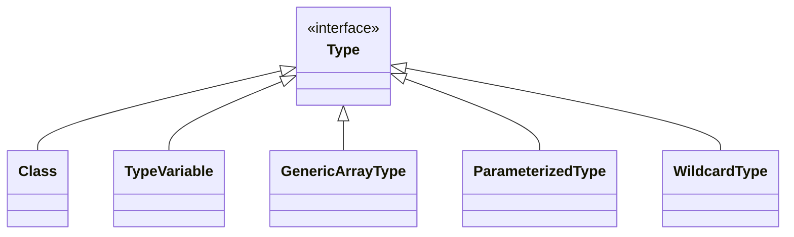

《通用源码阅读指导书：MyBatis源码详解》
-------

运行初探、模块归类、合理猜测、类比阅读、网格阅读等许多源码阅读方法

[《通用源码阅读指导书——MyBatis源码详解》配套示例](https://github.com/yeecode/MyBatisDemo)

[MyBatis中文详尽注释版](https://github.com/yeecode/MyBatisCN)

[作者网站](https://yeecode.top/)

[mybatis-3](https://github.com/mybatis/mybatis-3)

把握一个软件的设计需求和主要功能对于阅读软件的源码很有帮助。

**基础功能包**相对独立，与MyBatis的核心逻辑耦合小，比较适合作为源码阅读的切入点。

源码阅读对知识广度和深度都有较高要求。

掌握源码阅读的方法和技巧，并将这些方法和技巧应用到其他项目的源码阅读工作、系统设计工作、软件开发工作中，这才是阅读本书的最终目的。


## 一、背景介绍

### 1 源码阅读

#### 1.1 源码阅读的意义

**==基础==和==蓝图==之间却有着巨大的知识断层**：我们很容易找到用来夯实基础的入门书籍，也很容易找到用来阐述蓝图的分析文章，却鲜有资料告诉我们如何从基础开始构建出蓝图中的雄伟建筑。

**源码阅读是理解和分析优秀的开源代码，并从中积累和学习的过程。**

- 透彻地理解项目的实现原理；
- 接触到成熟和先进的架构方案；
- 学习到可靠与巧妙的实施技巧；
- 发现自身知识盲点，完善自身知识储备。

#### 1.2 源码阅读的方法

每一个优秀的工程项目都凝聚了众多开发者的缜密思维逻辑；每一个优秀的工程项目都经历了<u>从雏形到成熟的曲折演化过程</u>。最终，这些思维逻辑和演化过程都会投射和堆叠到源码上，使得源码变得复杂和难以理解。因此，==源码阅读的过程是一个通过源码去逆推思维逻辑和演化过程的工作==。

舒适能带来的只是原地踏步。<u>梳理这些凌乱文件、理解这些类型组织、追踪这些逻辑跳转、弄清这些方法变量的痛苦过程</u>，才是真正能让我们获得提升的过程。

一些基本技巧：

- 调式追踪
- 归类总结。优秀的源码都遵循一定的设计规则，这些规则可能是项目间通用的，也可能是项目内独有的。在源码阅读的过程中将这些设计规则总结出来，将会使源码阅读的过程越来越顺畅。
- 上下文整合。有些对象、属性、方法等，仅仅通过自身很难判断其作用和实现。此时可以结合其调用的上下文，查看对象<u>何时被引用、属性怎样被赋值、方法为何被调用</u>，这对于了解它们的作用和实现很有帮助。

有一套支持**代码高亮显示、错误提示、引用跳转、断点调试**等功能的开发工具十分必要。


#### 1.3 一些优秀的Java开源项目

apache/dubbo：一个高性能的远程过程调用框架；

netty/netty：事件驱动的异步网络应用框架；

spring-projects/spring-boot：一套简单易用的 Spring框架；

alibaba/fastjson：一套快速的 JSON解析、生成组件；

apache/kafka：一套实时数据流处理平台；

mybatis/mybatis-3：一套强大的对象关系映射工具。


#### 1.4 mybatis中的文件指代

使用MyBatis时，会涉及三类文件：

##### 1.配置文件（XML）

通常命名为**mybatis-config.xml**，根节点为configuration，根节点包含以下节点信息：

- properties：属性信息，相当于 MyBatis的全局变量。
- settings：设置信息，通过它对 MyBatis的功能进行调整。
- typeAliases：类型别名，在这里可以为类型设置一些简短的名字。
- typeHandlers：类型处理器，在这里可以为不同的类型设置相应的处理器。
- objectFactory：对象工厂，在这里可以指定 MyBatis创建新对象时使用的工厂。
- objectWrapperFactory：对象包装器工厂，在这里可以指定 MyBatis使用的对象包装器工厂。
- reflectorFactory：反射器工厂，在这里可以设置 MyBatis的反射器工厂。
- plugins：插件，在这里可以为 MyBatis 配置差价，从而修改或扩展 MyBatis 的行为。
- environments：环境，这里可以配置 MyBatis运行的环境信息，如数据源信息等。
- databaseIdProvider：数据库编号，在这里可以为不同的数据库配置不同的编号，这样可以对不同类型的数据库设置不同的数据库操作语句。
- mappers：映射文件，在这里可以配置映射文件或映射接口文件的地址。

==注意👆🏻上面节点必须按照这个顺序出现。==

##### 2.映射文件（XML）

用来完成 **Java方法与 SQL语句的映射、Java对象与SQL参数的映射、SQL查询结果与 Java对象的映射**等。跟节点为mapper，根节点包含节点信息：

- cache：缓存，通过它可以对当前命名空间进行缓存配置。
- cache-ref：缓存引用，通过它可以引用其他命名空间的缓存作为当前命名空间的缓存。
- resultMap：结果映射，通过它来配置如何将 SQL查询结果映射为对象。
- parameterMap：参数映射，通过它来配置如何将参数对象映射为 SQL参数。该节点已废弃，建议直接使用内联参数。
- sql：SQL语句片段，通过它来设置可以被复用的语句片段。
- insert：插入语句。
- update：更新语句。
- delete：删除语句。
- select：查询语句。

后面四个节点是**数据库操作节点**。


##### 3.映射接口文件

Java接口文件，并且该接口不需要实现类。通常情况下，每个映射接口文件都有一个同名的映射文件与之相对应。

映射接口文件中定义了一些抽象方法，它们分为两类：

- 第一类抽象方法与对应的映射文件中的数据库操作节点相对应。
- 第二类抽象方法通过注解声明自身的数据库操作语句。当整个接口文件中均为该类抽象方法时，则该映射接口文件可以没有对应的映射文件。

#### 1.5 本书中方法的指代

Java中，常常会针对某一方法重载多个方法，以满足不同的使用需求。本书中使用方法名和参数类型来特指某个方法。

在某些情况下，具有相同方法名的一组方法是为了便于外部调用而重载的，其核心实现逻辑都集中在某一个方法内，其他方法只做了转接适配的工作。

### 2 MyBatis概述

阅读源码之前，先要对项目整体有个全名了解（项目的产生背景、演进过程、使用方法等）

#### 2.1 背景介绍

##### 传统数据库连接

```java
// 1
Class.forName("com.mysql.cj.jdbc.Driver");
// 2
Connection conn = DriverManager.getConnection("jdbc:mysql://127.0.0.1:3306/jdbc?useSSL=false&useUnicode=true&characterEncoding=UTF-8&allowPublicKeyRetrieval=true", "root", "iop654321");
// 3
Statement statement = conn.createStatement();
ResultSet resultSet = statement.executeQuery("Select * From users");
// 4
List<User> userList = new ArrayList<>();
while (resultSet.next()) {
  User user = new User();
  user.setId(resultSet.getLong("id"));
  user.setName(resultSet.getString("name"));
  user.setName(resultSet.getString("password"));
  user.setEmail(resultSet.getString("email"));
  user.setBirthday(resultSet.getDate("birthday"));
  userList.add(user);
  System.out.println(user);
}
// 5
conn.close();
```

过程：

1. 加载驱动程序
2. 获得数据库连接
3. 创建语句并执行
4. 处理数据库操作结果
5. 关闭连接

第一、二、五步的工作是相对固定的，可以通过封装函数进行统一操作；而第三、四步的操作却因为涉及的输入参数和输出参数的 Java对象不同而很难将其统一起来。

ORM框架就为了解决上述问题而产生。


##### ORM框架

面向对象是在**软件工程原则**（如聚合、封装）的基础上发展起来的，而关系型数据库则是在**数学理论**（集合代数等）的基础上发展起来的，两者并不是完全匹配的，它们中间需要信息的转化。


这样的转化称为==对象关系映射==（Object Relational Mapping，简称ORM）。ORM 会在数据库数据的读取和写入操作过程中频繁发生，为了降低这种转化过程的开发成本，产生了大量的 ORM框架，MyBatis就是其中非常出色的一款。


##### MyBatis的特点

大多数 ORM框架选择将 Java对象和数据表直接关联起来，用一组对应关系将两者绑定在一起。


MyBatis则采取了另一种方式，它没有将 Java对象和数据表直接关联起来，而是将**Java方法和 SQL语句关联**起来。


这样只要**调用一个方法就可以执行一条复杂的 SQL语句**。在调用方法时可以给方法传递对象作为 SQL语句的参数，而 SQL语句的执行结果也会被映射成对象后返回。因此，关系型数据库被 MyBatis屏蔽了，读写数据库的过程成了一个纯粹的面向对象的过程。

除核心映射功能外，MyBatis 还提供了<u>缓存功能、懒加载功能、主键自增功能、多数据集处理功能</u>等。

#### 2.2 快速上手

建立SpringBoot项目，简单使用Mybatis。


#### 2.3 MyBatis的核心功能分析

```java
List<User> userList = userMapper.queryUserBySchoolName(userParam)
```

不包含 SQL语句，接收的参数是 Java对象，输出的结果是 Java对象列表。

MyBatis完成了下面的映射关系

- 映射文件中的SQL语句与映射接口的抽象方法建立了映射。
- SQL语句的输入参数与方法输入参数建立了映射。
- SQL语句的输出结果与方法结果建立了映射。


mybatis的主要工作：

- 将包含 if等标签的复杂数据库操作语句解析为纯粹的 SQL语句。
- 将数据库操作节点和映射接口中的抽象方法进行绑定，在抽象方法被调用时执行数据库操作。
- 将输入参数对象转化为数据库操作语句中的参数。
- 将数据库操作语句的返回结果转化为对象。

> 阅读源码的策略：**找出软件项目的核心功能，重点关注与核心功能相关的代码。**

### 3 MyBatis运行初探

在追踪的过程中要抓大放小，重点关注与项目核心功能相关的部分，忽略一些细枝末节的代码。

搭建一个纯粹的MyBatis项目。

```xml
<?xml version="1.0" encoding="UTF-8" ?>
<!DOCTYPE configuration
        PUBLIC "-//mybatis.org//DTD Config 3.0//EN"
        "http://mybatis.org/dtd/mybatis-3-config.dtd">

<configuration>
    <settings>
        
    </settings>
		...
</configuration>
```

```java
				// 第一阶段：mybatis初始化
        String resource = "mybatis-config.xml";
        InputStream inputStream = null;
        try {
            inputStream = Resources.getResourceAsStream(resource);
        } catch (IOException e) {
            e.printStackTrace();
        }
        SqlSessionFactory sqlSessionFactory = new SqlSessionFactoryBuilder().build(inputStream);

        // 第二阶段：数据读写阶段
        try (SqlSession session = sqlSessionFactory.openSession()) {
            UserMapper userMapper = session.getMapper(UserMapper.class);
            List<User> userList = userMapper.getUserList();
            for (User user : userList) {
                System.out.println(user);
            }
        }
```


#### 3.1 初始化阶段追踪

主要用来完成配置文件的解析、数据库的连接等工作。


负责读写外部文件：

```
org.apache.ibatis.io.Resources
org.apache.ibatis.io.ClassLoaderWrapper
```

```java
  InputStream getResourceAsStream(String resource, ClassLoader[] classLoader) {
    for (ClassLoader cl : classLoader) {
      if (null != cl) {

        // try to find the resource as passed
        InputStream returnValue = cl.getResourceAsStream(resource);

        // now, some class loaders want this leading "/", so we'll add it and try again if we didn't find the resource
        if (null == returnValue) {
          returnValue = cl.getResourceAsStream("/" + resource);
        }

        if (null != returnValue) {
          return returnValue;
        }
      }
    }
    return null;
  }
```

一般情况下，类加载器会将名称转换为文件名，然后从文件系统中读取该名称的类文件。因此，类加载器具有读取外部资源的能力，这里要借助的正是类加载器的这种能力。

##### 配置信息读取

SqlSessionFactoryBuilder类中build的核心方法：

```java
  public SqlSessionFactory build(InputStream inputStream, String environment, Properties properties) {
    try {
      XMLConfigBuilder parser = new XMLConfigBuilder(inputStream, environment, properties);
      return build(parser.parse());
    } catch (Exception e) {
      throw ExceptionFactory.wrapException("Error building SqlSession.", e);
    } finally {
      ErrorContext.instance().reset();
      try {
        inputStream.close();
      } catch (IOException e) {
        // Intentionally ignore. Prefer previous error.
      }
    }
  }
```

XMLConfigBuilder对象的parse方法会得到一个**==Configuration对象==**：

```java
  public Configuration parse() {
    if (parsed) {
      throw new BuilderException("Each XMLConfigBuilder can only be used once.");
    }
    parsed = true;
    parseConfiguration(parser.evalNode("/configuration"));
    return configuration;
  }
```

“/configuration”是整个配置文件的根节点，上面的就是解析配置文件的入口。

parseConfiguration方法是解析配置文件的起始方法：

```java
  private void parseConfiguration(XNode root) {
    try {
      //issue #117 read properties first
      propertiesElement(root.evalNode("properties"));
      Properties settings = settingsAsProperties(root.evalNode("settings"));
      loadCustomVfs(settings);
      loadCustomLogImpl(settings);
      typeAliasesElement(root.evalNode("typeAliases"));
      pluginElement(root.evalNode("plugins"));
      objectFactoryElement(root.evalNode("objectFactory"));
      objectWrapperFactoryElement(root.evalNode("objectWrapperFactory"));
      reflectorFactoryElement(root.evalNode("reflectorFactory"));
      settingsElement(settings);
      // read it after objectFactory and objectWrapperFactory issue #631
      environmentsElement(root.evalNode("environments"));
      databaseIdProviderElement(root.evalNode("databaseIdProvider"));
      typeHandlerElement(root.evalNode("typeHandlers"));
      mapperElement(root.evalNode("mappers"));
    } catch (Exception e) {
      throw new BuilderException("Error parsing SQL Mapper Configuration. Cause: " + e, e);
    }
  }
```

parseConfiguration方法依次解析了配置文件 configuration节点下的各个子节点，包括关联了所有的映射文件的 mappers子节点。每个方法解析的结果都会保存到`Configuration`类的实例中。`Configuration`类中保存了配置文件的所有配置信息，也保存了映射文件的信息。

最终，通过 XMLConfigBuilder 对象的 parse 方法获得了 Configuration 对象后，SqlSessionFactoryBuilder 自身的 build 方法接受 Configuration 对象为参数，返回了SqlSessionFactory对象。

初始化阶段，mybatis的主要工作如下：

- 根据配置文件的位置，获取它的输入流 InputStream。
- 从配置文件的根节点开始，逐层解析配置文件，也包括相关的映射文件。解析过程中不断将解析结果放入 Configuration对象。
- 以配置好的 Configuration对象为参数，获取一个 SqlSessionFactory对象。

#### 3.2 数据读写阶段追踪

##### 获得SqlSession

DefaultSqlSessionFactory 中的openSessionFromDataSource方法是生成 SqlSession的核心代码：

```java
  private SqlSession openSessionFromDataSource(ExecutorType execType, TransactionIsolationLevel level, boolean autoCommit) {
    Transaction tx = null;
    try {
      final Environment environment = configuration.getEnvironment();
      final TransactionFactory transactionFactory = getTransactionFactoryFromEnvironment(environment);
      tx = transactionFactory.newTransaction(environment.getDataSource(), level, autoCommit);
      final Executor executor = configuration.newExecutor(tx, execType);
      return new DefaultSqlSession(configuration, executor, autoCommit);
    } catch (Exception e) {
      closeTransaction(tx); // may have fetched a connection so lets call close()
      throw ExceptionFactory.wrapException("Error opening session.  Cause: " + e, e);
    } finally {
      ErrorContext.instance().reset();
    }
  }
```

Configuration对象中存储的设置信息被用来创建各种对象，包括<u>事务工厂TransactionFactory、执行器 Executor及默认的DefaultSqlSession</u>。

DefaultSqlSession 类提供了查询、增加、更新、删除、提交、回滚等大量的方法。

##### 映射接口文件与映射文件的绑定

`session.getMapper(UserMapper.class)`最终进入MapperRegistry类中的getMapper方法：

```java
  public <T> T getMapper(Class<T> type, SqlSession sqlSession) {
    final MapperProxyFactory<T> mapperProxyFactory = (MapperProxyFactory<T>) knownMappers.get(type);
    if (mapperProxyFactory == null) {
      throw new BindingException("Type " + type + " is not known to the MapperRegistry.");
    }
    try {
      return mapperProxyFactory.newInstance(sqlSession);
    } catch (Exception e) {
      throw new BindingException("Error getting mapper instance. Cause: " + e, e);
    }
  }
```

这个getMapper方法通过映射接口信息从所有已经解析的映射文件中找到对应的映射文件，然后根据该映射文件组建并返回接口的一个实现对象。

##### 映射接口的代理

`mapperProxyFactory.newInstance(sqlSession)`：

```java
  protected T newInstance(MapperProxy<T> mapperProxy) {
    return (T) Proxy.newProxyInstance(mapperInterface.getClassLoader(), new Class[] { mapperInterface }, mapperProxy);
  }
```

基于反射的动态代理对象，MapperProxy类的invoke方法：

```java
  /*
  代理方法：
  proxy 代理对象
  method 代理方法
  args 代理方法的参数
  
  */
	@Override
  public Object invoke(Object proxy, Method method, Object[] args) throws Throwable {
    try {
      if (Object.class.equals(method.getDeclaringClass())) {
        return method.invoke(this, args);
      } else if (method.isDefault()) {
        return invokeDefaultMethod(proxy, method, args);
      }
    } catch (Throwable t) {
      throw ExceptionUtil.unwrapThrowable(t);
    }
    final MapperMethod mapperMethod = cachedMapperMethod(method);
    return mapperMethod.execute(sqlSession, args);
  }
```

这样的`userMapper.getUserList()`调用接口的数据库操作，会触发`MapperMethod`对象的execute方法：

```
```

根据不同数据库操作类型调用了不同的处理方法。

紧接着`MapperMethod`的executeForMany方法中，通过DefaultSqlSession对象的selectList方法开展后续的查询工作。

##### SQL语句的查找

```java
  @Override
  public <E> List<E> selectList(String statement, Object parameter, RowBounds rowBounds) {
    try {
      MappedStatement ms = configuration.getMappedStatement(statement);
      return executor.query(ms, wrapCollection(parameter), rowBounds, Executor.NO_RESULT_HANDLER);
    } catch (Exception e) {
      throw ExceptionFactory.wrapException("Error querying database.  Cause: " + e, e);
    } finally {
      ErrorContext.instance().reset();
    }
  }
```

每个 MappedStatement 对象对应了我们设置的一个数据库操作节点，它主要定义了数据库操作语句、输入/输出参数等信息。

##### 查询结果缓存

CachingExecutor类的query方法：

```java
  @Override
  public <E> List<E> query(MappedStatement ms, Object parameterObject, RowBounds rowBounds, ResultHandler resultHandler) throws SQLException {
    BoundSql boundSql = ms.getBoundSql(parameterObject);
    CacheKey key = createCacheKey(ms, parameterObject, rowBounds, boundSql);
    return query(ms, parameterObject, rowBounds, resultHandler, key, boundSql);
  }

	@Override
  public <E> List<E> query(MappedStatement ms, Object parameterObject, RowBounds rowBounds, ResultHandler resultHandler, CacheKey key, BoundSql boundSql)
      throws SQLException {
    Cache cache = ms.getCache();
    if (cache != null) {
      flushCacheIfRequired(ms);
      if (ms.isUseCache() && resultHandler == null) {
        ensureNoOutParams(ms, boundSql);
        @SuppressWarnings("unchecked")
        List<E> list = (List<E>) tcm.getObject(cache, key);
        if (list == null) {
          list = delegate.query(ms, parameterObject, rowBounds, resultHandler, key, boundSql);
          tcm.putObject(cache, key, list); // issue #578 and #116
        }
        return list;
      }
    }
    return delegate.query(ms, parameterObject, rowBounds, resultHandler, key, boundSql);
  }
```

BoundSql是经过层层转化后去除掉 if、where等标签的 SQL语句，而 CacheKey是为该次查询操作计算出来的缓存键。

如果缓存命中，则从缓存中获取数据结果；否则，便通过 delegate调用 query方法。

##### 数据库查询

BaseExecutor类中的 query方法  -> queryFromDatabase方法

-> SimpleExecutor类的doQuery方法

-> PreparedStatementHandler类（实现接口StatementHandler）的query方法

```java
  @Override
  public <E> List<E> query(Statement statement, ResultHandler resultHandler) throws SQLException {
    PreparedStatement ps = (PreparedStatement) statement;
    ps.execute();
    return resultSetHandler.handleResultSets(ps);
  }
```

至此`ps.execute();`，不再由mybatis负责，由 com.mysql.cj.jdbc包中的类负责。

> 不同类型的数据库，负责执行ps.execute()的包会不同。

查询完成之后的结果放在 PreparedStatement对象，通过调试工具可以看到其中包含了这次查询得到的数据库字段信息、数据记录信息等。

> 结果在PreparedStatement对象中层级比较深，`ps>statement>results`：
>
> 
>
> columnDefinition是数据库字段信息；rowData是查询出数据记录信息。

查询整个流程关键步骤：

- 在进行数据库查询前，先查询缓存；如果确实需要查询数据库，则数据库查询之后的结果也放入缓存中。
- SQL 语句的执行经过了层层转化，依次经过了 MappedStatement 对象、Statement对象和 PreparedStatement对象，最后才得以执行。
- 最终数据库查询得到的结果交给 ResultHandler对象处理。

##### 处理结果集

ResultHandler是**结果处理器**，结果的处理是ResultHandler接口的实现类DefaultResultSetHandler中：

```java
  @Override
  public List<Object> handleResultSets(Statement stmt) throws SQLException {
    ErrorContext.instance().activity("handling results").object(mappedStatement.getId());

    final List<Object> multipleResults = new ArrayList<>();

    int resultSetCount = 0;
    ResultSetWrapper rsw = getFirstResultSet(stmt);

    List<ResultMap> resultMaps = mappedStatement.getResultMaps();
    int resultMapCount = resultMaps.size();
    validateResultMapsCount(rsw, resultMapCount);
    while (rsw != null && resultMapCount > resultSetCount) {
      ResultMap resultMap = resultMaps.get(resultSetCount);
      handleResultSet(rsw, resultMap, multipleResults, null);
      rsw = getNextResultSet(stmt);
      cleanUpAfterHandlingResultSet();
      resultSetCount++;
    }
    
    String[] resultSets = mappedStatement.getResultSets();
    if (resultSets != null) {
      while (rsw != null && resultSetCount < resultSets.length) {
        ResultMapping parentMapping = nextResultMaps.get(resultSets[resultSetCount]);
        if (parentMapping != null) {
          String nestedResultMapId = parentMapping.getNestedResultMapId();
          ResultMap resultMap = configuration.getResultMap(nestedResultMapId);
          handleResultSet(rsw, resultMap, null, parentMapping);
        }
        rsw = getNextResultSet(stmt);
        cleanUpAfterHandlingResultSet();
        resultSetCount++;
      }
    }
```

> MyBatis如何将数据库输出的记录转化为对象列表？

整个过程非常长，在 DefaultResultSetHandler 的方法中进行了多次跳转：


- createResultObject方法创建了输出结果对象。在示例中，为 User对象。
- applyAutomaticMappings 方法：在自动属性映射功能开启的情况下，该方法将数据记录的值赋给输出结果对象。
-  applyPropertyMappings方法：该方法按照用户的映射设置，给输出结果对象的属性赋值。

基本思路就是**循环遍历每个属性**，然后调用“metaObject.setValue（mapping.property，value）”语句为属性赋值。

经过以上过程，数据库输出的记录被转化为了对象列表。

##### 总结

这个阶段mybatis工作汇总：

- 建立连接数据库的 SqlSession。
- 查找当前映射接口中抽象方法对应的数据库操作节点，根据该节点生成接口的实现。
- 接口的实现拦截对映射接口中抽象方法的调用，并将其转化为数据查询操作。
- 对数据库操作节点中的数据库操作语句进行多次处理，最终得到标准的 SQL语句。
- 尝试从缓存中查找操作结果，如果找到则返回；如果找不到则继续从数据库中查询。
- 从数据库中查询结果。
- 处理结果集。
  - 建立输出对象；
  - 根据输出结果对输出对象的属性赋值。
- 在缓存中记录查询结果。
- 返回查询结果。


### 4 MyBatis源码结构

#### 包结构


#### 分组


按照包的功能大致划分（各个包的类、方式实际是互相关联、交织的）：

- 基础功能包：这些包用来为其他包提供一些外围基础功能，如文件读取功能、反射操作功能等。这些包的特点是功能相对独立，与业务逻辑耦合小。
- 配置解析包：这些包用来完成配置解析、存储等工作。这些包中的方法主要在系统初始化阶段运行。
- 核心操作包：这些包用来完成数据库操作。在工作过程中，这些包可能会依赖基础功能包提供的基础功能和配置解析包提供的配置信息。这些包中的方法主要在数据库操作阶段运行。

源码阅读过程中有一个非常重要的技巧，那就是从整个项目的<u>外围源码入手</u>。外围源码很少依赖核心源码，相对独立。先阅读外围源码，受到其他未阅读部分的干扰较小；核心源码大量依赖外围源码。


## 二、基础功能包源码阅读




```mermaid
```

### 5 exceptions包

