《通用源码阅读指导书：MyBatis源码详解》
-------

运行初探、模块归类、合理猜测、类比阅读、网格阅读等许多源码阅读方法

[《通用源码阅读指导书——MyBatis源码详解》配套示例](https://github.com/yeecode/MyBatisDemo)

[MyBatis中文详尽注释版](https://github.com/yeecode/MyBatisCN)

[作者网站](https://yeecode.top/)

[mybatis-3](https://github.com/mybatis/mybatis-3)

把握一个软件的设计需求和主要功能对于阅读软件的源码很有帮助。

**基础功能包**相对独立，与MyBatis的核心逻辑耦合小，比较适合作为源码阅读的切入点。

源码阅读对知识广度和深度都有较高要求。

掌握源码阅读的方法和技巧，并将这些方法和技巧应用到其他项目的源码阅读工作、系统设计工作、软件开发工作中，这才是阅读本书的最终目的。


## 一、背景介绍

### 1 源码阅读

#### 1.1 源码阅读的意义

**==基础==和==蓝图==之间却有着巨大的知识断层**：我们很容易找到用来夯实基础的入门书籍，也很容易找到用来阐述蓝图的分析文章，却鲜有资料告诉我们如何从基础开始构建出蓝图中的雄伟建筑。

**源码阅读是理解和分析优秀的开源代码，并从中积累和学习的过程。**

- 透彻地理解项目的实现原理；
- 接触到成熟和先进的架构方案；
- 学习到可靠与巧妙的实施技巧；
- 发现自身知识盲点，完善自身知识储备。

#### 1.2 源码阅读的方法

每一个优秀的工程项目都凝聚了众多开发者的缜密思维逻辑；每一个优秀的工程项目都经历了<u>从雏形到成熟的曲折演化过程</u>。最终，这些思维逻辑和演化过程都会投射和堆叠到源码上，使得源码变得复杂和难以理解。因此，==源码阅读的过程是一个通过源码去逆推思维逻辑和演化过程的工作==。

舒适能带来的只是原地踏步。<u>梳理这些凌乱文件、理解这些类型组织、追踪这些逻辑跳转、弄清这些方法变量的痛苦过程</u>，才是真正能让我们获得提升的过程。

一些基本技巧：

- 调式追踪
- 归类总结。优秀的源码都遵循一定的设计规则，这些规则可能是项目间通用的，也可能是项目内独有的。在源码阅读的过程中将这些设计规则总结出来，将会使源码阅读的过程越来越顺畅。
- 上下文整合。有些对象、属性、方法等，仅仅通过自身很难判断其作用和实现。此时可以结合其调用的上下文，查看对象<u>何时被引用、属性怎样被赋值、方法为何被调用</u>，这对于了解它们的作用和实现很有帮助。

有一套支持**代码高亮显示、错误提示、引用跳转、断点调试**等功能的开发工具十分必要。


#### 1.3 一些优秀的Java开源项目

apache/dubbo：一个高性能的远程过程调用框架；

netty/netty：事件驱动的异步网络应用框架；

spring-projects/spring-boot：一套简单易用的 Spring框架；

alibaba/fastjson：一套快速的 JSON解析、生成组件；

apache/kafka：一套实时数据流处理平台；

mybatis/mybatis-3：一套强大的对象关系映射工具。


#### 1.4 mybatis中的文件指代

使用MyBatis时，会涉及三类文件：

##### 1.配置文件（XML）

通常命名为**mybatis-config.xml**，根节点为configuration，根节点包含以下节点信息：

- properties：属性信息，相当于 MyBatis的全局变量。
- settings：设置信息，通过它对 MyBatis的功能进行调整。
- typeAliases：类型别名，在这里可以为类型设置一些简短的名字。
- typeHandlers：类型处理器，在这里可以为不同的类型设置相应的处理器。
- objectFactory：对象工厂，在这里可以指定 MyBatis创建新对象时使用的工厂。
- objectWrapperFactory：对象包装器工厂，在这里可以指定 MyBatis使用的对象包装器工厂。
- reflectorFactory：反射器工厂，在这里可以设置 MyBatis的反射器工厂。
- plugins：插件，在这里可以为 MyBatis 配置差价，从而修改或扩展 MyBatis 的行为。
- environments：环境，这里可以配置 MyBatis运行的环境信息，如数据源信息等。
- databaseIdProvider：数据库编号，在这里可以为不同的数据库配置不同的编号，这样可以对不同类型的数据库设置不同的数据库操作语句。
- mappers：映射文件，在这里可以配置映射文件或映射接口文件的地址。

==注意👆🏻上面节点必须按照这个顺序出现。==

##### 2.映射文件（XML）

用来完成 **Java方法与 SQL语句的映射、Java对象与SQL参数的映射、SQL查询结果与 Java对象的映射**等。跟节点为mapper，根节点包含节点信息：

- cache：缓存，通过它可以对当前命名空间进行缓存配置。
- cache-ref：缓存引用，通过它可以引用其他命名空间的缓存作为当前命名空间的缓存。
- resultMap：结果映射，通过它来配置如何将 SQL查询结果映射为对象。
- parameterMap：参数映射，通过它来配置如何将参数对象映射为 SQL参数。该节点已废弃，建议直接使用内联参数。
- sql：SQL语句片段，通过它来设置可以被复用的语句片段。
- insert：插入语句。
- update：更新语句。
- delete：删除语句。
- select：查询语句。

后面四个节点是**数据库操作节点**。

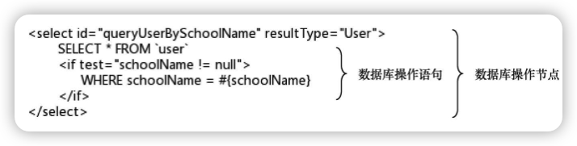

##### 3.映射接口文件

Java接口文件，并且该接口不需要实现类。通常情况下，每个映射接口文件都有一个同名的映射文件与之相对应。

映射接口文件中定义了一些抽象方法，它们分为两类：

- 第一类抽象方法与对应的映射文件中的数据库操作节点相对应。
- 第二类抽象方法通过注解声明自身的数据库操作语句。当整个接口文件中均为该类抽象方法时，则该映射接口文件可以没有对应的映射文件。

#### 1.5 本书中方法的指代

Java中，常常会针对某一方法重载多个方法，以满足不同的使用需求。本书中使用方法名和参数类型来特指某个方法。

在某些情况下，具有相同方法名的一组方法是为了便于外部调用而重载的，其核心实现逻辑都集中在某一个方法内，其他方法只做了转接适配的工作。

### 2 MyBatis概述

阅读源码之前，先要对项目整体有个全名了解（项目的产生背景、演进过程、使用方法等）

#### 2.1 背景介绍

##### 传统数据库连接

```java
// 1
Class.forName("com.mysql.cj.jdbc.Driver");
// 2
Connection conn = DriverManager.getConnection("jdbc:mysql://127.0.0.1:3306/jdbc?useSSL=false&useUnicode=true&characterEncoding=UTF-8&allowPublicKeyRetrieval=true", "root", "iop654321");
// 3
Statement statement = conn.createStatement();
ResultSet resultSet = statement.executeQuery("Select * From users");
// 4
List<User> userList = new ArrayList<>();
while (resultSet.next()) {
  User user = new User();
  user.setId(resultSet.getLong("id"));
  user.setName(resultSet.getString("name"));
  user.setName(resultSet.getString("password"));
  user.setEmail(resultSet.getString("email"));
  user.setBirthday(resultSet.getDate("birthday"));
  userList.add(user);
  System.out.println(user);
}
// 5
conn.close();
```

过程：

1. 加载驱动程序
2. 获得数据库连接
3. 创建语句并执行
4. 处理数据库操作结果
5. 关闭连接

第一、二、五步的工作是相对固定的，可以通过封装函数进行统一操作；而第三、四步的操作却因为涉及的输入参数和输出参数的 Java对象不同而很难将其统一起来。

ORM框架就为了解决上述问题而产生。


##### ORM框架

面向对象是在**软件工程原则**（如聚合、封装）的基础上发展起来的，而关系型数据库则是在**数学理论**（集合代数等）的基础上发展起来的，两者并不是完全匹配的，它们中间需要信息的转化。

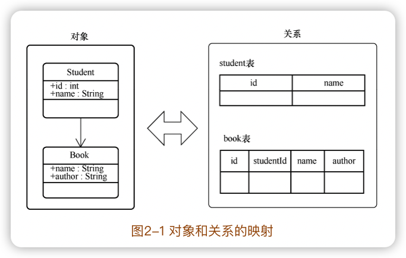

这样的转化称为==对象关系映射==（Object Relational Mapping，简称ORM）。ORM 会在数据库数据的读取和写入操作过程中频繁发生，为了降低这种转化过程的开发成本，产生了大量的 ORM框架，MyBatis就是其中非常出色的一款。


##### MyBatis的特点

大多数 ORM框架选择将 Java对象和数据表直接关联起来，用一组对应关系将两者绑定在一起。

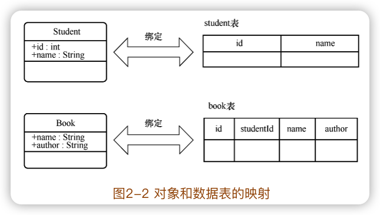

MyBatis则采取了另一种方式，它没有将 Java对象和数据表直接关联起来，而是将**Java方法和 SQL语句关联**起来。

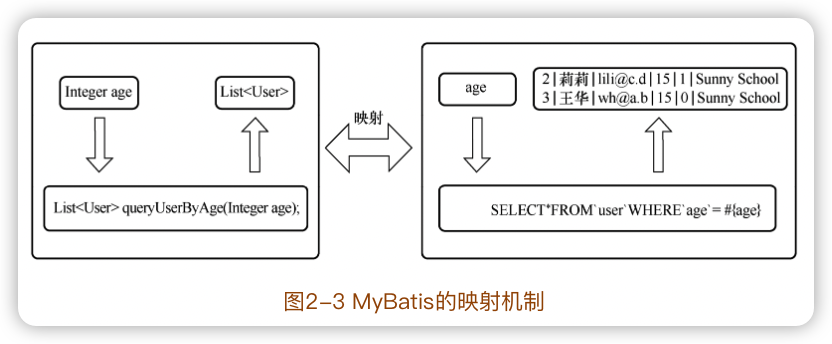

这样只要**调用一个方法就可以执行一条复杂的 SQL语句**。在调用方法时可以给方法传递对象作为 SQL语句的参数，而 SQL语句的执行结果也会被映射成对象后返回。因此，关系型数据库被 MyBatis屏蔽了，读写数据库的过程成了一个纯粹的面向对象的过程。

除核心映射功能外，MyBatis 还提供了<u>缓存功能、懒加载功能、主键自增功能、多数据集处理功能</u>等。

#### 2.2 快速上手

建立SpringBoot项目，简单使用Mybatis。


#### 2.3 MyBatis的核心功能分析

```java
List<User> userList = userMapper.queryUserBySchoolName(userParam)
```

不包含 SQL语句，接收的参数是 Java对象，输出的结果是 Java对象列表。

MyBatis完成了下面的映射关系

- 映射文件中的SQL语句与映射接口的抽象方法建立了映射。
- SQL语句的输入参数与方法输入参数建立了映射。
- SQL语句的输出结果与方法结果建立了映射。

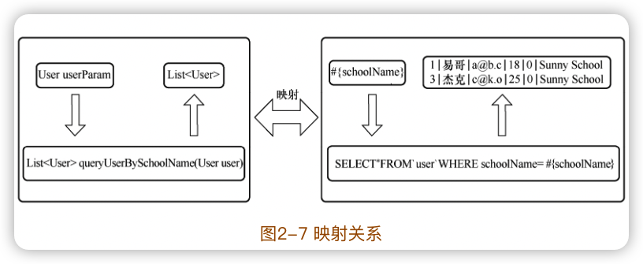

mybatis的主要工作：

- 将包含 if等标签的复杂数据库操作语句解析为纯粹的 SQL语句。
- 将数据库操作节点和映射接口中的抽象方法进行绑定，在抽象方法被调用时执行数据库操作。
- 将输入参数对象转化为数据库操作语句中的参数。
- 将数据库操作语句的返回结果转化为对象。

> 阅读源码的策略：**找出软件项目的核心功能，重点关注与核心功能相关的代码。**

### 3 MyBatis运行初探

在追踪的过程中要抓大放小，重点关注与项目核心功能相关的部分，忽略一些细枝末节的代码。

搭建一个纯粹的MyBatis项目。

```xml
<?xml version="1.0" encoding="UTF-8" ?>
<!DOCTYPE configuration
        PUBLIC "-//mybatis.org//DTD Config 3.0//EN"
        "http://mybatis.org/dtd/mybatis-3-config.dtd">

<configuration>
    <settings>
        
    </settings>
		...
</configuration>
```

```java
				// 第一阶段：mybatis初始化
        String resource = "mybatis-config.xml";
        InputStream inputStream = null;
        try {
            inputStream = Resources.getResourceAsStream(resource);
        } catch (IOException e) {
            e.printStackTrace();
        }
        SqlSessionFactory sqlSessionFactory = new SqlSessionFactoryBuilder().build(inputStream);

        // 第二阶段：数据读写阶段
        try (SqlSession session = sqlSessionFactory.openSession()) {
            UserMapper userMapper = session.getMapper(UserMapper.class);
            List<User> userList = userMapper.getUserList();
            for (User user : userList) {
                System.out.println(user);
            }
        }
```


#### 3.1 初始化阶段追踪

主要用来完成配置文件的解析、数据库的连接等工作。


负责读写外部文件：

```
org.apache.ibatis.io.Resources
org.apache.ibatis.io.ClassLoaderWrapper
```

```java
  InputStream getResourceAsStream(String resource, ClassLoader[] classLoader) {
    for (ClassLoader cl : classLoader) {
      if (null != cl) {

        // try to find the resource as passed
        InputStream returnValue = cl.getResourceAsStream(resource);

        // now, some class loaders want this leading "/", so we'll add it and try again if we didn't find the resource
        if (null == returnValue) {
          returnValue = cl.getResourceAsStream("/" + resource);
        }

        if (null != returnValue) {
          return returnValue;
        }
      }
    }
    return null;
  }
```

一般情况下，类加载器会将名称转换为文件名，然后从文件系统中读取该名称的类文件。因此，类加载器具有读取外部资源的能力，这里要借助的正是类加载器的这种能力。

##### 配置信息读取

SqlSessionFactoryBuilder类中build的核心方法：

```java
  public SqlSessionFactory build(InputStream inputStream, String environment, Properties properties) {
    try {
      XMLConfigBuilder parser = new XMLConfigBuilder(inputStream, environment, properties);
      return build(parser.parse());
    } catch (Exception e) {
      throw ExceptionFactory.wrapException("Error building SqlSession.", e);
    } finally {
      ErrorContext.instance().reset();
      try {
        inputStream.close();
      } catch (IOException e) {
        // Intentionally ignore. Prefer previous error.
      }
    }
  }
```

XMLConfigBuilder对象的parse方法会得到一个**==Configuration对象==**：

```java
  public Configuration parse() {
    if (parsed) {
      throw new BuilderException("Each XMLConfigBuilder can only be used once.");
    }
    parsed = true;
    parseConfiguration(parser.evalNode("/configuration"));
    return configuration;
  }
```

“/configuration”是整个配置文件的根节点，上面的就是解析配置文件的入口。

parseConfiguration方法是解析配置文件的起始方法：

```java
  private void parseConfiguration(XNode root) {
    try {
      //issue #117 read properties first
      propertiesElement(root.evalNode("properties"));
      Properties settings = settingsAsProperties(root.evalNode("settings"));
      loadCustomVfs(settings);
      loadCustomLogImpl(settings);
      typeAliasesElement(root.evalNode("typeAliases"));
      pluginElement(root.evalNode("plugins"));
      objectFactoryElement(root.evalNode("objectFactory"));
      objectWrapperFactoryElement(root.evalNode("objectWrapperFactory"));
      reflectorFactoryElement(root.evalNode("reflectorFactory"));
      settingsElement(settings);
      // read it after objectFactory and objectWrapperFactory issue #631
      environmentsElement(root.evalNode("environments"));
      databaseIdProviderElement(root.evalNode("databaseIdProvider"));
      typeHandlerElement(root.evalNode("typeHandlers"));
      mapperElement(root.evalNode("mappers"));
    } catch (Exception e) {
      throw new BuilderException("Error parsing SQL Mapper Configuration. Cause: " + e, e);
    }
  }
```

parseConfiguration方法依次解析了配置文件 configuration节点下的各个子节点，包括关联了所有的映射文件的 mappers子节点。每个方法解析的结果都会保存到`Configuration`类的实例中。`Configuration`类中保存了配置文件的所有配置信息，也保存了映射文件的信息。

最终，通过 XMLConfigBuilder 对象的 parse 方法获得了 Configuration 对象后，SqlSessionFactoryBuilder 自身的 build 方法接受 Configuration 对象为参数，返回了SqlSessionFactory对象。

初始化阶段，mybatis的主要工作如下：

- 根据配置文件的位置，获取它的输入流 InputStream。
- 从配置文件的根节点开始，逐层解析配置文件，也包括相关的映射文件。解析过程中不断将解析结果放入 Configuration对象。
- 以配置好的 Configuration对象为参数，获取一个 SqlSessionFactory对象。

#### 3.2 数据读写阶段追踪

##### 获得SqlSession

DefaultSqlSessionFactory 中的openSessionFromDataSource方法是生成 SqlSession的核心代码：

```java
  private SqlSession openSessionFromDataSource(ExecutorType execType, TransactionIsolationLevel level, boolean autoCommit) {
    Transaction tx = null;
    try {
      final Environment environment = configuration.getEnvironment();
      final TransactionFactory transactionFactory = getTransactionFactoryFromEnvironment(environment);
      tx = transactionFactory.newTransaction(environment.getDataSource(), level, autoCommit);
      final Executor executor = configuration.newExecutor(tx, execType);
      return new DefaultSqlSession(configuration, executor, autoCommit);
    } catch (Exception e) {
      closeTransaction(tx); // may have fetched a connection so lets call close()
      throw ExceptionFactory.wrapException("Error opening session.  Cause: " + e, e);
    } finally {
      ErrorContext.instance().reset();
    }
  }
```

Configuration对象中存储的设置信息被用来创建各种对象，包括<u>事务工厂TransactionFactory、执行器 Executor及默认的DefaultSqlSession</u>。

DefaultSqlSession 类提供了查询、增加、更新、删除、提交、回滚等大量的方法。

##### 映射接口文件与映射文件的绑定

`session.getMapper(UserMapper.class)`最终进入MapperRegistry类中的getMapper方法：

```java
  public <T> T getMapper(Class<T> type, SqlSession sqlSession) {
    final MapperProxyFactory<T> mapperProxyFactory = (MapperProxyFactory<T>) knownMappers.get(type);
    if (mapperProxyFactory == null) {
      throw new BindingException("Type " + type + " is not known to the MapperRegistry.");
    }
    try {
      return mapperProxyFactory.newInstance(sqlSession);
    } catch (Exception e) {
      throw new BindingException("Error getting mapper instance. Cause: " + e, e);
    }
  }
```

这个getMapper方法通过映射接口信息从所有已经解析的映射文件中找到对应的映射文件，然后根据该映射文件组建并返回接口的一个实现对象。

##### 映射接口的代理

`mapperProxyFactory.newInstance(sqlSession)`：

```java
  protected T newInstance(MapperProxy<T> mapperProxy) {
    return (T) Proxy.newProxyInstance(mapperInterface.getClassLoader(), new Class[] { mapperInterface }, mapperProxy);
  }
```

基于反射的动态代理对象，MapperProxy类的invoke方法：

```java
  /*
  代理方法：
  proxy 代理对象
  method 代理方法
  args 代理方法的参数
  
  */
	@Override
  public Object invoke(Object proxy, Method method, Object[] args) throws Throwable {
    try {
      if (Object.class.equals(method.getDeclaringClass())) {
        return method.invoke(this, args);
      } else if (method.isDefault()) {
        return invokeDefaultMethod(proxy, method, args);
      }
    } catch (Throwable t) {
      throw ExceptionUtil.unwrapThrowable(t);
    }
    final MapperMethod mapperMethod = cachedMapperMethod(method);
    return mapperMethod.execute(sqlSession, args);
  }
```

这样的`userMapper.getUserList()`调用接口的数据库操作，会触发`MapperMethod`对象的execute方法：

```
```

根据不同数据库操作类型调用了不同的处理方法。

紧接着`MapperMethod`的executeForMany方法中，通过DefaultSqlSession对象的selectList方法开展后续的查询工作。

##### SQL语句的查找

```java
  @Override
  public <E> List<E> selectList(String statement, Object parameter, RowBounds rowBounds) {
    try {
      MappedStatement ms = configuration.getMappedStatement(statement);
      return executor.query(ms, wrapCollection(parameter), rowBounds, Executor.NO_RESULT_HANDLER);
    } catch (Exception e) {
      throw ExceptionFactory.wrapException("Error querying database.  Cause: " + e, e);
    } finally {
      ErrorContext.instance().reset();
    }
  }
```

每个 MappedStatement 对象对应了我们设置的一个数据库操作节点，它主要定义了数据库操作语句、输入/输出参数等信息。

##### 查询结果缓存

CachingExecutor类的query方法：

```java
  @Override
  public <E> List<E> query(MappedStatement ms, Object parameterObject, RowBounds rowBounds, ResultHandler resultHandler) throws SQLException {
    BoundSql boundSql = ms.getBoundSql(parameterObject);
    CacheKey key = createCacheKey(ms, parameterObject, rowBounds, boundSql);
    return query(ms, parameterObject, rowBounds, resultHandler, key, boundSql);
  }

	@Override
  public <E> List<E> query(MappedStatement ms, Object parameterObject, RowBounds rowBounds, ResultHandler resultHandler, CacheKey key, BoundSql boundSql)
      throws SQLException {
    Cache cache = ms.getCache();
    if (cache != null) {
      flushCacheIfRequired(ms);
      if (ms.isUseCache() && resultHandler == null) {
        ensureNoOutParams(ms, boundSql);
        @SuppressWarnings("unchecked")
        List<E> list = (List<E>) tcm.getObject(cache, key);
        if (list == null) {
          list = delegate.query(ms, parameterObject, rowBounds, resultHandler, key, boundSql);
          tcm.putObject(cache, key, list); // issue #578 and #116
        }
        return list;
      }
    }
    return delegate.query(ms, parameterObject, rowBounds, resultHandler, key, boundSql);
  }
```

BoundSql是经过层层转化后去除掉 if、where等标签的 SQL语句，而 CacheKey是为该次查询操作计算出来的缓存键。

如果缓存命中，则从缓存中获取数据结果；否则，便通过 delegate调用 query方法。

##### 数据库查询

BaseExecutor类中的 query方法  -> queryFromDatabase方法

-> SimpleExecutor类的doQuery方法

-> PreparedStatementHandler类（实现接口StatementHandler）的query方法

```java
  @Override
  public <E> List<E> query(Statement statement, ResultHandler resultHandler) throws SQLException {
    PreparedStatement ps = (PreparedStatement) statement;
    ps.execute();
    return resultSetHandler.handleResultSets(ps);
  }
```

至此`ps.execute();`，不再由mybatis负责，由 com.mysql.cj.jdbc包中的类负责。

> 不同类型的数据库，负责执行ps.execute()的包会不同。

查询完成之后的结果放在 PreparedStatement对象，通过调试工具可以看到其中包含了这次查询得到的数据库字段信息、数据记录信息等。

> 结果在PreparedStatement对象中层级比较深，`ps>statement>results`：
>
> 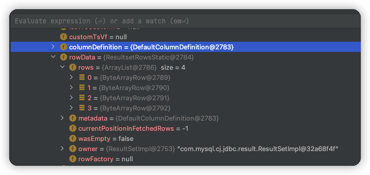
>
> columnDefinition是数据库字段信息；rowData是查询出数据记录信息。

查询整个流程关键步骤：

- 在进行数据库查询前，先查询缓存；如果确实需要查询数据库，则数据库查询之后的结果也放入缓存中。
- SQL 语句的执行经过了层层转化，依次经过了 MappedStatement 对象、Statement对象和 PreparedStatement对象，最后才得以执行。
- 最终数据库查询得到的结果交给 ResultHandler对象处理。

##### 处理结果集

ResultHandler是**结果处理器**，结果的处理是ResultHandler接口的实现类DefaultResultSetHandler中：

```java
  @Override
  public List<Object> handleResultSets(Statement stmt) throws SQLException {
    ErrorContext.instance().activity("handling results").object(mappedStatement.getId());

    final List<Object> multipleResults = new ArrayList<>();

    int resultSetCount = 0;
    ResultSetWrapper rsw = getFirstResultSet(stmt);

    List<ResultMap> resultMaps = mappedStatement.getResultMaps();
    int resultMapCount = resultMaps.size();
    validateResultMapsCount(rsw, resultMapCount);
    while (rsw != null && resultMapCount > resultSetCount) {
      ResultMap resultMap = resultMaps.get(resultSetCount);
      handleResultSet(rsw, resultMap, multipleResults, null);
      rsw = getNextResultSet(stmt);
      cleanUpAfterHandlingResultSet();
      resultSetCount++;
    }
    
    String[] resultSets = mappedStatement.getResultSets();
    if (resultSets != null) {
      while (rsw != null && resultSetCount < resultSets.length) {
        ResultMapping parentMapping = nextResultMaps.get(resultSets[resultSetCount]);
        if (parentMapping != null) {
          String nestedResultMapId = parentMapping.getNestedResultMapId();
          ResultMap resultMap = configuration.getResultMap(nestedResultMapId);
          handleResultSet(rsw, resultMap, null, parentMapping);
        }
        rsw = getNextResultSet(stmt);
        cleanUpAfterHandlingResultSet();
        resultSetCount++;
      }
    }
```

> MyBatis如何将数据库输出的记录转化为对象列表？

整个过程非常长，在 DefaultResultSetHandler 的方法中进行了多次跳转：

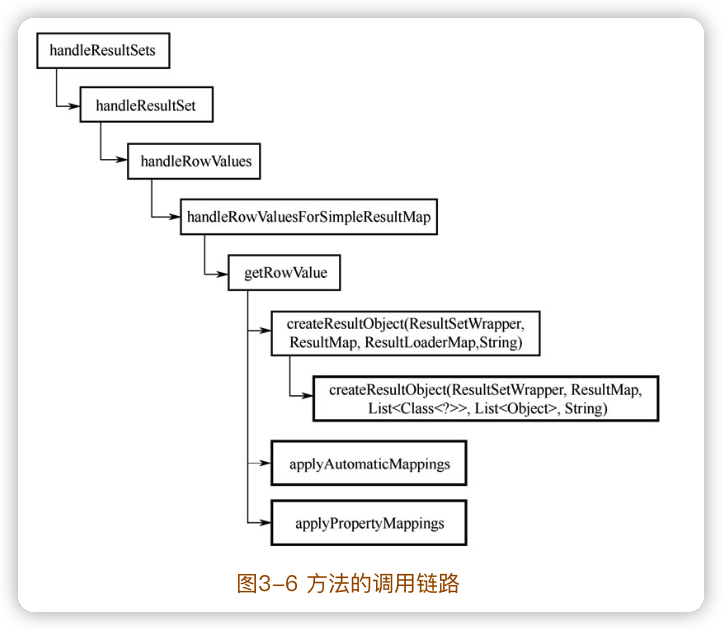

- createResultObject方法创建了输出结果对象。在示例中，为 User对象。
- applyAutomaticMappings 方法：在自动属性映射功能开启的情况下，该方法将数据记录的值赋给输出结果对象。
-  applyPropertyMappings方法：该方法按照用户的映射设置，给输出结果对象的属性赋值。

基本思路就是**循环遍历每个属性**，然后调用“metaObject.setValue（mapping.property，value）”语句为属性赋值。

经过以上过程，数据库输出的记录被转化为了对象列表。

##### 总结

这个阶段mybatis工作汇总：

- 建立连接数据库的 SqlSession。
- 查找当前映射接口中抽象方法对应的数据库操作节点，根据该节点生成接口的实现。
- 接口的实现拦截对映射接口中抽象方法的调用，并将其转化为数据查询操作。
- 对数据库操作节点中的数据库操作语句进行多次处理，最终得到标准的 SQL语句。
- 尝试从缓存中查找操作结果，如果找到则返回；如果找不到则继续从数据库中查询。
- 从数据库中查询结果。
- 处理结果集。
  - 建立输出对象；
  - 根据输出结果对输出对象的属性赋值。
- 在缓存中记录查询结果。
- 返回查询结果。

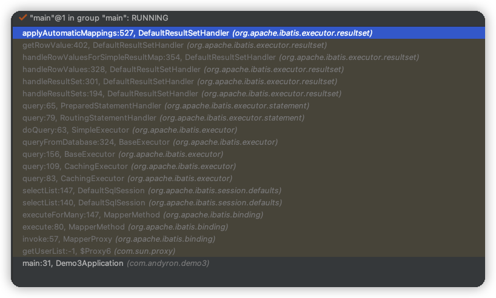

### 4 MyBatis源码结构

#### 包结构

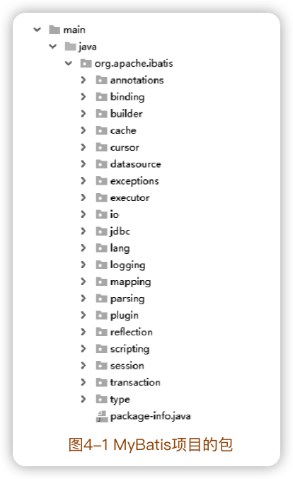

#### 分组

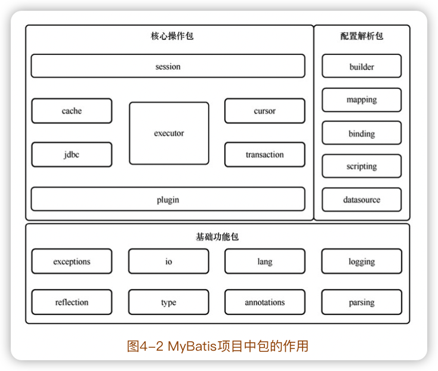

按照包的功能大致划分（各个包的类、方式实际是互相关联、交织的）：

- 基础功能包：这些包用来为其他包提供一些外围基础功能，如文件读取功能、反射操作功能等。这些包的特点是功能相对独立，与业务逻辑耦合小。
- 配置解析包：这些包用来完成配置解析、存储等工作。这些包中的方法主要在系统初始化阶段运行。
- 核心操作包：这些包用来完成数据库操作。在工作过程中，这些包可能会依赖基础功能包提供的基础功能和配置解析包提供的配置信息。这些包中的方法主要在数据库操作阶段运行。

源码阅读过程中有一个非常重要的技巧，那就是从整个项目的<u>外围源码入手</u>。外围源码很少依赖核心源码，相对独立。先阅读外围源码，受到其他未阅读部分的干扰较小；核心源码大量依赖外围源码。


## 二、基础功能包源码阅读


### 5 exceptions包

exceptions包为 MyBatis定义了绝大多数异常类的父类，同时也提供了异常类的生产工厂。

#### 5.1 背景知识

##### Java的异常

“异常”代表程序运行中遇到了**意料之外的事情**，为了**表征异常**，Java标准库中内建了一些通用的异常，这些类以 Throwable为父类。

- Error及其子类，代表了 JVM自身的异常。这一类异常发生时，<u>无法通过程序来修正</u>。最可靠的方式就是尽快停止 JVM的运行。
- Exception 及其子类，代表程序运行中发生了意料之外的事情。这些意外的事情可以被 Java异常处理机制处理。
  - RuntimeException及其子类：这一类异常其实是程序设计的错误，<u>通过修正程序设计是可以避免的</u>，如数组越界异常、数值异常等。
  - 非RuntimeException及其子类：这一类异常的发生通常由外部因素导致，是不可预知和避免的，如 IO异常、类型寻找异常等。

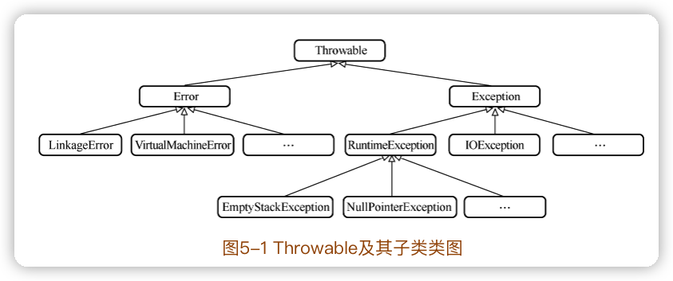


Error及其子类 和 RuntimeException及其子类 为**免检异常**，即不需要对这两类异常进行强制检查；

其它异常（也就是非RuntimeException及其子类） 为**必检异常**，写程序时必须用 try、catch 语句将其包围起来。

 Throwable主要的成员变量有 detailMessage和 cause。

- detailMessage为一个字符串，用来存储异常的详细信息。

- cause 为另一个 Throwable 对象，用来存储引发异常的原因。

  这是因为一个异常发生时，通常引发异常的上级程序也发生异常，从而导致一连串的异常产生，叫作==**异常链**==。一个异常的 cause属性可以指向引发它的下级异常，从而将整个异常链保存下来。

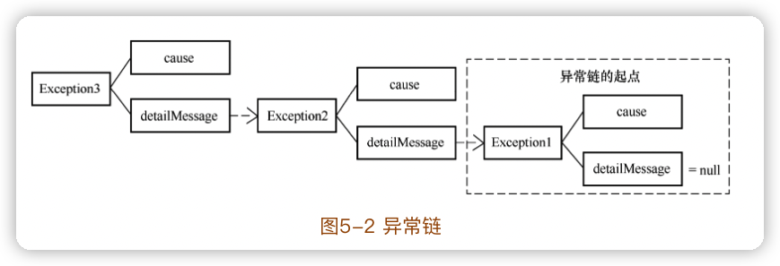

##### 序列化与反序列化

对象的序列化主要有两个目的：

- 一是将对象转化成字节后保存在存储介质中，即为了持久化对象；
- 二是将对象转化成字节后在网络上传输，即为了传输对象。

在 Java中，要表明一个类的对象是可序列化的，则必须继承 **Serializable**接口或其子接口 **Externalizable**接口。

序列化与反序列化过程中，要面临版本问题。例如，将一个 User类的对象 user1持久化到了硬盘中，然后增删了 User类的属性，那么此时还能将持久化在硬盘中的user1对象的序列还原成一个新的 User类的对象吗？

```java
public class User implements Serializable {
	private static final long serialVersionUID = 1L;
	// ....
}
```

serialVersionUID字段叫作**序列化版本控制字段**。

在反序列化过程中，如果对象字节序列中的 serialVersionUID与当前类的该值不同，则反序列化失败，否则成功。

**如果没有显式地为一个类定义 serialVersionUID属性，系统就会自动生成一个**。自动生成的序列化版本控制字段与类的类名、类及其属性修饰符、接口及接口顺序、属性、构造函数等相关，其中任何一项的改变都会导致 serialVersionUID发生变化。

#### 5.2 mybatis中的Exception类

exceptions包中有三个异常类：IbatisException类、PersistenceException类和 TooManyResultsException类。

mybatis的其它异常，分散在其它包中，这些异常类中除 RuntimeSqlException类外，均为 PersistenceException的子类。

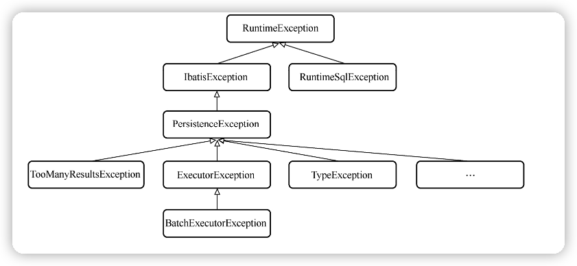

IbatisException类上有@Deprecated注解，表明该类在未来可能会被废弃。

通常，在规划一个项目的包结构时，可以按照以下两种方式进行包的划分：

- 按照**类型**方式划分，例如将所有的接口类放入一个包，将所有的 Controller类放入一个包。这种分类方式从类型上看更为清晰，但是会将完成同一功能的多个类分散在不同的包中，不便于模块化开发。
- 按照**功能**方式划分，例如将所有与加/解密有关的类放入一个包，将所有与 HTTP请求有关的类放入一个包。这种分类方式下，同一功能的类内聚性高，便于模块化开发，但会导致同一包内类的类型混乱。

通常项目都是**同时采用这两种划分方式**。mybatis中按照类型划分的包有exceptions包、annotations包等；按照功能划分的包有logging包、plugin包。

> 在项目设计和开发中，推荐**优先将功能耦合度高的类放入按照功能划分的包中，而将功能耦合度低或供多个功能使用的类放入按照类型划分的包中**。
>
> 类、方法、代码片段的组合与拆分等都可以参照这种思想。

PersistenceException类和 TooManyResultsException类 都有四种构造方法：

- 无参构造方法；
- 传入错误信息字符串的构造方法；
- 传入上级 Throwable实例的构造方法；
- 传入上级 Throwable实例和错误信息字符串的构造方法。

为 Throwable 类及其子类创建上述四种构造方法几乎是惯例。这样一来，无论已知几个输入参数信息，都可以方便地调用合适的构造方法创建实例。

#### 5.3 ExceptionFactory类

构造方法由 private修饰，确保该方法无法在类的外部被调用，也就永远无法生成该类的实例。通常，会对一些工具类、工厂类等仅提供静态方法的类进行这样的设置，因为这些类不需要实例化就可以使用。

### 6 reflection包

reflection包是提供反射功能的基础包。该包功能强大且与 MyBatis的业务代码耦合度低，可以直接复制到其他项目中使用。

#### 6.1 背景知识

##### 装饰器模式

装饰器模式（又称包装模式），是一种结构型模式，是指能够在一个类的基础上增加一个装饰类（也可以叫包装类），并在装饰类中增加一些新的特性和功能。这样，通过对原有类的包装，就可以在不改变原有类的情况下为原有类增加更多的功能。

装饰器模式通常的使用场景是**在一个核心基本类的基础上，提供大量的装饰类，从而使核心基本类经过不同的装饰类修饰后获得不同的功能。**

##### 反射

通过 Java反射，能够在类的运行过程中知道这个类有哪些属性和方法，还可以修改属性、调用方法、建立类的实例。

- 在运行时判断任意一个对象所属的类；
- 在运行时构造任意一个类的对象；
- 在运行时修改任意一个对象的成员变量；
- 在运行时调用任意一个对象的方法。

##### Type接口及其子类

`java.lang.reflect.Type`

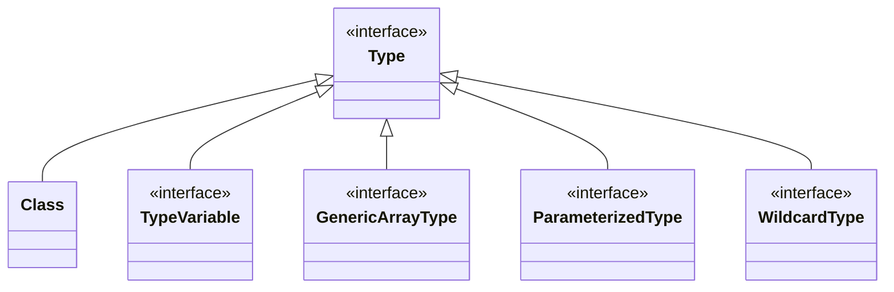

- Class类：类（枚举类型也属于类）、接口（注解也属于接口）。
- WildcardType接口：代表通配符表达式。例如，`?` ，`？extends Number`， `？super Integerd`。
- TypeVariable接口：类型变量的父接口。例如，`Map＜K，V＞`中的“K”“V”就是类型变量。
- ParameterizedType接口：代表参数化的类型。例如，`Collection ＜String＞`就是参数化的类型。
- GenericArrayType接口：它代表包含 ParameterizedType或者 TypeVariable元素的列表。

> ==遇到不了解的类、方法时，直接跳转到类、方法的定义处查看其原生注释是学习Java编程、阅读项目源码非常有效的方法。==

#### 6.2 对象工厂子包

reflection包下的factory子包是一个对象工厂子包，该包中的类用来**==基于反射生产出各种对象==**。

ObjectFactory接口的方法：

- `void setProperties(Properties)`：设置工厂的属性。
- `＜T＞ T create(Class＜T＞)`：传入一个类型，采用无参构造方法生成这个类型的实例。

- `＜T＞ T create(Class＜T＞，List＜Class＜?＞＞，List＜Object＞)`：传入一个目标类型、一个参数类型列表、一个参数值列表，根据参数列表找到相应的含参构造方法生成这个类型的实例。

- `＜T＞ boolean isCollection(Class＜T＞)`：判断传入的类型是否是集合类。

DefaultObjectFactory 默认的对象工厂实现。其中create方法最终都调用instantiateClass 方法，它能够通过反射找到与参数匹配的构造方法，然后基于反射调用该构造方法生成一个对象。

```java
private  <T> T instantiateClass(Class<T> type, List<Class<?>> constructorArgTypes, List<Object> constructorArgs) {
    try {
      Constructor<T> constructor;
      if (constructorArgTypes == null || constructorArgs == null) {
        // 参数类型列表或参数列表有一个为null，就使用无参构造创建实例
        constructor = type.getDeclaredConstructor();
        try {
          return constructor.newInstance();
        } catch (IllegalAccessException e) {
          // 如果发展异常，就修改构造函数的访问属性后再次尝试
          if (Reflector.canControlMemberAccessible()) {
            constructor.setAccessible(true);
            return constructor.newInstance();
          } else {
            throw e;
          }
        }
      }
      // 根据输入参数类型查找对应的构造器
      constructor = type.getDeclaredConstructor(constructorArgTypes.toArray(new Class[constructorArgTypes.size()]));
      try {
        // 采用有参构造函数创建实例
        return constructor.newInstance(constructorArgs.toArray(new Object[constructorArgs.size()]));
      } catch (IllegalAccessException e) {
        if (Reflector.canControlMemberAccessible()) {
          constructor.setAccessible(true);
          return constructor.newInstance(constructorArgs.toArray(new Object[constructorArgs.size()]));
        } else {
          throw e;
        }
      }
    } catch (Exception e) {
      // 收集所有的参数类型
      String argTypes = Optional.ofNullable(constructorArgTypes).orElseGet(Collections::emptyList)
          .stream().map(Class::getSimpleName).collect(Collectors.joining(","));
      // 收集所有的参数
      String argValues = Optional.ofNullable(constructorArgs).orElseGet(Collections::emptyList)
          .stream().map(String::valueOf).collect(Collectors.joining(","));
      throw new ReflectionException("Error instantiating " + type + " with invalid types (" + argTypes + ") or values (" + argValues + "). Cause: " + e, e);
    }
  }
```

DefaultObjectFactory中还有一个 resolveInterface方法，当传入的目标类型是一个接口时，该方法可以给出一个符合该接口的实现。

#### 6.3 执行器子包

reflection 包下的 invoker 子包是执行器子包，该子包中的类能够**==基于反射实现对象方法的调用和对象属性的读写==**。

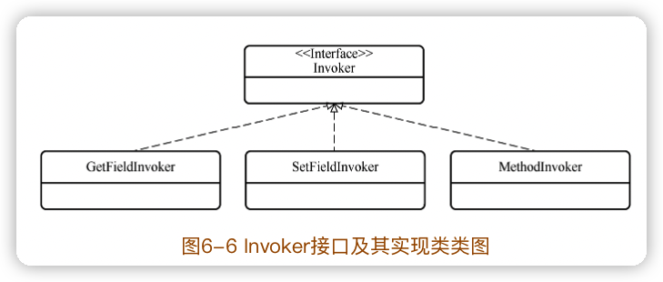

- GetFieldInvoker：负责对象属性的读操作；
- SetFieldInvoker：负责对象属性的写操作；
- MethodInvoker：负责对象其他方法的操作。

Invoker接口的两个方法：

- invoke方法，即执行方法负责完成对象方法的调用和对象属性的读写。在三个实现类中，分别是属性读取操作、属性赋值操作、方法触发操作。

- getType方法，用来获取类型，对于 GetFieldInvoker和 SetFieldInvoker是获得目标属性的类型。MethodInvoker中直接返回type属性，如果一个方法有且只有一个输入参数，则 type为输入参数的类型；否则，type为方法返回值的类型。

  ```java
    public MethodInvoker(Method method) {
      this.method = method;
  
      if (method.getParameterTypes().length == 1) {
        type = method.getParameterTypes()[0];
      } else {
        type = method.getReturnType();
      }
    }
  ```

  

> 阅读源码时，重点关注自己理解不够清晰的点是让自己快速理解源码的一个小技巧。

#### 6.4 属性子包

reflection包下的 property子包是属性子包，该子包中的类用来**完成与对象属性相关的操作**。

只有三个类：PropertyCopier，PropertyTokenizer，PropertyNamer。

```java
PropertyCopier.copyBeanProperties(User.class, user1, user2);
System.out.println(user2);
```

PropertyCopier只有一个静态方法copyBeanProperties，它原理很简单：通过反射获取类的所有属性（没有继承的属性），然后依次将这些属性值从源对象复制出来并赋给目标对象。

PropertyNamer提供属性名称相关的操作功能。

PropertyTokenizer 是一个属性标记器。

#### 6.5 对象包装器子包

reflection包下的 wrapper子包是对象包装器子包，该子包中的类**使用装饰器模式对各种类型的对象（包括基本 Bean对象、集合对象、Map对象）进行进一步的封装**，为其增加一些功能，使它们更易于使用。

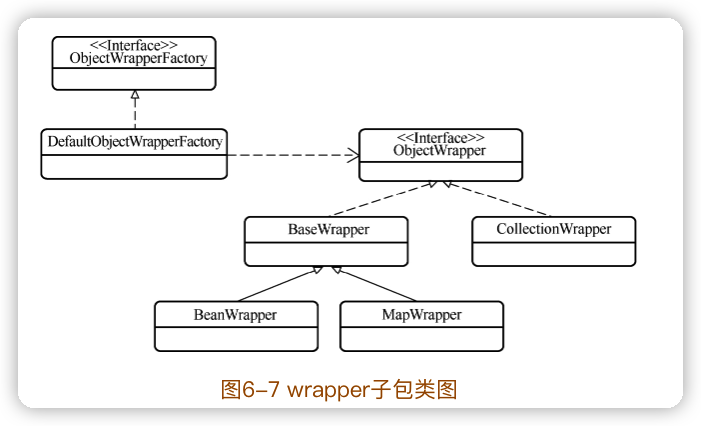

MyBatis 也允许用户通过配置文件中的 objectWrapperFactory节点来注入新的 ObjectWrapperFactory。

> reflection包中的两个类：MetaObject类和 MetaClass类
>
> meta 在中文中常译为“元”，在英文单词中作为词头有**“涵盖”“超越”“变换”**等多种含义。在这里，这三种含义都是存在的。例如，MetaObject类中涵盖了对应Object类中的全部信息，并经过变化和拆解得到了一些更为细节的信息。因此，可以将 MetaObject类理解为**一个涵盖对象（Object）中更多细节信息和功能的类**，称为“元对象”。同理，MetaClass就是**一个涵盖了类型（Class）中更多细节信息和功能的类**，称为“元类”。

🔖

#### 6.6 反射核心类

Reflector 类负责对一个类进行反射解析，并将解析后的结果在属性中存储起来。

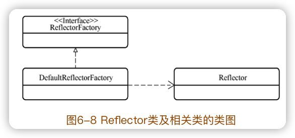

Reflector 类负责对一个类进行反射解析，并将解析后的结果在属性中存储起来。

🔖


#### 6.7 反射包装类

MetaClass类和MetaObject类

SystemMetaObject


#### 6.8 异常拆包工具

ExceptionUtil

InvocationTargetException和 UndeclaredThrowableException

> 很多时候读懂源码的实现并不难，但是一定要多思考源码为什么这么写。

> 为什么需要给 InvocationTargetException和 UndeclaredThrowableException这两个类拆包？这两个类为什么要把其他异常包装起来？

反射操作中，代理类通过反射调用目标类的方法时，目标类的方法可能抛出异常。反射可以调用各种目标方法，因此目标方法抛出的异常是多种多样无法确定的。这意味着反射操作可能抛出一个任意类型的异常。可以用 Throwable 去接收这个异常，但这无疑太过宽泛。

InvocationTargetException就是为解决这个问题而设计的，当反射操作的目标方法中出现异常时，都统一包装成一个必检异常 InvocationTargetException。InvocationTargetException内部的 target 属性则保存了原始的异常。

🔖


#### 6.9 参数名解析器

ParamNameResolver 是一个参数名解析器，用来按顺序列出方法中的虚参，并对实参进行名称标注。

🔖


> **断点调试法**在阅读字符串处理类的函数时十分有效，因为打断点的方式能够将字符串处理过程中的所有中间值展现出来，便于把握程序的每一步流程。

#### 6.10 泛型解析器

TypeParameterResolver是泛型参数解析器。

> 很多情况下，弄清一个类的功能对阅读其源码十分必要。

TypeParameterResolver 类的功能是帮助 MyBatis 推断出属性、返回值、输入参数中泛型的具体类型。

```java
public class TypeParameterResolverTest {
    public static void main(String[] args) throws NoSuchMethodException {
        Type type1 = TypeParameterResolver.resolveReturnType(User.class.getMethod("getInfo"), User.class);
        System.out.println("User类中getInfo方法的输出结果类型\n" + type1);

        Type type2 = TypeParameterResolver.resolveReturnType(User.class.getMethod("getInfo"), Student.class);
        System.out.println("Student类中getInfo方法的输出结果类型\n" + type2);
    }
}

class User<T> {
    public List<T> getInfo() {
        return null;
    }
}

class Student extends User<Number> {

}
```

```
User类中getInfo方法的输出结果类型
ParameterizedTypeImpl [rawType=interface java.util.List, ownerType=null, actualTypeArguments=[class java.lang.Object]]
Student类中getInfo方法的输出结果类型
ParameterizedTypeImpl [rawType=interface java.util.List, ownerType=null, actualTypeArguments=[class java.lang.Number]]
```

TypeParameterResolver类的三个方法：

- resolveFieldType：解析属性的泛型；
- resolveReturnType：解析方法返回值的泛型；
- resolveParamTypes：解析方法输入参数的泛型。

🔖


### 7 annotations包与lang包

🔖

### 8 type包🔖

> 归类总结是源码阅读中非常好的办法。往往越是大量的类，越是大量的方法，越有规律进行分类。

type包55个类、接口的可分层6组：

1. 类型处理器：1个接口、1个基础实现类、1个辅助类、43个实现类。

   - TypeHandler：类型处理器接口；

   - BaseTypeHandler：类型处理器的基础实现（抽象类）；
   - TypeReference：类型参考器（抽象类）；
   - *TypeHandler：43个类型处理器。

2. 类型注册表：3个。

   - SimpleTypeRegistry：基本类型注册表，内部使用 Set 维护了所有 Java 基本数据类型的集合；
   - TypeAliasRegistry：类型别名注册表，内部使用 HashMap维护了所有类型的别名和类型的映射关系；
   - TypeHandlerRegistry：类型处理器注册表，内部维护了所有类型与对应类型处理器的映射关系。

3. 注解类：3个。

   - Alias：使用该注解可以给类设置别名，设置后，别名和类型的映射关系便存入TypeAliasRegistry中；
   - MappedJdbcTypes：有时我们想使用自己的处理器来处理某些 JDBC 类型，只需创建 BaseTypeHandler 的子类，然后在上面加上该注解，声明它要处理的JDBC类型即可；
   - MappedTypes：有时我们想使用自己的处理器来处理某些Java类型，只需创建BaseTypeHandler的子类，然后在上面加上该注解，声明它要处理的 Java类型即可。

4. 异常类：1个。

   TypeException：表示与类型处理相关的异常。

5. 工具类：1个。

   ByteArrayUtils：提供数组转化的工具方法。

6. 枚举类：1个。

   JdbcType：在 Enum中定义了所有的 JDBC类型，类型来源于 java.sql.Types。

#### 8.1 模板模式

在模板模式中，需要使用一个抽象类定义一套操作的整体步骤（即模板），而抽象类的子类则完成每个步骤的具体实现。这样，抽象类的不同子类遵循了同样的一套模板。

确定了一套操作的框架，而子类只需在此框架的基础上定义具体的实现即可。

#### 8.2 类型处理器

作为一个 ORM框架，**处理 Java对象和数据库关系之间的映射**是 MyBatis工作中的重要部分。

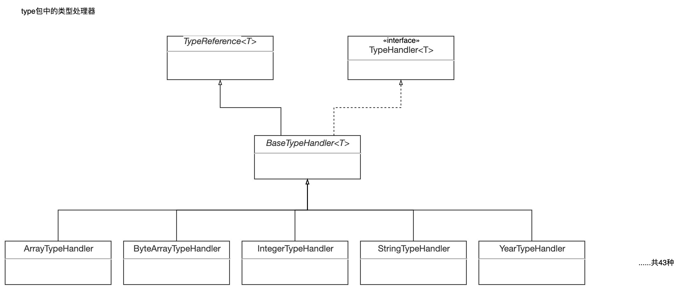

在类型处理器相关类的设计中采用了模板模式，BaseTypeHandler＜T＞作为**所有类型处理器的基类，定义了模板的框架**。而在各个具体的实现类中，则实现了具体的细节。


#### 8.3 类型注册表


TypeHandlerRegistry类的属性：

```java
	// JDBC类型与对应类型处理器的映射  
	private final Map<JdbcType, TypeHandler<?>> jdbcTypeHandlerMap = new EnumMap<>(JdbcType.class);
	// Java类型与Map<JdbcType, TypeHandler<?>>的映射
  private final Map<Type, Map<JdbcType, TypeHandler<?>>> typeHandlerMap = new ConcurrentHashMap<>();
	// 未知类型的处理器
  private final TypeHandler<Object> unknownTypeHandler;
	// 键为typeHandler.getClass()，值为typeHandler。这里存储了所有的类型处理器
  private final Map<Class<?>, TypeHandler<?>> allTypeHandlersMap = new HashMap<>();
	// 空的 Map<JdbcType, TypeHandler<?>>，表示该Java类型没有对应的Map<JdbcType, TypeHandler<?>>
  private static final Map<JdbcType, TypeHandler<?>> NULL_TYPE_HANDLER_MAP = Collections.emptyMap();
	
	// 默认的枚举类型处理器 
  private Class<? extends TypeHandler> defaultEnumTypeHandler = EnumTypeHandler.class;
```

通过两次映射，获得一个类型的类型处理器：

1. 根据传入的 Java 类型，调用 getJdbcHandlerMap 方法寻找对应的`Map<JdbcType, TypeHandler<?>>`后返回；

   ```java
   Map<JdbcType, TypeHandler<?>> jdbcHandlerMap = getJdbcHandlerMap(type);
   ```

2. 基于 jdbcTypeHandlerMap这个map，根据 JDBC类型再一映射找到对应的 TypeHandler。

### 9 io包

mybatis的io包提供对磁盘文件（xml）的读操作，还有对内存中类文件（class文件）的操作。


#### 9.1 背景知识

##### 单例模式

##### 代理模式

代理模式（Proxy Pattern）是指建立某一个对象的代理对象，并且由代理对象控制对原对象的引用。

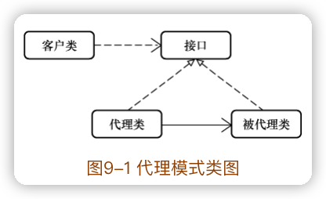

代理模式能够实现很多功能：

- 隔离功能：通过建立一个目标对象的代理对象，可以防止外部对目标对象的直接访问，这样就使得目标对象与外部隔离。我们可以在代理对象中增加**身份验证、权限验证**等功能，从而实现对目标对象的安全防护。
- 扩展功能：对一个目标对象建立代理对象后，可以在代理对象中增加更多的扩展功能。例如，可以在代理对象中增加**日志记录**功能，这样对目标对象的访问都会被代理对象计入日志。
- 直接替换：对一个目标对象建立代理对象后，可以直接使用代理对象完全替换目标对象，由代理对象来实现全部的功能。例如，MyBatis 中数据库操作只是一个抽象方法，但实际运行中会建立代理对象来完成数据库的读写操作。

##### 静态代理

静态代理就是代理模式最简单的实现。所谓“静态”，是指**被代理对象和代理对象在程序中是确定的，不会在程序运行过程中发生变化**。

##### VFS

VFS（Virtual File System）作为一个虚拟的文件系统将各个磁盘文件系统的差异屏蔽了起来，提供了统一的操作接口。

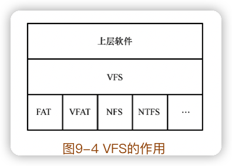

#### 9.2 VFS实现类

MyBatis的 io包中 `VFS`（抽象类）的作用是**从应用服务器中找寻和读取资源文件（配置文件、类文件等）**。

VFS中有两个属性分别保存了内置和用户自定义的VFS实现类：

```java
public static final Class<?>[] IMPLEMENTATIONS = { JBoss6VFS.class, DefaultVFS.class };

public static final List<Class<? extends VFS>> USER_IMPLEMENTATIONS = new ArrayList<>();
```

VFS中有一个内部类VFSHolder使用单例模式，createVFS方法创建能够对外给出唯一的VFS实现类：

```java
	private static class VFSHolder {
    static final VFS INSTANCE = createVFS();

    @SuppressWarnings("unchecked")
    static VFS createVFS() {
      // 所有VFS实现类的列表
      List<Class<? extends VFS>> impls = new ArrayList<>();
      // 列表中先加入用户自定义的实现类。因此，用户自定义的优先级更高
      impls.addAll(USER_IMPLEMENTATIONS);
      impls.addAll(Arrays.asList((Class<? extends VFS>[]) IMPLEMENTATIONS));

      VFS vfs = null;
      // 依次生成实例，找出第一可用的
      for (int i = 0; vfs == null || !vfs.isValid(); i++) {
        Class<? extends VFS> impl = impls.get(i);
        try {
          vfs = impl.newInstance();
          // 判断对象是否生成成功并可用
          if (vfs == null || !vfs.isValid()) {
            if (log.isDebugEnabled()) {
              log.debug("VFS implementation " + impl.getName() +
                  " is not valid in this environment.");
            }
          }
        } catch (InstantiationException | IllegalAccessException e) {
          log.error("Failed to instantiate " + impl, e);
          return null;
        }
      }

      if (log.isDebugEnabled()) {
        log.debug("Using VFS adapter " + vfs.getClass().getName());
      }

      return vfs;
    }
  }
```

##### DefaultVFS类


##### JBoss6VFS类


#### 9.3 类文件的加载

要把类文件加载成类，需要类加载器的支持。**ClassLoaderWrapper** 类中封装了五种类加载器，而 **Resources** 类又对 ClassLoaderWrapper 类进行了一些封装。

```java
  ClassLoader[] getClassLoaders(ClassLoader classLoader) {
    return new ClassLoader[]{
        classLoader,
        defaultClassLoader,
        Thread.currentThread().getContextClassLoader(),
        getClass().getClassLoader(),
        systemClassLoader};
  }
```

五种类加载器依次是(优先级由高到低，都类文件时依次寻找，找到即可返回结果)：

- 作为参数传入的类加载器，可能为 null；
- 系统默认的类加载器，如未设置则为 null；
- 当前线程的线程上下文中的类加载器；
- 当前对象的类加载器；
- 系统类加载器，在 ClassLoaderWrapper的构造方法中设置。

classForName 方法根据类名找出指定类：

```java
  Class<?> classForName(String name, ClassLoader[] classLoader) throws ClassNotFoundException {
		// 对五种类加载器依次进行尝试
    for (ClassLoader cl : classLoader) {

      if (null != cl) {

        try {
					// 当前加载能加载成功，立马返回结果
          return Class.forName(name, true, cl);

        } catch (ClassNotFoundException e) {
          // 故意忽略该异常，5中类加载都没找到目标类，再在下面重新抛出该异常
        }

      }

    }

    throw new ClassNotFoundException("Cannot find class: " + name);

  }

```

#### 9.4 ResolverUtil类

ResolverUtil是一个工具类，主要功能是完成**类的筛选**。

🔖

### 10 logging包

#### 10.1 背景知识

##### 适配器模式

适配器模式（Adapter Pattern）是一种结构型模式，基于该模式设计的类能够在两个或者多个不兼容的类之间起到沟通桥梁的作用。

适配器的思想在程序设计中非常常见。

1. 方法适配

```java
// 方法一
public <K, V> Map<K, V> selectMap(String statement, String mapKey) {
  return this.selectMap(statement, null, mapKey, RowBounds.DEFAULT);
}

// 方法二
public <K, V> Map<K, V> selectMap(String statement, Object parameter, String mapKey) {
  return this.selectMap(statement, parameter, mapKey, RowBounds.DEFAULT);
}

// 方法三
public <K, V> Map<K, V> selectMap(String statement, Object parameter, String mapKey, RowBounds rowBounds) {
  // ...
}
```

方法三是核心方法，需要四个参数。方法一和方法二充当了方法适配器的作用。这两个适配器通过为未知参数设置默认值的方式，搭建起了调用方和核心方法之间的桥梁。

2. 类适配器

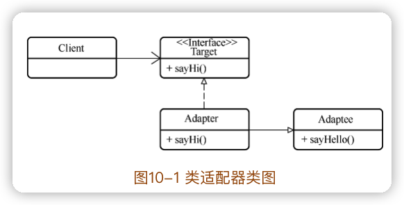

Target接口是 Client想调用的标准接口，而 Adaptee是提供服务但不符合标准接口的目标类。Adapter便是为了 Client能顺利调用 Adaptee而创建的适配器类。

Adapter既实现了 Target接口又继承了 Adaptee类，从而使 Client能够与Adaptee适配：

```java
public class Adapter extends Adaptee implements Target {
  @Override
  public void sayHi() {
    super.sayHello();
  }
}
```

3. 对象适配器

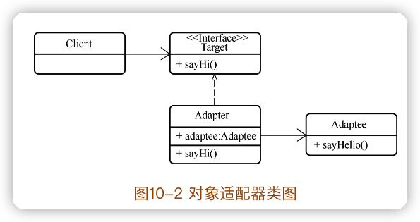

```java
public class Adapter implements Target {
  // 目标类的对象
  private Adaptee adaptee;
  
  // 初始化适配器是可以指定目标类对象
  public Adapter(Adaptee adaptee) {
    this.adaptee = adaptee;
  }
  
  @Override
  public void sayHi() {
    adaptee.sayHello();
  }
}
```

这样，Adapter可以直接将 Client要求的操作委托给目标类对象处理，也实现了Client和 Adaptee 之间的适配。而且这种适配器更为灵活一些，因为要适配的目标对象是作为初始化参数传给 Adapter的。

适配器模式能够使得原本不兼容的类可以一起工作。通常情况下，如果目标类是可以修改的，则不需要使用适配器模式，直接修改目标类即可。但如果目标类是不可以修改的（例如<u>目标类由外部提供，或者目标类被众多其他类依赖必须保持不变</u>），那么适配器模式则会非常有用。

##### 日志框架与日志级别

**日志框架**是一种**在==目标对象发生变化==时将相关信息记录进日志文件**的框架。

Java 领域的日志框架有 <u>log4j、Logging、commons-logging、slf4j、logback</u>等。


##### 基于反射的动态代理

静态代理中代理对象和被代理对象是在程序中写死的，不够灵活。具体来说，要想建立某个对象的静态代理，必须为其建立一个代理类，而且所有被代理的方法均需在代理类中直接调用。这就使得**代理类高度依赖被代理类，被代理类的任何变动都可能引发代理类的变动**。

而动态代理则灵活很多，它能**在代码运行时动态地为某个对象增加代理，并且能为代理对象动态地增加方法**。

基于反射的动态代理：在 Java中 java.lang.reflect包下提供了一个 Proxy类和一个 InvocationHandler接口，使用它们就可以实现动态代理。

🔖

对于基于反射的动态代理而言，有一个必需的条件：**被代理的对象必须有一个父接口**。

#### 10.2 Log接口

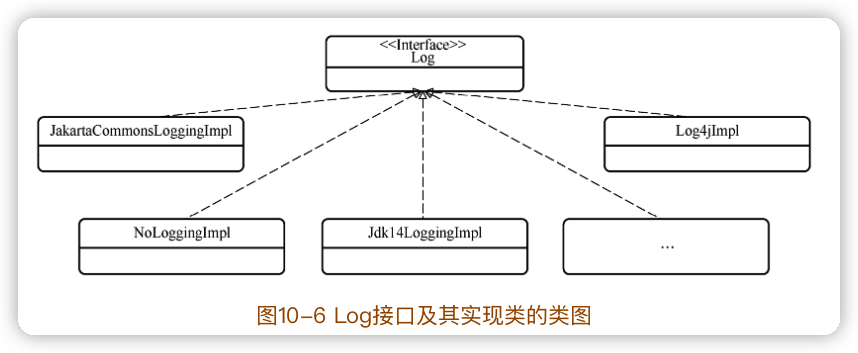

#### 10.3 Log接口的实现类

NoLoggingImpl

StdOutImpl

Slf4jLocationAwareLoggerImpl 类和 Slf4jLoggerImpl 类是Slf4jImpl 类的装饰器

Log4j2AbstractLoggerImpl 类和 Log4j2LoggerImpl 类是 Log4j2Impl类的装饰器


JakartaCommonsLoggingImpl

Jdk14LoggingImpl

Log4jImpl

Log4j2Impl

Slf4jImpl

#### 10.4 LogFactory


#### 10.5 JDBC日志打印

 jdbc子包中的源码和之前几节的实现逻辑完全不同。

MyBatis是 ORM框架，它负责数据库信息和 Java对象的互相映射操作，而不负责具体的数据库读写操作。具体的数据库读写操作是由 JDBC进行的。


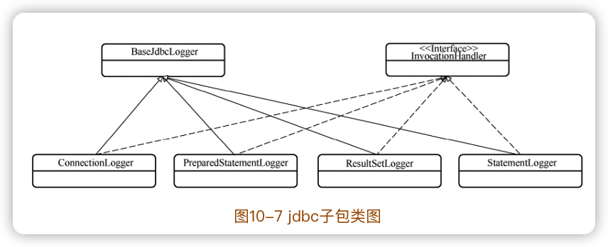

### 11 parsing包

#### 11.1 背景知识

##### XML文件

**可扩展** **标记** 语言（eXtensible Markup Language，XML）是一种标记语言。所谓的==标记==是指**计算机所能理解的信息符号**，通过标记可以实现软件开发者与计算机之间的信息沟通。

HTML也是一种标记语言，但是固定的，是不可扩展的。XML则可以由开发人员自由扩展定义。

XML可扩展的一个重要表现就是 **XML文档的结构是可以自由定义的**。

定义 XML文档的结构可以使用 **DTD**（Document Type Definition，文档类型定义后缀名为==dtd==），或者 **XML Schema**（后缀名为==xsd==）。

 **XML文档的结构**：元素节点、属性节点、文本节点、文档节点等。

```xml
<?xml version="1.0" encoding="UTF-8" ?>
<members>
    <user type="student">
        <id>1</id>
        <name>jack</name>
        <school>high</school>
    </user>
    <user type="student">
        <id>2</id>
        <name>andy</name>
        <school>primary</school>
    </user>
</members>
```

第一行是**XML声明**。

每一个 XML文档都必须有一个根元素。

上面xml的XML Schema文档定义形式：

```xml
<:schema attributeFormDefault="unqualified" elementFormDefault="qualified" xmlns:xs="http://www.w3.org/2001/XMLSchema">
  <xs:element name="members">
    <xs:complexType>
      <xs:sequence>
        <xs:element maxOccurs="unbounded" name="user">
          <xs:complexType>
            <xs:sequence>
              <xs:element name="id" type="xs:unsignedByte" />
              <xs:element name="name" type="xs:string" />
              <xs:element name="school" type="xs:string" />
            </xs:sequence>
            <xs:attribute name="type" type="xs:string" />
          </xs:complexType>
        </xs:element>
      </xs:sequence>
    </xs:complexType>
  </xs:element>
</xs:schema>
```

上面xml的DTD文档定义形式：

```xml
<!DOCTYPE members[
  <!ELEMENT members(user*)>
  <!ELEMENT user(id,name.school)>
  <!ATTLIST user type CDATA #IMPLIED>
  <!ELEMENT id(#PCDATA)>
  <!ELEMENT name(#PCDATA)>
  <!ELEMENT school(#PCDATA)>
  ]>
```

DTD也支持使用外部 DTD文档来定义 XML文档。例如mybatis的配置文件开头：

```xml
<?xml version="1.0" encoding="UTF-8" ?>
<!DOCTYPE configuration
        PUBLIC "-//mybatis.org//DTD Config 3.0//EN"
        "http://mybatis.org/dtd/mybatis-3-config.dtd">
```

- `configuration`：表示当前 XML文档的根节点为 configuration。
- `PUBLIC`：表示当前 XML文档采用的是公共的 DTD。
- `-//mybatis.org//DTD Config 3.0//EN`：表示 DTD文档的信息。
  - `-`：表示是非 ISO组织；
  - `mybatis.org`：表示组织名称 mybatis.org；
  - `DTD Config 3.0`：表示文本描述，包括版本号；
  - EN：表示 DTD文档是英文。
- `http://mybatis.org/dtd/mybatis-3-config.dtd`：表示文档的下载地址。

##### XPath

XPath（XML Path Language，XML路径语言）作为一种小型的查询语言能够根据 XML结构树在树中寻找节点。

XPath语法与CSS选择器或 jQuery选择器类似，它们的语法思路是想通的。

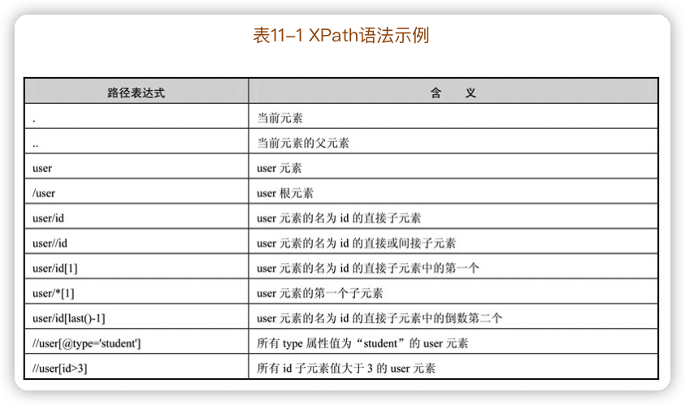

`javax.xml.xpath`包提供了强大的 XPath解析功能，可以基于它实现 XML的解析。

```java
String resource = "info.xml";
DocumentBuilderFactory dbf = DocumentBuilderFactory.newInstance();
DocumentBuilder db = dbf.newDocumentBuilder();
Document doc = db.parse(Thread.currentThread().getContextClassLoader().getResourceAsStream(resource));

XPathFactory factory = XPathFactory.newInstance();
XPath xPath = factory.newXPath();
XPathExpression compile = xPath.compile("/members/user[id=2]");
System.out.println(compile.evaluate(doc));
```


#### 11.2 XML解析

MyBatis的配置文件与映射文件均是 XML文件，因此解析并读取 XML文档中的内容是 MyBatis展开后续工作的基础。

MyBatis中的 parsing包就是用来进行 XML文件解析的包。

解析 XML文件的过中，XPathParser类与 XNode类是两个最为关键的类：

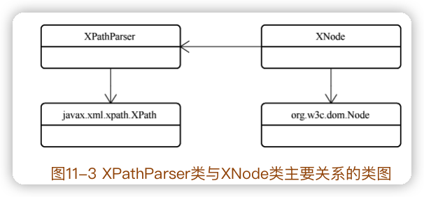


> 在一个类中封装自己的解析器，这是一种非常常见的做法，如此一来这个类不需要外界的帮助便可以解析自身，即获得了自解析能力。


#### 11.3 文档解析中的变量替换


## 三、配置解析包源码阅读

配置解析包用来实现 MyBatis 配置文件、映射文件的解析等工作，并最终为MyBatis 准备好进行数据库操作的运行环境。

### 12 配置解析概述

MyBatis的配置依靠两个文件来完成：

1. 配置文件，包含基本配置信息。只有一个。
2. 映射文件，里面设置了 Java对象和数据库属性之间的映射关系、数据库操作语句等。可以有多个。

配置解析的过程就是**==将配置信息提取、转化，最终在 Java对象中保存的过程==**，如：

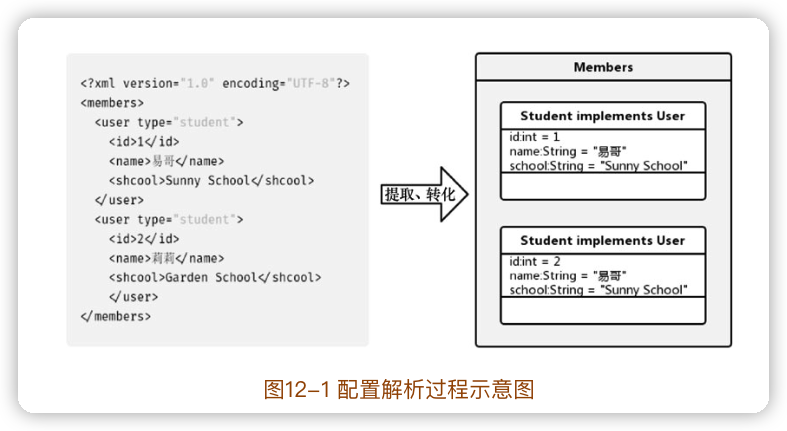

可以将与配置解析相关的类（含接口）分为以下两种：

1. **解析器类（含接口）**：提供配置的解析功能，负责完成配置信息的提取、转化。MyBatis中这样的类有 <u>XMLConfigBuilder类、XMLMapperBuilder类、CacheRefResolver类和XMLStatementBuilder类</u>等。
2. **解析实体类**（含接口）：提供配置的保存功能。该类在结构上与配置信息有对应关系。**配置信息最终会保存到解析实体类的属性中**。MyBatis 中这样的类有<u>Configuration类、ReflectorFactory类、Environment类、DataSource类、ParameterMap类、ParameterMapping类、Discriminator类和 SqlNode类等</u>。

> 这种划分不是绝对的，一些类两者都是，既能在属性中保存信息，又能解析自身或者下层配置。

mybatis配置文件中各个节点对应的解析器类和解析实体：

```
configuration			对应 Configuration 类，有XMLConfigBuilder解析
  properties	
  settings
  typeAliases			TypeAliasRegistry
  typeHandlers		TypeHandlerRegistry
  objectFactory		ObjectFactory
  objectWrapperFactory	ObjectWrapperFactory
  plugins					interceptor属性对应Interceptor类
  environments
  	environment						Environment
  		transactionManager
  		dataSource					DataSource
  databaseIdProvider			DatabaseIdProvider
  mappers
  	mapper					由XMLMapperBuilder解析
```

映射文件节点对应的解析器类和解析实体类：

```
mapper
	cache-ref								由 CacheRefResolver 解析
	cache										Cache
	parameterMap						ParameterMap
		parameter							ParameterMapping
	resultMap								ResultMap
		result								ResultMapping
		discriminator					Discriminator
	select									对应 MappedStatement 对象，由 XMLStatementBuilder 解析
		SQL语句 							 对应SqlSource类，有SqlSourceBuilder解析
		include								由 XMLIncludeTransformer 解析
		foreach								对应SqlNode类，由其自身解析
```

> 以上没有注明解析器类的节点，由其父节点的解析器类进行解析。

### 13 binding包

binding包是主要用来**处理 Java方法与 SQL语句之间绑定关系**的包。两个功能：

- 维护映射接口中抽象方法与数据库操作节点之间的关联关系；
- 为映射接口中的抽象方法接入对应的数据库操作。

#### 13.1 数据库操作的接入

binding包中是用基于反射的动态代理，为抽象方法接入实现方法。


##### 数据库操作的方法化


MapperMethod类将一个数据库操作语句和一个 Java方法绑定在了一起：它的MethodSignature属性保存了这个方法的详细信息；它的 SqlCommand属性持有这个方法对应的 SQL语句。

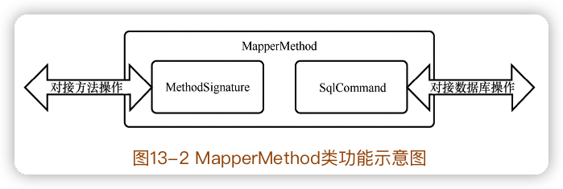

##### 数据库操作方法的接入


#### 13.2 抽象方法与数据库操作节点的关联


#### 13.3 数据库操作接入总结


#### 13.4 MyBatis与Spring、Spring Boot的整合

Spring在启动阶段会使用MapperScannerConfigurer类对指定包进行扫描。对于扫描到的映射接口，mybatis-spring 会将其当作MapperFactoryBean对象注册到 Spring的 Bean列表中。而 MapperFactoryBean可以给出映射接口的代理类。


### 14 builder包

按类型划分出来

两个比较完整的功能：

1. 解析 XML配置文件和映射文件， xml子包；
2. 解析注解形式的 Mapper声明， annotation子包。

#### 14.1 建造者模式


使用建造者模式，对象的建造细节均交给建造者来完成，调用者只需掌控总体流程即可，而不需要了解被建造对象的细节。


#### 14.2 建造者基类与工具类

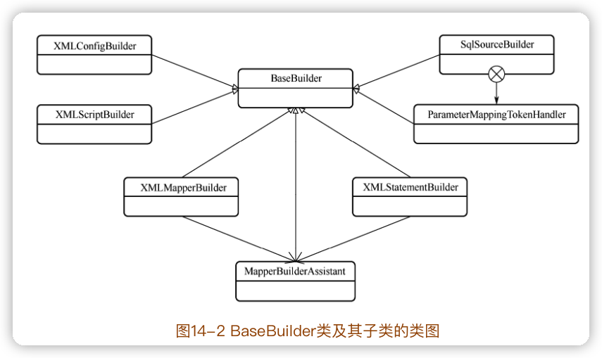


#### 14.3 SqlSourceBuilder类与StaticSqlSource类


#### 14.4 CacheRefResolver类和ResultMapResolver类


#### 14.5 ParameterExpression类

ParameterExpression 是一个**属性解析器**，用来**将描述属性的字符串解析为键值对**的形式。


#### 14.6 XML文件解析

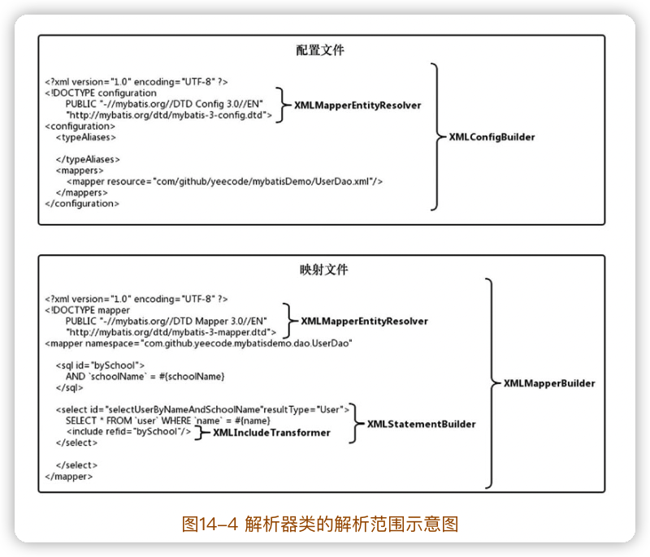

##### XML文件的声明解析


##### 配置文件解析


##### 数据库操作语句解析


##### Statement解析

**数据库操作节点**（四类：select、insert、update、delete）的解析由XMLStatementBuilder完成。


##### 引用解析


#### 14.7 注解映射的解析


### 15 mapping包

众多的解析实体类

主要功能：

- SQL语句处理功能；
- 输出结果处理功能；
- 输入参数处理功能；
- 多数据库种类处理功能；
- 其他功能。

#### 15.1 SQL语句处理功能

MappedStatement类表示的是数据库操作节点（select、insert、update、delete四类节点）内的所有内容；

SqlSource类是数据库操作标签中包含的 SQL语句；

BoundSql类则是SqlSource类进一步处理的产物。

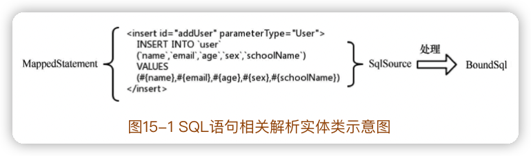


#### 15.2 输出结果处理功能

resultType

resultMap


#### 15.3 输入参数处理功能

parameterMap


#### 15.4 多数据库种类处理功能


#### 15.5 其他功能

Environment类

CacheBuilder类是缓存建造者，它负责完成缓存对象的创建。

其它一些枚举类：

- FetchType：延迟加载设置；
- ParameterMode：参数类型，指输入参数、输出参数等；
- ResultFlag：返回结果中属性的特殊标志，表示是否为 id属性、是否为构造器属性；
- ResultSetType：结果集支持的访问方式；
- SqlCommandType：SQL命令类型，指增、删、改、查等；
- StatementType：SQL语句种类，指是否为预编译的语句、是否为存储过程等。


### 16 scripting包

MyBatis支持非常灵活的 SQL语句组建方式，可以使用 foreach、where、if等标签完成复杂的语句组装工作。

这些标签语句最终还是会被解析成为最基本的 SQL语句才能被数据库接收，这个解析过程主要由 scripting包完成。

#### 16.1 OGNL

OGNL（Object Graph Navigation Language，对象图导航语言）是一种功能强大的表达式语言（Expression Language，EL），通过它能够完成**从集合中选取对象、读写对象的属性、调用对象和类的方法、表达式求值与判断等**操作。
